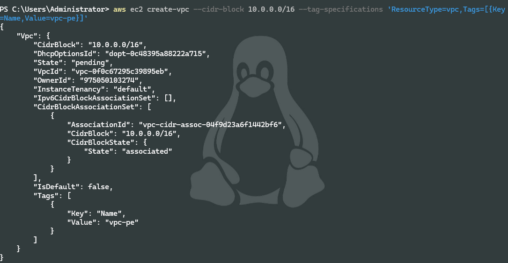
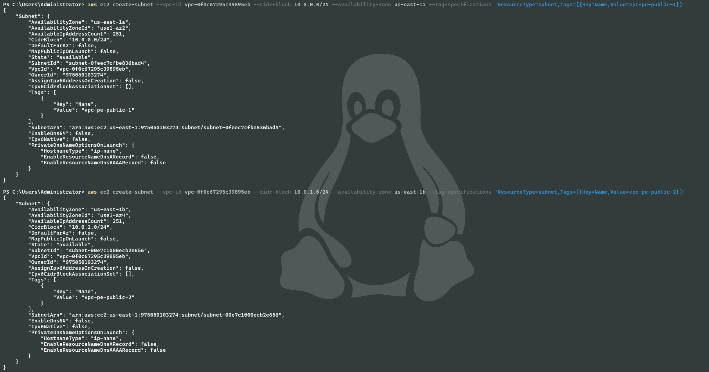
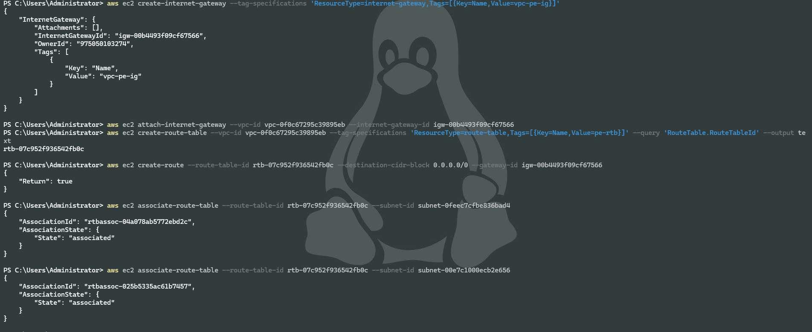
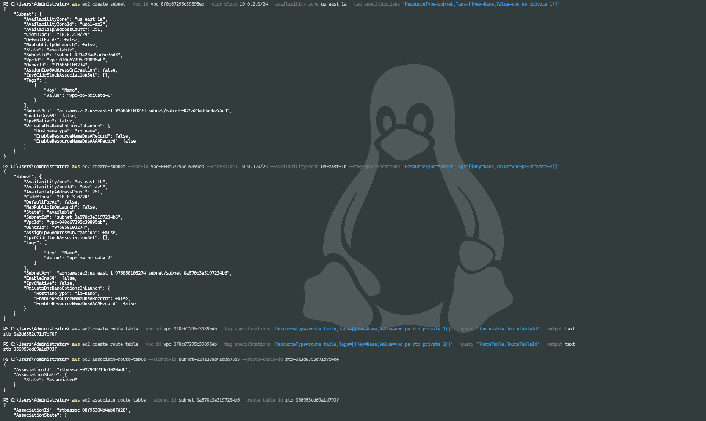
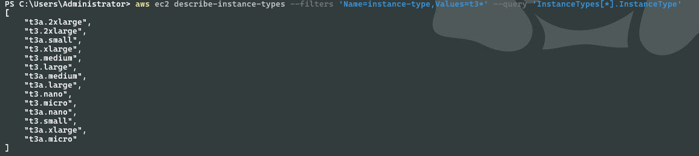
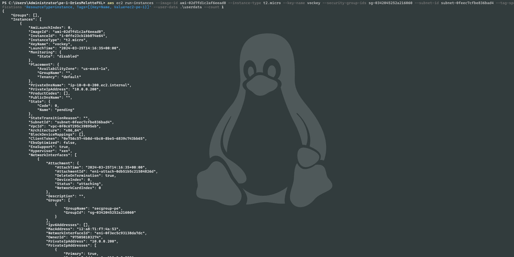
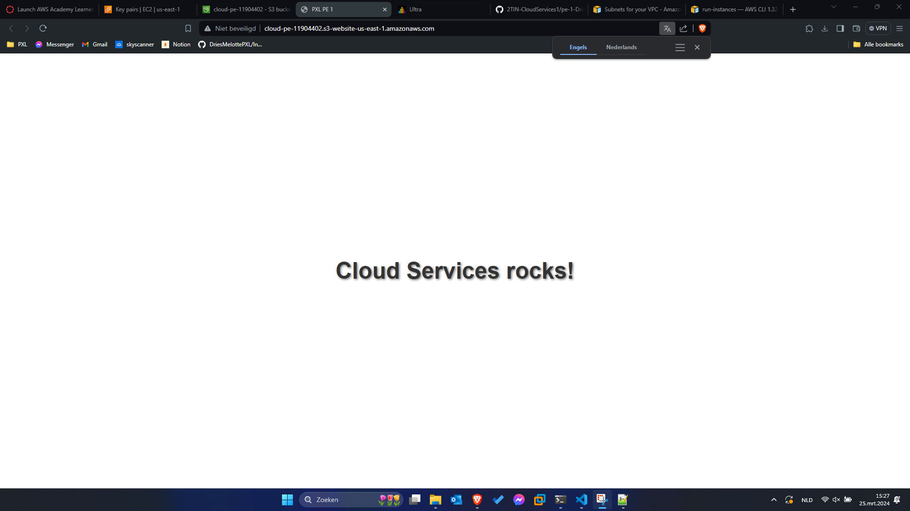

# Deel 1

## Antwoord A

Gebruikte commando(s):

```

```


## Antwoord B

Gebruikte commando(s):

```
aws ec2 create-vpc --cidr-block 10.0.0.0/16 --tag-specifications 'ResourceType=vpc,Tags=[{Key=Name,Value=vpc-pe}]'
```

Screenshot:



## Antwoord C

Gebruikte commando(s):

```
aws ec2 create-subnet --vpc-id vpc-0f0c67295c39895eb --cidr-block 10.0.0.0/24 --availability-zone us-east-1a --tag-specifications 'ResourceType=subnet,Tags=[{Key=Name,Value=vpc-pe-public-1}]'

aws ec2 create-subnet --vpc-id vpc-0f0c67295c39895eb --cidr-block 10.0.1.0/24 --availability-zone us-east-1b --tag-specifications 'ResourceType=subnet,Tags=[{Key=Name,Value=vpc-pe-public-2}]'

aws ec2 modify-subnet-attribute --subnet-id subnet-0feec7cfbe836bad4 --map-public-ip-on-launch

aws ec2 modify-subnet-attribute --subnet-id subnet-00e7c1000ecb2e656 --map-public-ip-on-launch
```

Screenshot:



## Antwoord D

Gebruikte commando(s):

```
aws ec2 create-internet-gateway --tag-specifications 'ResourceType=internet-gateway,Tags=[{Key=Name,Value=vpc-pe-ig}]'

aws ec2 attach-internet-gateway --vpc-id vpc-0f0c67295c39895eb --internet-gateway-id igw-00b4493f09cf67566

aws ec2 create-route-table --vpc-id vpc-0f0c67295c39895eb --tag-specifications 'ResourceType=route-table,Tags=[{Key=Name,Value=pe-rtb}]' --query 'RouteTable.RouteTableId' --output text

aws ec2 associate-route-table --route-table-id rtb-07c952f936542fb0c --subnet-id subnet-0feec7cfbe836bad4

aws ec2 associate-route-table --route-table-id rtb-07c952f936542fb0c --subnet-id subnet-00e7c1000ecb2e656

aws ec2 create-route --route-table-id rtb-07c952f936542fb0c --destination-cidr-block 0.0.0.0/0 --gateway-id igw-00b4493f09cf67566
```

Screenshot:



## Antwoord E

Gebruikte commando(s):

```
aws ec2 create-subnet --vpc-id vpc-0f0c67295c39895eb --cidr-block 10.0.2.0/24 --availability-zone us-east-1a --tag-specifications 'ResourceType=subnet,Tags=[{Key=Name,Value=vpc-pe-private-1}]'

aws ec2 create-subnet --vpc-id vpc-0f0c67295c39895eb --cidr-block 10.0.3.0/24 --availability-zone us-east-1b --tag-specifications 'ResourceType=subnet,Tags=[{Key=Name,Value=vpc-pe-private-2}]'

aws ec2 create-route-table --vpc-id vpc-0f0c67295c39895eb --tag-specifications 'ResourceType=route-table,Tags=[{Key=Name,Value=vpc-pe-rtb-private-1}]' --query 'RouteTable.RouteTableId' --output text

aws ec2 create-route-table --vpc-id vpc-0f0c67295c39895eb --tag-specifications 'ResourceType=route-table,Tags=[{Key=Name,Value=vpc-pe-rtb-private-2}]' --query 'RouteTable.RouteTableId' --output text

aws ec2 associate-route-table --subnet-id subnet-024a23ad4aebe75d3 --route-table-id rtb-0a2d6352c71d7cf0f

aws ec2 associate-route-table --subnet-id subnet-0a570c3e3197234b6 --route-table-id rtb-056953cd69a1d793f
```

Screenshot:



## Antwoord F

Gebruikte commando(s):

```

```

Screenshot:


## Antwoord G

Gebruikte commando(s):

```
aws ec2 describe-instance-types --filters 'Name=instance-type,Values=t3*' --query 'InstanceTypes[*].InstanceType'
```

Screenshot:



## Antwoord H

Gebruikte commando(s):

```
aws ec2 create-security-group --group-name secgroup-pe --vpc-id vpc-0f0c67295c39895eb --description "sec group for PE”

aws ec2 authorize-security-group-ingress --group-id sg-0342045252a216060 --protocol tcp --port 22 --cidr 0.0.0.0/0

aws ec2 authorize-security-group-ingress --group-id sg-0342045252a216060 --protocol tcp --port 80 --cidr 0.0.0.0/0

aws ec2 run-instances --image-id ami-02d7fd1c2af6eead0 --instance-type t2.micro --key-name vockey --security-group-ids sg-0342045252a216060 --subnet-id subnet-0feec7cfbe836bad4 --tag-specifications 'ResourceType=instance, Tags=[{Key=Name, Value=ec2-pe-1}]' --user-data .\userdata --count 1

aws ec2 run-instances --image-id ami-02d7fd1c2af6eead0 --instance-type t2.micro --key-name vockey --security-group-ids sg-0342045252a216060 --subnet-id subnet-00e7c1000ecb2e656 --tag-specifications 'ResourceType=instance, Tags=[{Key=Name, Value=ec2-pe-2}]' --user-data ./userdata --count 1


```

Screenshot:



## Antwoord I

Gebruikte commando(s):

```

```

Screenshot:


## Antwoord J

Gebruikte commando(s):

```
 aws s3api create-bucket --bucket cloud-pe-11904402 --region us-east-1

aws s3 website s3://cloud-pe-11904402 --index-document index.html

aws s3api put-public-access-block --bucket cloud-pe-11904402 --public-access-block-configuration "BlockPublicAcls=false,IgnorePublicAcls=false,BlockPublicPolicy=false,RestrictPublicBuckets=false"

aws s3api put-bucket-policy --bucket cloud-pe-11904402 --policy file://policy.json

aws s3 sync . s3://cloud-pe-11904402/


```

[S3 bucket URL](http://cloud-pe-11904402.s3-website-us-east-1.amazonaws.com/)

Screenshot:



Screenshot homepage s3 bucket in browser:


