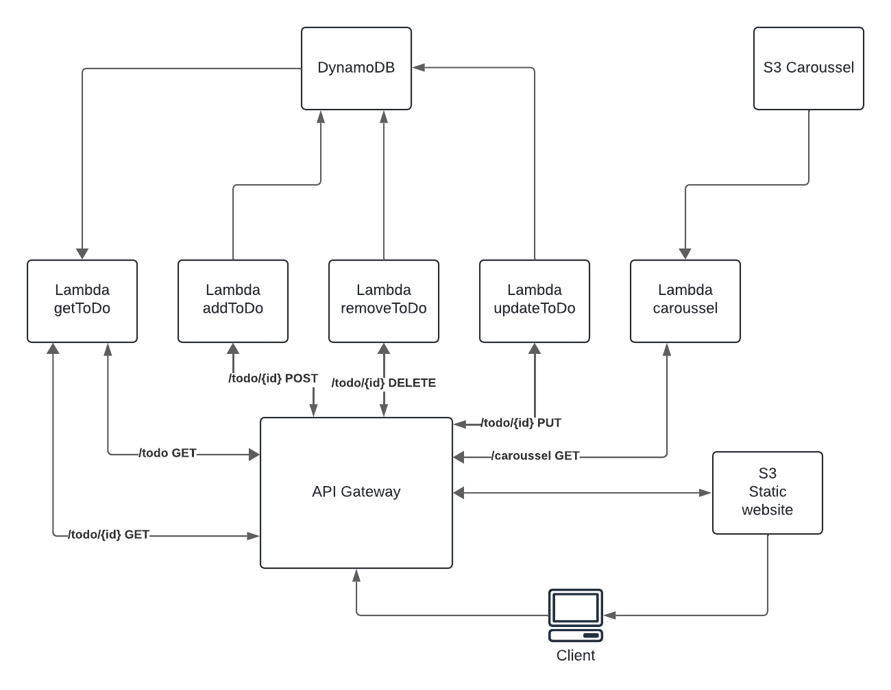

# sequelize

## setting up the VPC

- CIDR: 10.0.0.0/16
- 2 availability zone's

vpc id: vpc-028abc983314278c5

eerst op de subnet auto-assign public ip address aan zetten!

Maak een route aan voor de private subnets met cidr 0.0.0.0/0 met als target de igw van de vpc. (anders werkt ssh niet)

## create security groups

### voor de front en backend machines in- en outbound (cloudpe-sg)

- allow http en https
- allow ssh anywhere
- zet poort 8090 open voor backend
- zet poort 3306 open voor sec group van de db


## setting up the ec2's

### creating keypair

```bash
aws ec2 create-key-pair --key-name cloud --query 'KeyMaterial' --output text > cloud.pem
```

### creating ec2's

```bash 
aws ec2 run-instances --image-id <imageid> --instance-type t2.micro --key-name cloud --security-group-ids sg-0a1eeb87cc4074f55 --subnet-id <subnetid> --tag-specifications 'ResourceType=instance, Tags=[{Key=Name, Value=ec2-name}]' --count 1
```


- install docker and docker compose on machine
- pull repo with docker files
- make image
- maak nu de front en backend instances met de juiste subnet id's en de juiste security group.
- maak 2 elastic ip's voor de backend instance en de bastion host
- splits de docker compose files op
- add restart: always

frontend compose file:
```bash
version: "3.7"
services:
  frontend:
    build:
      context: ./frontend
      args:
        - APIURL=http://52.87.131.149:8090
    ports:
      - 80:80
    restart: always
```

backend compose file:
```bash
version: "3.7"
services:
  backend:
    build:
      context: ./backend
    ports:
      - 8090:8080
    environment:
      - PORT=8080
      - DBURL=mysql
      - DBUSER=root
      - DBPASSWORD=password
      - DBDATABASE=todo
      - DBPORT=3306
    depends_on:
      - mysql
    restart: always
      
  mysql:
    image: mysql:latest
    ports:
      - 3306:3306
    command: --init-file /data/application/init.sql
    volumes:
      - ./backend/init.sql:/data/application/init.sql
    environment:
      MYSQL_ROOT_PASSWORD: password
    restart: always
```

## setting up the RDS

Create RDS:
- Engine type: MySQL
- Template: free tier
- instance identifier: myapp-db
- auto generate password
- Allocated storage: 20
- VPC: MyApp-VPC
- initial db name: todo

master password: 
master username: admin

change the compose file in the backend instance:

```bash
version: "3.7"
services:
  backend:
    build:
      context: ./backend
    ports:
      - 8090:8080
    environment:
      - PORT=8080
      - DBURL=myapp-db.cvwym2aqwtqj.us-east-1.rds.amazonaws.com
      - DBUSER=admin
      - DBPASSWORD=2GlhoROAII2htPaweHqw
      - DBDATABASE=todo
      - DBPORT=3306
    restart: always
```


## S3 bucket

### Create bucket

```bash
aws s3api create-bucket --bucket pe-bucket-11904402 --region us-east-1
```

install nodejs and the aws sdk

```bash
sudo yum install nodejs
```

```bash
npm install aws-sdk
```

geef de instances de IAM role "LabInstanceProfile"

in carrousel.routes.js
```bash
const express = require('express');
const carrouselRouter = express.Router();

const AWS = require('aws-sdk');
const s3 = new AWS.S3({
    accessKeyId: process.env.AWS_ACCESS_KEY,
    secretAccessKey: process.env.AWS_SECRET_KEY,
    region: 'us-east-1',
});

carrouselRouter.get('', (req, res) => {
    const params = {
        Bucket: 'pe-bucket-11904402',
    };

    s3.listObjectsV2(params, (err, data) => {
        if (err) {
            console.error(err);
            return res.status(500).json({ error: 'Internal Server Error' });
        }

        const jpgImages = data.Contents.filter((obj) => {
            return obj.Key.endsWith('.jpg');
        });

        const images = jpgImages.map((obj) => {
            const url = s3.getSignedUrl('getObject', {
                Bucket: params.Bucket,
                Key: obj.Key,
                Expires: 60,
            });
            return { url };
        });

        res.json(images);
    });
});

module.exports = carrouselRouter;

```

## setting up the loadbalancer

### enable docker service on back and frontend machine
```bash
sudo systemctl enable docker
sudo systemctl start docker
```

### create an AMI of both instances
```bash
aws ec2 create-image --name backend-image --instance-id i-0aa2a17c088e33b78
aws ec2 create-image --name frontend-image --instance-id i-0e6e4b5ca3223e8ee
```

### create target group
- target type: instances
- target group name: backend-tg
- protocol: http on port 8090
- VPC: MyApp-VPC
- select MyBack-End en MyBack-End2 instances

### create the loadbalancer
- name: backend-lb
- VPC: MyApp-VPC
- Mappings: de 2 subnets dat gelinkt zijn aan onze 2 backend instances
- security groups: cloudpe-sg
- listener op port 80 forward het naar de backend-tg target group.

### create target group
- target type: instances
- target group name: frontend-tg
- protocol: http on port 80
- VPC: MyApp-VPC
- select MyFront-End en MyFront-End2 instances

### create the loadbalancer
- name: frontend-lb
- VPC: MyApp-VPC
- Mappings: de 2 subnets dat gelinkt zijn aan onze 2 frontend instances
- security groups: cloudpe-sg
- listener op port 80 forward het naar de frontend-tg target group.

nu kan je de site bezoeken met de dns naam van de frontend-lb: lb-frontend-1370162221.us-east-1.elb.amazonaws.com

## setting up autoscaling

### create launch template for the frontend

- name: frontend-lt
- auto scaling guidence is checked
- ami: frontend-image
- instance-type: t2.micro
- key pair: cloud
- subnet: dont include in launch template
- security-goup: cloudpe-sg

### create auto scaling group for the frontend

- name frontend-asg
- launch-template: frontend-lt
- VPC: MyApp-VPC
- AZ & subnets: 2 public subnets
- attach frontend-tg
- desired capacity: 1
- minimum capacity: 1
- maximum capacity: 5
- tags:
  - Key: name
  - value: frontend

### create launch template for the backend

- name: backend-lt
- auto scaling guidence is checked
- ami: backend-image
- instance-type: t2.micro
- key pair: cloud
- subnet: dont include in launch template
- security-goup: cloudpe-sg

### create auto scaling group for the backend

- name backend-asg
- launch-template: backend-lt
- VPC: MyApp-VPC
- AZ & subnets: 2 private subnets
- attach backend-tg
- desired capacity: 1
- minimum capacity: 1
- maximum capacity: 5
- tags:
  - Key: name
  - value: backend

nu staan er minimum 2 machines voor frontend en 2 voor backend aan

# Serverless Backend

## Lambda

### every function

- author from scratch
- x86_64
- execution role: use an existing role -> labrole
- after adding the code deploy

### create function addToDO

```bash
import { DynamoDBClient, PutItemCommand  } from "@aws-sdk/client-dynamodb";
import { marshall, unmarshall } from "@aws-sdk/util-dynamodb"
import  { randomUUID } from "crypto";
/*
Function that handles adding a todo object to DynamoDB.
Todo object must have a _id property as a primary key. They also have the properties
title (string), label (string) and completed (boolean).

Make sure the DYNAMOTABLENAME and region are set correctly.
Make sure the Lambda has the correct execution role(s)
*/
export const handler = async(event) => {
    console.log('Received event:', JSON.stringify(event, null, 2));
    
    const DYNAMODBTABLENAME = 'todo';
    let body;
    let statusCode = '200';
    const headers = {
        'Content-Type': 'application/json',
        "Access-Control-Allow-Headers" : "*",
        "Access-Control-Allow-Origin": "*",
        "Access-Control-Allow-Methods": "*"
    };
    const client = new DynamoDBClient({ region: 'us-east-1' });
    
    try{
        const item = JSON.parse(event.body);
        if(!item.title || !item.label)
            throw new Error("Missing title or label property");
        const postInput = {
                TableName: DYNAMODBTABLENAME,
                Item: {
                    _id: {S: randomUUID()},
                    title: {S: item.title},
                    label: {S: item.label},
                    completed: {BOOL: item.completed}
                }
              }
    
        const Putcommand = new PutItemCommand(postInput);
        const putResponse = await client.send(Putcommand);
        body = unmarshall(postInput.Item);
    }catch(err){
        statusCode = '400';
        body = err.message;
    }finally{
        body = JSON.stringify(body);
    }
        
    return {
        statusCode,
        body,
        headers,
    };
};
```

### create function carrousel

```bash
import {
    S3Client,
    GetObjectCommand,
    ListObjectsV2Command,
  } from "@aws-sdk/client-s3";
import { getSignedUrl } from "@aws-sdk/s3-request-presigner";
/*
Function that reads the contents from an S3 bucket and returns all object urls.
*/
  
export const handler = async(event) => {
    console.log('Received event:', JSON.stringify(event, null, 2));
    
    const bucketName = 'carrousel';
    let body;
    let statusCode = '200';
    const headers = {
        'Content-Type': 'application/json',
        "Access-Control-Allow-Headers" : "*",
        "Access-Control-Allow-Origin": "*",
        "Access-Control-Allow-Methods": "*"
    };
    

    try{
        const client = new S3Client({});
    
        const command = new ListObjectsV2Command({
            Bucket: pe-bucket-11904402 ## change bucket name to your bucket
        });
        
        const result = await client.send(command);
        
        const publicUrls = await Promise.all(
            result.Contents
                .filter(obj => obj.Size > 0) // exclude zero-byte objects (directories)
                .map(async obj => {
                    const getObjectCommand = new GetObjectCommand({ Bucket: bucketName, Key: obj.Key });
                    const url = await getSignedUrl(client, getObjectCommand, { expiresIn: 3600 });
                    return {url:url};
            })
        );
        body = publicUrls;

        
    }catch(err){
        statusCode = '400';
        body = err.message;
    }finally{
        body = JSON.stringify(body);
    }
    
    return {
        statusCode,
        body,
        headers,
    };
};
```

### Create function getToDo

```bash
import { DynamoDBClient, ScanCommand, GetItemCommand  } from "@aws-sdk/client-dynamodb";
import { unmarshall } from "@aws-sdk/util-dynamodb"
/*
Function that handles getting all todo objects or get a single todo object if the id is provided as
a parameter in the API route.

Make sure the DYNAMOTABLENAME and region are set correctly.
Make sure the Lambda has the correct execution role(s)
*/

export const handler = async(event) => {
    console.log('Received event:', JSON.stringify(event, null, 2));
    console.log('any params: ', event.id);
    const DYNAMODBTABLENAME = 'todo';
    let body;
    let statusCode = '200';
    const headers = {
        'Content-Type': 'application/json',
        "Access-Control-Allow-Headers" : "*",
        "Access-Control-Allow-Origin": "*",
        "Access-Control-Allow-Methods": "*"
    };
    const client = new DynamoDBClient({ region: 'us-east-1' });
    
    try{
        let command;
        
        if(event.pathParameters && event.pathParameters.id){
            // if the event.id is set, only get one item
            const params = {
                TableName: DYNAMODBTABLENAME,
                Key: {
                    _id: {S: event.pathParameters.id}
                }
            };
            command = new GetItemCommand(params);
        }else{
            // Otherwise get all the items
            const params = {
                TableName: DYNAMODBTABLENAME
            };
            command = new ScanCommand(params);
        }
        const response = await client.send(command);
        
        let itemObjects;
        if(response.Items){
            itemObjects = response.Items.map(item => {
            return unmarshall(item);
            });
        }else{
            itemObjects = unmarshall(response.Item);
        }

        body = itemObjects;
        
    }catch(err){
        statusCode = '400';
        body = err.message;
    }finally{
        body = JSON.stringify(body);
    }
        
    return {
        statusCode,
        body,
        headers,
    };
};
```

### create function removeToDo

```bash
import { DynamoDBClient, DeleteItemCommand    } from "@aws-sdk/client-dynamodb";
import { marshall, unmarshall } from "@aws-sdk/util-dynamodb"
/*
Function that handles deleting an object in DynamoDB based on the id provided in the url
a parameter in the API route.

Make sure the DYNAMOTABLENAME and region are set correctly.
Make sure the Lambda has the correct execution role(s)
*/
export const handler = async(event) => {
    console.log('Received event:', JSON.stringify(event, null, 2));
    
    const DYNAMODBTABLENAME = 'todo';
    let body;
    let statusCode = '200';
    const headers = {
        'Content-Type': 'application/json',
        "Access-Control-Allow-Headers" : "*",
        "Access-Control-Allow-Origin": "*",
        "Access-Control-Allow-Methods": "*"
    };
    const client = new DynamoDBClient({ region: 'us-east-1' });
    
    try{
        let itemId;
        if(event.pathParameters && event.pathParameters.id){
            // Todo check if the item exists, if not error
            itemId = event.pathParameters.id;
        }else{
            throw new Error("No id provided");
        }
        const params = {
                TableName: DYNAMODBTABLENAME,
                Key: {
                    _id: {S: itemId},
                }
              }
    
        const command = new DeleteItemCommand(params);
        const response = await client.send(command);
        console.log(response);
        body = { success: true };
        
    }catch(err){
        statusCode = '400';
        body = err.message;
    }finally{
        body = JSON.stringify(body);
    }
        
    return {
        statusCode,
        body,
        headers,
    };
};
```

### create function updateToDo

```bash
import { DynamoDBClient, UpdateItemCommand   } from "@aws-sdk/client-dynamodb";
import { marshall, unmarshall } from "@aws-sdk/util-dynamodb"
import  { randomUUID } from "crypto";
/*
Function that handles updating an object in DynamoDB based on the id provided in the url
a parameter in the API route.

Make sure the DYNAMOTABLENAME and region are set correctly.
Make sure the Lambda has the correct execution role(s)
*/
export const handler = async(event) => {
    console.log('Received event:', JSON.stringify(event, null, 2));
    
    const DYNAMODBTABLENAME = 'todo';
    let body;
    let statusCode = '200';
    const headers = {
        'Content-Type': 'application/json',
        "Access-Control-Allow-Headers" : "*",
        "Access-Control-Allow-Origin": "*",
        "Access-Control-Allow-Methods": "*"
    };
    const client = new DynamoDBClient({ region: 'us-east-1' });
    
    try{
        const item = JSON.parse(event.body);
        if(!item.title || !item.label)
            throw new Error("Missing title or label property");
        if(event.pathParameters && event.pathParameters.id){
            // Todo check if the item exists, if not error
            item._id = event.pathParameters.id;
        }else{
            throw new Error("No id provided");
        }
        const params = {
                TableName: DYNAMODBTABLENAME,
                Key: {
                    _id: {S: item._id},
                },
                UpdateExpression: "set title = :t, label = :l, completed = :c",
                ExpressionAttributeValues: {
                    ":t": {S: item.title},
                    ":l": {S: item.label},
                    ":c": {BOOL: item.completed}
                },
                ReturnValues: "ALL_NEW"
              }
    
        const command = new UpdateItemCommand (params);
        const response = await client.send(command);
        body = unmarshall(response.Attributes);
        
    }catch(err){
        statusCode = '400';
        body = err.message;
    }finally{
        body = JSON.stringify(body);
    }
        
    return {
        statusCode,
        body,
        headers,
    };
};
```

## DynamoDB

### Create table

- table name: todo
- partition key: _id (te vinden in code van lambda)

## API Gateway

### create API

- create public REST API 
- new API
- API name
- endpoint type: regional

### Create resource

- resource name:
    - carrousel
    - todo
- enable CORS 

### Create Method

- Method type (lambda function)
    - /todo
        - GET (getToDo)
        - POST (addToDo)
        - /{id}
            - PUT (updateToDo)
            - DELETE (removeToDo)
            - GET (addToDo)
    - /carrousel
        - GET (carrousel)

- enable Lambda proxy integration
- select the lambda function

### Deploy API

- new stage
- stage name: v*

# Serverless Frontend

## create a bucket

```bash
aws s3api create-bucket --bucket serverless-bucket-11904402 --region us-east-1
```

### Enable static site hosting

```bash
aws s3 website s3://serverless-bucket-11904402 --index-document index.html
```

### disable block all public access setting

```bash
aws s3api put-public-access-block --bucket serverless-bucket-11904402 --public-access-block-configuration "BlockPublicAcls=false,IgnorePublicAcls=false,BlockPublicPolicy=false,RestrictPublicBuckets=false"
```

### add a new policy to bucket

- go into the bucket
- select the permissions tab
- Edit bucket policy

```bash
{
    "Version": "2012-10-17",
    "Statement": [
        {
            "Sid": "PublicReadGetObject",
            "Effect": "Allow",
            "Principal": "*",
            "Action": "s3:GetObject",
            "Resource": "arn:aws:s3:::serverless-bucket-11904402/*"
        }
    ]
}
```

### redirect error page to index.html

- go into the bucket
- select the properties tab
- edit static website hosting section
- Error document: index.html

## build the frontend

```bash
np build
```
upload the files in the dist/ folder to the bucket

## architecture diagram for serverless





# Monitoring

- Create a dashboard in CloudWatch
- add Metrics

## Loadbalancer metrics

- Line metric
- ApplicationELB
- TargetGroup
- select the backend-tg and the frontend-tg

## API Gateway metrics

- Number metric
- ApiGateway
- By Stage
- select latency and 4XXError

## Database metrics

- Number metric
- RDS
- DBInstanceIdentifier
- select FreeStorageSpace from myapp-db

## autoscaling mertics

- Line metric
- EC2
- By Auto Scaling Group
- Select StatusCheckFailed from the front- and backend-asg
