# kernel
### **Linux virtual memory**
when a linux program allocates memory, this is just an entry in a table of the OS. it is virtual

Only when the program actually accesses the memory is the RAM for it found and used.

"memory usage" of a process can mean two things:
 - how much virtual memory it uses overall
 - how much actual or "resident" memory it uses, limited to the system's resident RAM capacity.

### **linux kernel**
Core component of the linux operating system

Responsible for managing system resources, providing low-level services to other parts of the operating systems, and controlling hardware services.

### **linux kernel: Monolithic and Modular**
Typically described as **monolithic**
 - All system-level services are contained within a single executable file
 - Benefits of monolithic design: improved performance and symplified system management.

The kernel also includes a **modular** design
 - certain features can be compiled as loadable kernel modules
 - Modules can be dynamically loaded or unloaded at runtime
 - Provides greater flexibilty and allows for customization
 - example: adding support for a particular hardware device or file system
    - Developers can experiment with new features without commiting to the main kernel source code
    - if a new feature proves useful and stable, it can be integrated into the main kernel codebase
 - Modular design allows for greather customization and flexibility

 ### **Features and services of the linux kernel**
 - **process management**: The kernel manages all running processes on the system, allocating resources and scheduling CPU time.
 - **Memory management**: The kernel is responsible for managing the allocation and deallocation of system memory, as well as implementing virtual memory.
 - **File system management**: The kernel provides the file system interface for managing multiple file systems.
 - **Device management**: The kernel controls access to hardware devices, such as disk drives, network adapters, and input/output devices.
 - **Network management**: The kernel provides the networking sack.

 ### **Linux Kernel Organization**
 Software residing in memory that tells the CPU where to look for its next task

 Acting as a mediator, the kernel manages the hardware and is the primary interface between the hardware and any running program.

 processes, managed by the kernel, make up user space.

### **User space and user processes**
the kernel runs in kernel mode, and the user processes run in user mode.

**user space**:
 - User mode restricts access to a small subnet of memory and safe CPU operations.
 - User space refers to the parts of main memory that the user processes can access. if a process makes a mistake and crashes, the consequences are limited and can be cleaned up by the kernel

**kernel space**:
 - Code running in kernel mode has unrestricted access to the processor and main memory.
 - This is a powerfull but dangerous privilege that allows the kernel to easily corrupt and crash the entire system.
 - The memory area that only the kernel can access is called kernel space.

### **Linux virtual file system**
VFS provides unified view of file system to apps & kernel.

Abstracts underlying file system details for consistent interface.

File systems mounted at specific mount points in file system hierarchy.

VFS caches recently accessed files/directories in memory for performance improvement.

supports various file system types: local, network, special.
 - procfs: virtual view of running system, allows access/modification of system info & config parameters.
 - sysfs: virtual view of system's hardware devices & drivers, allows view/modification of device attributes & settings.

Provides flexible & extensible framework for managing files/directories in various file system tymes & locations.

### **Process Management**
Starting, pausing, resuming, scheduling, and terminating of processes.

Each process uses the CPU for a small fraction of a second, then pauses; then another process uses the CPU for another small fraction of a second; then another process takes a turn, and so on.

**Context switch**: The act of one process giving up control of the CPU to another process.

**Time slice**: each piece of time gives a process enough time for significant computation.

The linux kernel also provides system calls for managing processes, such as creating new processes, changing process priority, and terminating processes.

### **Linux processes (minder belangrijk)**

A process is an instance of a program that is currently executing.

Each process has its own memory space, program code and execution context, including program counter, stack and other registers.

Processes can communicate with each other using various interprocess communication mechanisms, such as pipes, sockets and shared memory segments.

Processes are created using the fork system call, which creates a new process by duplicating the current process.:
 - The new process is called the child process, and it has its own unique process ID
 - The fork system call creates a copy of the parent process, including its memory and state, and then sets the PID of the child process to a new value.
 - The child process can then execute a new program of perform other tasks independently of the parent process.

Processes can also be created using other system calls, such as exec, which replaces the current process with a new program, or clone, which create a new process with shared memory and oter resources. 

### **Types of linux processes**
**Init process**: The "init" process is the first process that gets started when the linux operating system boots up, and it becomes the parent process for all other processes.

**Parent and Child Processes**: Each user process has a parent process in the system, with most commands having a shell as their parent.

**Orphan processes**: When a child process is killed or terminated, the parent process is updated about it through the SIGCHLD signal. But, when the parent process is killed before the termination of the child process, the child process becomas an orphan process with "init" process as its new PID

**Zombie processes**: A process which is killed but still shows its entry in the process status or the process table is called a zombie process, they are dead and are not used.

**Daemon processes**: Daemon processes are system-related background processes that run with root permissions and wait for requests from the other processes. They often run in the background and can work with other processes. Examples include print daemon.

### **Processs states $ signals**
Linux signals are a form of interprocess communication (IPC) used to notify a process of an event or condition.

Signals can be sent to a process by another process, by the kernel, or by the process itself.

Each signal has a unique number that identifies it, such as SIGTERM for termination or SIGKILL for immediate termination.

Signals can be sent using the kill command, the kill system call, or other IPC mehcanisms such as pipes or sockets.

When a process receives a signal, it can either ignore the signal, handle the signal, or perform the default action associated with the signal.

The signal system call allows a process to specify a custom signal handler function to be executed when a particular signal is received.

Some common use cases for signal include graceful termination of a process, handling user interrupts, and sending status updates between processes.

### **fork() and exec()**
**fork()**
 - Fork is a clone operation, it takes the current process, also called the parent process, and it clones it in a new process with a brand new process ID.
 - when forking, everything is copied from the parent process: the stack, the heap, but also the file descriptors meaning the standard input, the standard output and the standard error.
 - it means that if my parent process was writing to the current shell console, the child process will also write to the shell console.

**exec()**
 - the execute operation is used onlinux to replace the current process image with the image from another process.

### **Shell command execution**
A shell console is a process that waits for input from the user.

It also launches a bash interpreter when you hit Enter and it provides an environment for your commands to run.

When you type a command and hit enter, the shell is forked to a child process that will be responsible for running your command. The shell will wait patiently until the execution of the child process finishes.

On the other hand, the child process is linked to the same file descriptors and it may share variables that were declared on a global scope.

The child process executes the "exec" command in order to replace the current process image in the process image of the command you are trying to run.

The child process will eventually finish and it will print its result to the standard output it inherited from the parent process, in thi case the shell console itself.

### **Kernel: Process management -context switching**
1. The CPU interrupts the current process based on an internet timer, switches into kernel mode, and hadns control back to the kernel.

2. The kernel records the current state of the CPU and memory, which will be essential to resuming the process that was just interrupted.

3. The kernel performs any tasks that might have come up diring the preceding time slice (such as collecting data form input and output, or I/O operations)

4. The kernel is now ready to let another process run The kernel analyzes the list of processes taht are ready to run and chooses one.

5. the kernel prepares the memory for this new process and then prepares the CPU.

6. The kernel tells the CPU how long the time slice for the new process will last.

7. The kernel switches the CPU into user mode and hands control of the CPU to the process

The context switch answers the important questions of when the kernel runs. The answer is that it runs between process time slices during a context switch.


### The linux scheduler

Responsible for deciding which process to run next.

The scheduler uses a variety of factors to make informed decisions, including process priorities, CPU utilization, process states, and scheduling classes.

Each process is assigned a priority value, which ranges from -20 (highest priority) to 19 (lowest priority)

The scheduler uses a priority-based scheduling algorithm, but also takes into account other factors to ensure that system resources are used efficiently.

The scheduler can dynamically adjust priorities based on system load and other factors, e.g. process affinity and process real-time constraints.

linux supports multiple scheduling classes, each with its own scheduling algorithm, to optimize performance for different types of workloads.

The Completely Fair Scheduler (CFS) is the default scheduler in most linux distributions, wich uses a fairness algorithm to ensure that all processes receive an equal share of the CPU time.

### **Completely fair scheduler**
Linux scheduler manages groups of threads, multi-threaded processes, and all the processes of a given user.

Tasks are grouped and managed by scheduler as schedulable entities.

Each per-CPU run queue of processes sorts schedulable entities structures in a time-ordered fashion into a red-black tree.

The leftmost node in the tree is occupied by the entity that has received the least slice of execution time, indexed by processor "execution time" in nanoseconds.

When the scheduler is invoked to run a new process, it selects the leftmost node in the scheduling tree to execute.

Each process has a "maximum execution time" that represents the time the process would have expected to run on an "ideal processor"

when a process is stopped or reaches its maximum execution time, it is reinserted into the scheduling tree based on its newly spent execution time

The new leftmost node is selected from the tree for execution

if a process spends a lot of its time sleeping, its spent time value is low , and it automatically gets the priority boost when it finally needs it.

### **Linux threads**
Threads are lightweight execution contexts that share memory and code within a parent process.

For example, in a browser, multiple tabs can be different threads.

Each thread has its own stack and program counter, but all threads within a process share the same heap and global variables.

Threads allow a program to perform multiple tasks simultaneously.

Threads within a process can communicate within each other using shared memory or other IPC mechanisms.

Threads can synchronize their actions using mutexes, semaphores, and other synchronization primitives.

**Advantages**

**Responsiveness**: if the process is divided into multiple threads, if one thread completes its execution, then its output can be immediately returned.

**Faster context switch**: context switch time between threads is lower compared to process context switch. Process context switchin requires more overhead from the CPU.

**Effective utilization of multiprocessor system**: if we have multiple threads in a single process, then we can schedule  multiple threads on multiple processors.

**Resource sharing**: Resources like code, data, and files can be shared among all threads within a process.

**Communication**: Communication between multiple threads is easier, as the threads shares common address space, Processes require Inter-Process Communication (IPC) techniques.

### **Interrupts in Linux**
Signal emitted by hardware or software when a process or an event needs immediate attention.

Interrupts can be generated by 3 sources: Hardware, processor and software

Interrupts cause the CPU to switch to calling the interrupt handler

The interrupt handler in a software routine that performs a specific task, such as reading data from a hardware device or notifying the kernel of a user input event.

Interrupts in linux are managed by the Interrupt Service Routine (ISR) and the Interrupt Request (IRQ) subsystem.

The ISR is invoked to handle the interrupt, and the corresponding IRQ number is passed to the ISR.

The Linux kernel supports interrupt coalescing, combining many interrupts into one, which reduces the overall overhead of handling interrupts.

### **sockets**
Linux sockets are a type of file descriptor that allow processes to communicate with each other over a network between processes on the same system.

The socket mechanism provides a means of inter-process communication (IPC) by establishing named contact points between which the communication take place and provide a standardized way to send and receive data between processes or between a process and a network service.

Sockets can be created and managed using various system calls and APIs, such as socket(), bind(), listen(), accept(), send() and recv().

The socket API is implemented in the linux kernel and is used by many network services and applications.

Sockets are widely user for various network protocols, such as TCP/IP, UDP, and Unix domain sockets.

**what are sockets used for**

Socket are generally employed in client-server applications
 - the server creates a socket, attaches it to a network port addresses then waits for the client to contact it.
 - the client creates a socket and then attempts to connect to the server socket.
 - When the connection is established, transfer of data takes place.

 **practically**

 A socket connecting to the network is created at each end of the communication
 
 Each socket has a specific address, composed of an IP address and a port number.

# Routing
### **terminologie**
**Routing** is the process of selecting a path for traffic in a network or between or across multiple networks.

**Packet forwarding** is the transit of network packets from one network interfce to another.

The routing process usually directs forwarding on the basis of **routing tables**. Routing tables maintain a record of the routes to various network destinations.

**IP routing** assumes that network addresses are structured and that similar addresses imply proximity within the network. Structured addresses allow a single routing table entry to represent the route to a group of devices.

Routing has become the dominant form of addressing on the internet.

# Firewalls
### **Functions of a Firewall**
Protects the host system from unauthorized connections.
 - blocks connections to services that should not be public
 - Enables restriction of connections to certain IP address ranges

Rewrites packet headers to route packets between networks.
 - Enables to machine to function as a network router.
 - Most consumer and business "router" devices are just small computers running a firewall with routing capabilities.

### **advanced Firewall functions**
Firewalls may implement additional features
 - Network Address Translation (NAT)
 - Quality of Service (QoS) 

### **iptables and netfilter
iptables is a user space to the linux kernel's netfilter system.

netfilter implements firewall and routing capabilities within the kernel, enabling any Linux machine or device to act as a firewall and/or a router.

### **iptables and netfilter features**
iptables is a user space interface to the linux kernel's netfilter system.
 - listing the contents of the packet filter ruleset
 - adding/removing/modifying rules in the packet filter ruleset
 - listing/zeroing per-rule counters of the packet filter ruleset.

netfilter implements firewall and routing capabilities within the kernel, enabling any linux machine or device to act as a firewall and/or a router.
 - stateless packet filtering
 - stateful packet filtering
 - all kinds of network address and port translation, e.g. NAT
 - flexible and extensible infrastructure
 - multiple layers of API's for 3rd party extensions

### **iptables architecture**
**iptables is the user space interface to the linux kernel firewall.**

iptables service is a systemd service that uses the iptables tool to interact with the kernel netfilter framework.

iptables is a linux user space command line tool that manipulates the IPv4 network packet filtering tables and rules.

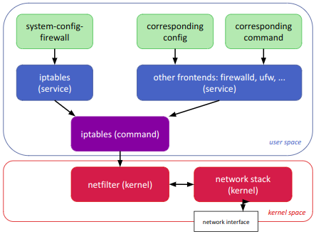

### **nftables**
the netfilter project has created nftables
 - positioned as a replacement for iptables
 - Completely different configuration syntax
 - as of october 2021, nftables is the default firewall backend for Ubuntu

iptables will be available for a long period of time in the future, even if nftables matures.

### **netfilter: how packets are processed
When packets arrive from the network, the netfilter component of the linux kernel recognizes and groups packets into streams or flows.
 - netfilter performs Stateful Packet Inspection (SPI), which analyzes both packet headers and packet contents to track connections

Each packet in a stream is processed by the firewall, with some performance optimizations
 - for example: NAT rules are only determined for the first packet in a stream, then all subsequent packets receive the same processing.

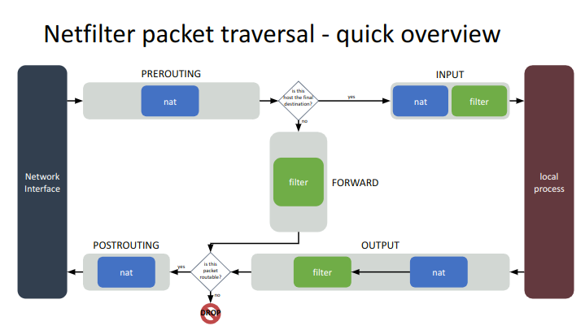

### **Tables**
An iptables table is a data structure that contains a number of chains. Several different tables are defined.

The default table acted upon the tables command is "filter".

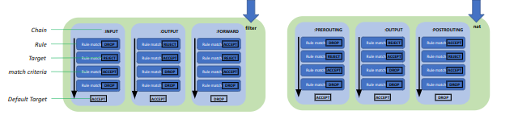

### **Chains**
Once it is decided a packet is matched against a certain table, the packet is matched against rules contained by that tables' chains.
 - Within a chain, a packet starts at the top (or head) of the chain and is matched rule-by-rule
 - When a match is found, processing normally jumps to another chain or target

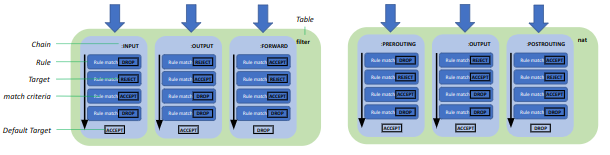

### **stateless vs. stateful firewall**
Stateless firewall
 - packet filtering, usually only in the network layer (OSI). Sometimes there are protocols that are in a higher layer.

Stateful firewall
 - Everything a stateless firewall does
 - Also tracks whether certain packets have been seen before in a given session and applies access policies to packets based on what has already been seen for a given connection.

netfilter/iptables are statefull thanks to the conntrack table

### **Conntrack use cases**
NAT relies on the connection tracking information so that it can stranslate all packets in a flow in the same way
 - e.g. when a pod accesses a Kubernetes service, NAT is used by kube proxy's load balancing to redirect the connection to a particular backend pod.

Stateful firewalls, such as Calico, rely on the connection tracking information to exactly whitelist "response" traffic, once the outgoing connection has been established.

### **Conntrack gebruiken**
Op de router (in het lab, bv op 'web')
 - installeer het package
 ```bash
         sudo apt install conntrack
         sudo yum install conntrack
      sudo conntrack -L
      sudo conntrack -L --src-nat
      man conntrack
 ```

### **Default packet-filtering policy**
Een firewall is een device om access control policies te implementeren

Je hebt 2 basis manieren om de default policy van je firewall te configureren
 - Default DENY en dan specifieke pakketten toelaten
  - meest aanbevolen aanpak
  - Gemakkelijker om een veilige firewall op te zetten
  - Je moet wel het communicatie protocol voor elke service die je wilt toelaten begrijpen
  - Meer werk om op te zetten
 - Default ACCEPT en dan specifieke pakketten weigeren
  - Gemakkelijker om initieel op te zetten
  - Je moet er aan denken om elke service die geinstalleerd wordt te blokkeren tegen misbruik
  - Configuratie en onderhoud is meer werk
  - minder veilig

# NFS
### **Network File System (NFS)**
Network File System (NFS)

Protocol voor een gedistribueerd file system

Client computer kan via een netwerk toegang krijgen tot remote file systemen (exports) via een local mount point.

Internet standaard

ook ingebouwd in Windows Server

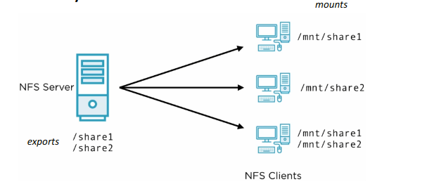

### **NFS architecture**
Linux virtual file system (vfs)
 - software layer in the kernel that provides the filesystem interface to user space programs
 - also provides an abstraction layer within the kernel which allows different filesystem implementations to coexist

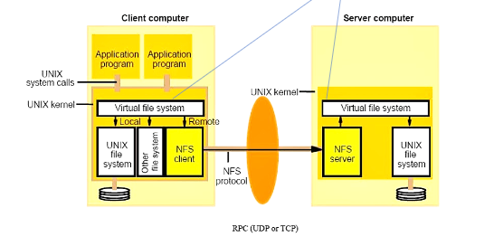

### **NFS Networking**
NFSv3
 - UDP / dynamic ports
 - sneller - interessant in low-latency, super-reliable netwerken
 - makkelijker om op te zetten

NFSv4
 - TCP/2049
 - more reliable
 - meer security features zoals Kerberos support
 - file locking support
 - complex

### **NFS Server configuration**
exports
 - shared directory resources
 - beschreven in /etc/exports:
 - /export  <host>(options)
  - bv /share1 server1.psdemo.local
  - /export    directory die geshared wordt
  - <host>     host of network die access hebben tot deze export
  - (options)  opties voor die host/network

exportfs - commando om runtime config tabel van exported file systems te maintainen
 - /var/lib/nfs/etab - runtime configuratie van de exports

### **NFS File Security**
default: UID/GID security model met AUTH_SYS RPC calls

gevaarlijk: UIDs en GUID kunnen overlappen

Werkt goed met centralized authentication server

root? (UID 0)
 - root_squash enabled by default

### **clustering begrippen**
**quorum**: meer dan de helft van de nodes vormt een quorum of absolute meerderheid. De cluster is available zolang de available nodes quorum hebben.

# Load Balancers
### **state, stateful and determinism**
Stateful systems
 - Designed to remember prior events or user interactions
 - the remembered information is called to state of the system
 - Examples include the TCP protocol, or a stateful inspection firewall that remembers aspects of previous packets to apply customized access policies.

Stateless systems
 - have no state
 - Examples include the HTTP and REST protocols.

Determinism
 - Refers to a system's ability to produce the same output given the same initial conditions
 - A deterministic algorithm that, given a certain input, always produces the same output, with the underlying machine going through the same sequence of states.
 - The output of deterministic computer program is always determined by the inputs and the state of the program.

### **Finite state machine (FSM)**
Abstract machine used to illustrate algorithms, systems, or protocols

can be in exactly one of a finite number of states at any given time

can transition from one state to another in response to certain inputs

Defined by:
 - A list of states
 - the initial state
 - the inputs that trigger each transition

Can be described using:
 - a state diagram
 Optionally, a state transition diagram.

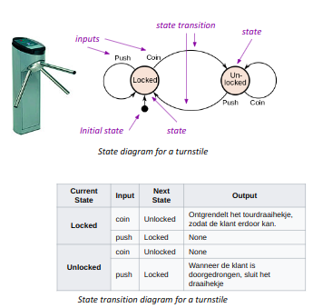

### **REST - REpresentional State Transfer (stateless)
**stateless** betekent dat het aan de cient is om er voor te zorgen dat alle vereiste informatie aan de server wordt gegeven met elke request

Software architecture style that uses a subset of HTTP

Comoonly used to create interactive applications that rely on web services

A web service that follows these guidelines is known as a RESTful web service
 - offers web resources in a textual format
   - Allows them to be read and modified using a stateless protocol
 - Facilitates interoperablility between web services
 - Respnds to requests to a URI of a resource with a payload in HTML, XML, JSON, or other formats
   - includes hypertext links in the response to related resources
 - Easy to scale because they are statless
   - Each server can be easily replicated, activated, and ready to handle traffic
   - No internal state to synchronize

**benefits:**
 - Separates client and server responsibilities
 - Improves visibility, reliqbility, and scalability of the application
 - Reduces coupling between systems

**Limitations:**
 - Lack of standardization of error handling
 - Potential for security vulnerabilities if not implemented properly

### **session-based authentication** (statefull)
1. the server creates a session for the user after they succesfully log in.

2. the session ID is then stored in a cookie on the user's browser

3. As long as the user remains logged in, the cookie is sent with each subsequent request to the server.

4. The server compares the session ID from the cookie with the session information stored in its memory and sends an appropriate response.

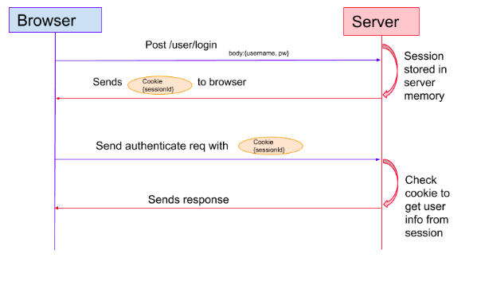

### **Token-based authentication**
Many RESTful web services and web applications use tokens, such as JSON Web Tokens (JWT), for authentication instead of sessions.

1. the server generates a token (e.g., a JWT) with a secret and sends it to the client after succesfull authentication.

2. The client stores the token locally (e.g. in a local storage or as a cookie) that includes it in the header (usually the "Authorization" header) with each subsequent request.

3. The server validates the token with each client request and sends an appropriate response based onthe token's validity.

The use state is not stored on the server but rather within the token on the client-side

Token-based authentication is a popular choice for RESTful API's and single-page applications (SPAs) because it is stateless and easily scalable.

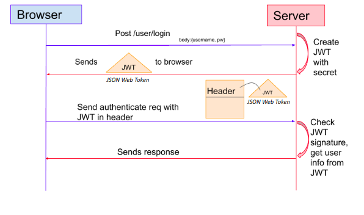

### **Stateless vs Stateful services

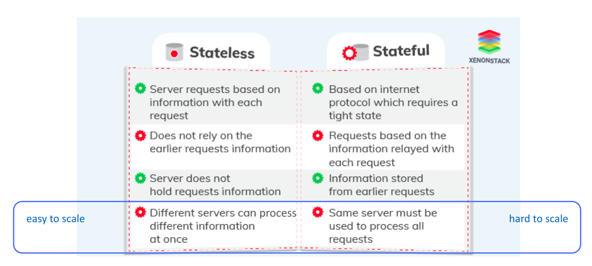

### **Load balancer**
Device or software that distributes a set of tasks across a set of resources to make processing more efficient.

Provides a single internet service from multiple servers, also known as a server farm.

Commonly used in HTTP request management to handle a large number of requests per second

**typical features:**
 - Asymmetric load: a ratio can be manually assigned to allocate a greater portion of the workload to some backend servers than others
   - Distribute 60% of traffic to Server A and 40% to server B
   - Allocate more resources to high-performic servers to handle heavier workloads
 - Priority activation: when the number of available servers falls below a certain threshold or the load becomes too high, standby servers can be brought online.
   - Bring additional servers online automatically during peak traffic hours
   - Increase server capacity diring major promotional events or flash sales
 - Health checking: polls servers to check their application layer health and removes failed servers form the server pool
   - Monitor server health and remove failed or unhealthy servers form the load balancer pool
   - ensure that each server can handle the required number of request and response times before it is added to the server pool.
 - Session persistence - sticky sessions

 ### **Sticky session**
 Feature of Layer 7 load balancers
 
 Incoming requests for a specific session are always directed to the same server

 This can be beneficial for web applications that require persistent user sessions

 Sticky sessions can result in uneven loads across servers

 To avoid this, web services must either be designed to be stateless or session data must be continuously replicated across servers

 Without session stickiness or proper session replication, users may experience interruptions or errors if their session is transferred to a different server in the pool.

### **Reverse proxy**

Service that sits in front of one or more servers, accepting requests from clients for resources located on the servers.

From the client point of view, the reverse proxy appears to be the web server and so is transparent to the remote user.

As all client requests pass through the proxy, it is a perfect point in a network to control traffic while also optimizing performance with compression, encryption offloading and caching.

The reverse proxy is a single point of connection to services, making it an ideal place to manage traffic and improve service quality

Reverse proxies are normally deployed in a highly available configuration to maximize application and service uptime.

This ensures that there is no single point of failure, and that the reverse proxy can continue to operate even if one of its components fails.

**typical features**
 - Compression
   - Compressing server responses before returning them to the client.
   - reduces the amount of bandwith they require
   - speeds their transit over the network
 - SSL termination
   - By decrypting incoming requests and encrypting server responses, the reverse prxy frees up resources on backend servers
 - Caching
   - Before returning the backend server's response to the client, the reverse proxy stores a copy of it locally
   - When the client makes the same request, the reverse proxy can provide the response itself fro mthe cache instead of forwarding the request to the backend server
   - this both decreases response time to the client and reduces the load on the backend server.

A reverse proxy accepts a request from a client, forwards it to a backend origin server that can handle it, and then sends the server's response back to the client. A reverse proxy is often used in combination with a load balancer.

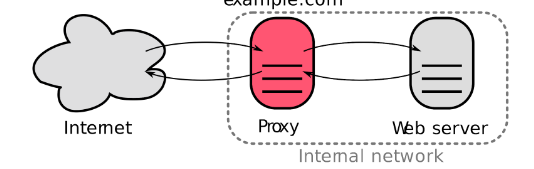

### **Load balancing - OSI layers
Layer4
 - TCP or UDP pakcets
 - routing requests based on commonly used algorithms
 - can scale to handle large volumes of requests

Layer 7
 - Application load balancers
 - Routing decisions based on content of application traffc
 - good couce for a containerized microservices-based architecture

 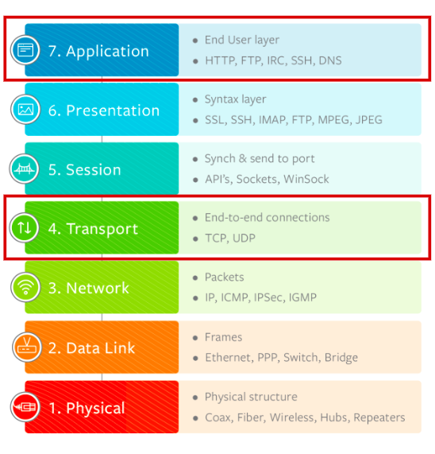

# eBPF
### **what is eBPF?**
"extended Berkeley Packet Filter"

Technology to write costom code that can dynamically change the way the linx kernel behaves

Platform for building a whole new generation of security, observability, and networking tools

Evolved from the BPF wich was originally designed for efficient packet filtering.

Can now be used to instrument almost any part of the linux kernel and user space programs.

### **importance**
Adds new functionality to linux kernel without kernel modules and can be dynamically loaded without rebooting or recompiling kernel.

Can hook anywhere in the kernel to modify functionality

eBPF programs are sandboxed and verified for safety

eBPF programs are compiled into efficient machine code usit JIT compiler, making them high-performance for network packet processing and other performance-critical applications

Widely used in cloud native environments, e.g. for advanced network routing and load balancing in Kubernetes clusters.

### **Components**
Technology that enables custom code to run directrly in the linux kernel

eBPF programs are written in a restricted C-like language and compiled into bytecode that runs in the eBPF virtual machine.

Bytecode is loaded into the kernel and attached to various hooks, such as tracepoints, kprobes, and perf events

eBPF programs are verified by the kernel 'verifier' before loading to ensure they are safe to run.

eBPF programs are run whenever the associated hook is triggered

eBPF programs can interact iwith eBPF maps which are key-value data structures for storing and retrieving data.

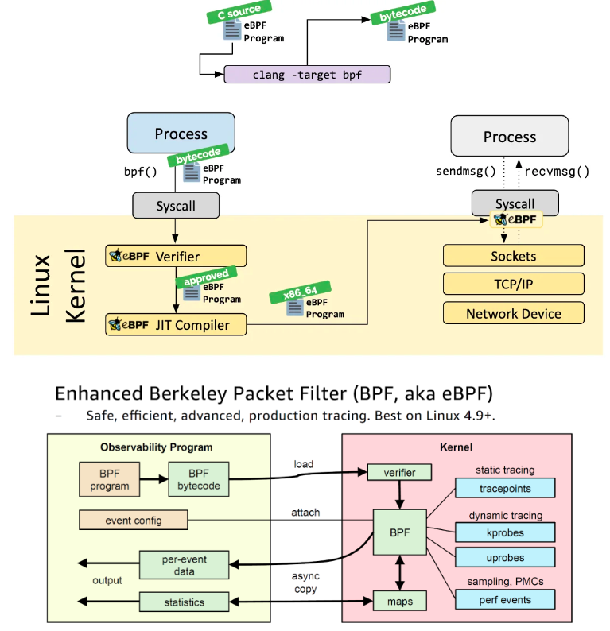

### **Maps**
Key-value data structures that allow eBPF programs to store and retrieve data in the kernel space

"in-kernel database" that can be accessed by eBPF programs

Can be used to share data between different eBPF programs of between eBPF programs and user space applications

### **map types**
**Hash maps:** hash table to store key-value pairs and provide fast access to data.

**Array maps:** contiguous array of elements to store data and are useful for scenarios where the data is accessed sequentially.

**Per-CPU maps:** similar to array maps, but provide a separate array to each CPU core in the system. Useful for scenarios where data needs to be accessed andupdated concurrently by multiple CPU cores.

**LRU maps:** maintain a cache of the most recently used items and can be used to implement caching functionality in eBPF programs.

### **networking**
eBPF can be used to create different types of networking programs that can be intercept and modify network traffic:
 - **XPD(eXpress Data Path)** is an eBPF-based high-performance data path used to send and receive network packets at high rates by bypassing most of the operating system networking stack
   - merged in the linux kernel and licensed under GPL
   - Amazon, Google and Intel support its development
   - Microsoft released XDP for Windows in 2022, licensed under MIT license.

### **tracing**
eBPF can be used to create different types of tracing programs that can capture and analyze system events:
 - **Tracepoints:** These programs are used to trace events that are triggered by the kernel or user space applications.
 - **Kprobes:** These programs are used to trace events that occur within the kernel, such as function calls or variable accesses.
 - **Uprobes:** These programs are used to trace events that occur within user space applications, such as function calls or system calls.


# systemd
### **what is systemd?**
 - open-source software that provides system components for linux
 - main goal: unify service config and behavior across linux distro's
 - provides a system and service manager that runs as PID1 and starts the rest of the system
 - provices replacements for various daemons and utilities, including device management, login management, network connection management, and event logging.

### **Issues with traditional init systems**
**Slow boot times:** limited in their ability to parallelize service startup.

**Service dependencies:** managing dependencies could be complex and error-prone, leading to system instability.

**Limited logging and monitoring:** difficult to diagnose and troubleshoot system issues.

**Inconsistent system behavior:** different Linux Distributions had different init systems.

**Limited security features:** difficult to isolate and protect system processes and resources

### **Advantages**
**Faster boot times** and improved system responsiveness duo to parallelized service startup and dependency management.

**Centralized and unified management of system services, sessions and devices**, making it easier to manage and troubleshoot system issues.

**improved security features**, such as process sandboing and user isolation.

**Extensive logging capabilities** and real-time monitoring of system activity.

### **Disadvantages**
Complexity and steep learning curve due to its extensive features and modular architecture

Resistance from some users and developers who prefer traditional init systems or see systemd as too tightly integrated into the linux ecosystem.

Concerns over system stability and reliability, particularly in the even tof systemd failures or bugs.

over-engineerd?

Limited support for non-Linux platforms.

### **Features**
provides aggressive parallelization capabilities

uses socket and D-Bus activation for starting services

offers on-demand starting of daemons

keeps track of processes using Linux control groups

maintains mount and automount points

implements an elaborate transactional dependency-based service control logic.

includes a logging daemon (journald)

control basic system configuration like the hostname, date,locale

maintain list of
 - logged-in users
 - running containers
 - virtual machines
 - system accounts
 - runtime directories and settings

daemons to manage simple network configuration, network time synchronization, log forwarding and name resolution.

**cgroups** (control groups) is a linux kernel fearture that limits, accounts for, and isolates the resource usage of a collection of processes invented by Google.

### **systemd has PID1**
started by the kernel before all other processes

the first process (PID 1) has a special role in Unix systems: it replaces the parent of a process when the original parent terminates.

parent process for all those other processes that have nobody else as a parent

systemd is a daemon that manages other daemons, which, including systemd itself, are background processes
 - responsible for bringing up and maintaining user space during boot
 - systemd is the first daemon to start during booting and the last daemon to terminate during shutdown
 - for inter-process communication, systemd makes Unix domain sockets and D-Bus available to the running daemons.

 ### **Units**
 systemd units are configuration files that define system resources and services managed by the systemd init system

 systemd supports several types of units, each designed for a specific purpose

 systemd unit files are usually stored in the **/etc/systemd/system/, /lib/systemd/system/ or (/usr)/lib/systemd/system/** directories

 The most common types of systemd units include:
  - Service units: define system services and daemons
  - Target units: define dependencies and groups of services that are started or stopped toghether
  - Timer units: define scheduled tasks and jobs
  - Device units: define hardware devices and their attributes
  - Mount units: define filesystem mounts
  - Socket units: define network sockets

### **timers**
Timers and cron jobs are used to schedule and automate tasks on linux systems
 - systemd timers are more flexible and powerful, with support for more complex scheduling and dependencies
 - Cron jobs are simpler and more widely supported across different linux distributions.

systemd provides its own timer system, which is an alternative to the traditional cron system.

systemd timers are units that define when a certain task should be run.

they are similar to systemd services, ut instead of running a service, they trigger an action or command

Timers can be configured to run once, repeatedly at specific intervals, or at specific times of day.

### **targets**
systemd targets are collections of system services and resources that are needed to achieve a specific system rate, such as multi-user mode or graphical user interface mode.

Target units define groups of services that are started or stopped together.

Like other unit types, targets units have their own unit files with a .target extension. These files contain configuration details, dependenciesn, and relationships with other units.

Target units can have dependencies on other target units, service units, or other types of units, making it easier to manage service startup and shutdown.

Targets are similar to runlevels in traditional init systems, but they are more flexible and powerful.

### **types of targets**

**Basic targets:** These are the most fundamental targets and include boot, shutdown, rescue, and emergency targets.

**Service targets:** These targets start or stop a specific service or group of services.

**Slice targets:** These targets used to group processes based on their resource usage.

**multi-user targets:** These targets provide a full system with a graphical user interface

other target: other targets include network, remote-fs, and time-sync targets.

### **changing targets**
Changing systemd targets can be done using the systemctl command.

To change to a specific target, use the command: systemctl isolate <target_name>

To set a default target for the system, use the command: systemctl set-default <target_name>

The defaut target is the target that the system will boot into.

### **practical targets**
**graphical.target:** represents the runlevel where the system is running with a graphical interface, such as a desktop environment.

**multi-user.target:** Represents a runlevel where system is running in a non-graphical, multi-user mode with networking enabled.

**rescue.target:** Represents a runlevel for performing system mainenance and recovery tasks in single-user mode

**reboot.target:** Represents a runlevel for shutting down and rebooting the system.


# Booting Linux
### **UEFI explained**
Unified Extensible Firmware Interface in short UEFI, is low-level software that starts when you boot your PC or embedded system before booting your operating system. It aims to resolve what BIOS could not.

UEFI is an open, active, universal specification that all major manufacturers adhere to.

A UEFI can:
 - boot from disk larger that 2 TB using GPT
 - provide the user with a graphical user interface.
 - provide extra securtiy, platform independence, consistency, modularity and performance.

UEFI Compatibility Support Module (CSM)
 - Enables an EFI-based computer to use BIOS-mode boot loaders. CSM is often activated in the firmware setup utility by enabling a feature called "legacy mode". BIOS, CSM, and legacy may refer to the same thing.

### **Advantages**
**Secure boot**: enforces signature checking of the boot process.

**GUID Partition table (GPT)**: Support GPT replaces the obsolete Master Boot Recort (MBR) partition scheme.

**Platform and Architecture Independance**: UEFI supports x86, x86_64, ARM, ARM64, POwerPC, Itanuim and other architectures.

**Consistent Variables and Services**: A standardized set of variables, services, and drivers are common to all UEFI implementations regardless of the host device.

**Mudular and Extensible**: UEFI formware modules can be added, removed or updated by vendors and device owners.

**Improved Boot Performance**: UEFI can run in 32-bit or 64-bit mode and has more addressable address space than BIOS, which means your boot process is faster.

## **linux boot process**
Display boot messages
 - By default, many Linux distributions hide boot messages behind a graphical splash screen. To observe the boot messages, you can disable the splash screen temporarily.

Single-user mode (rescue mode)
 - in single-user mode, the system starts with only essential services and drops you into a root shell.

Customize kernel parameters
 - you can customize kernel parameters to fine-tune your system's behavior during boot.
 - For instance, you can enable verbose kernel logging or set specific hardware options. To make these chagnes permanent, edit the bootloader configuration file (e.g. /etc/default/grub for GRUB)

Inspecting systemd configuration
 - For systemd-based systems, the main configuration file is usually located at /etc/systemd/system.conf. system service files are stored in /etc/systemd/system/ and /lib/systemd/system/.

Access system logs
 - once your system has booted, you can review the logs for information about the boot process.

Analyze boot performance
 - the systemd-analyze tool can help you analyze the boot process in systemd-based systems.

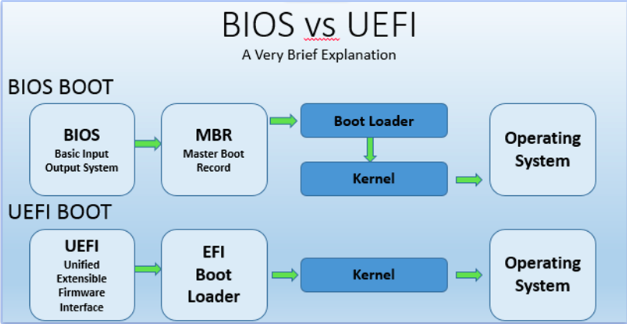


 
 