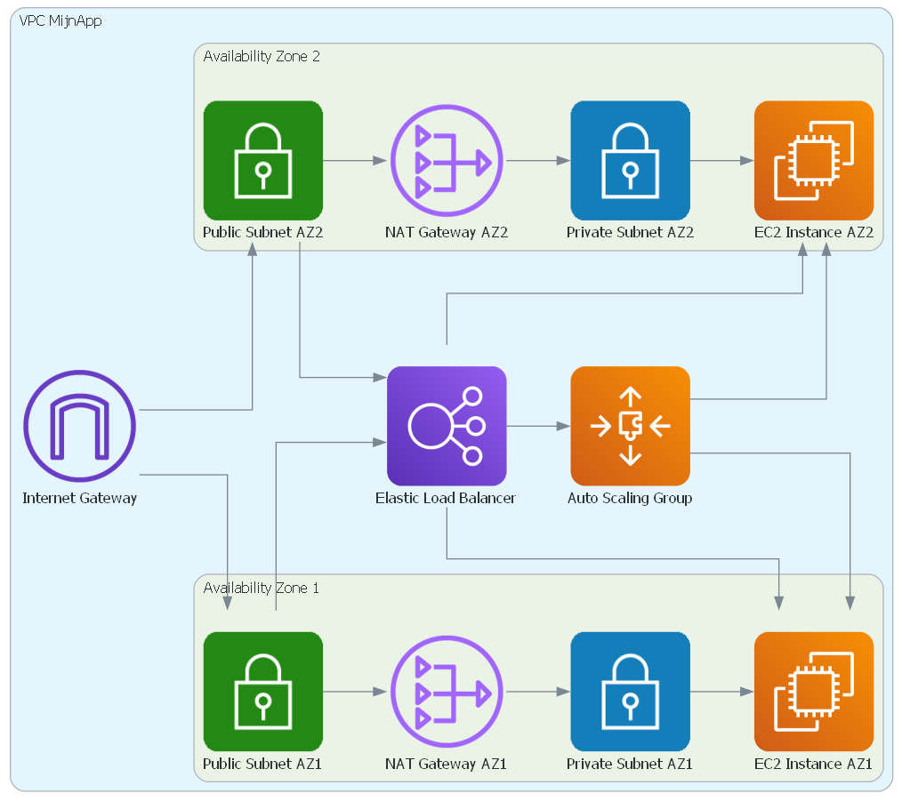

# Automation II - PE1

## Beschrijving

Je gaat onze PXL webapplicatie deployen naar een schaalbare en fouttolerante cloudinfrastructuur met behulp van Terraform. De applicatie moet bereikbaar zijn vanaf één vast IP-adres, terwijl de opzet high-availability en fault tolerance garandeert. Dit wordt gerealiseerd door gebruik te maken van een Elastic Load Balancer (ELB) die verkeer verdeelt over meerdere webservers in verschillende Availability Zones (AZ's).

De webservers moeten zo geconfigureerd worden dat ze de applicatie hosten, waarbij de laatste versie van de code eenvoudig vanaf Git kan worden gedeployed.

## Vereisten

### Standaardopdracht - Minimaal (10 punten)

Gebruik je AWS Academy account en de volgende Git repository voor de applicatie:
[https://github.com/PXL-Automation-II/nodejs-pxl](https://github.com/PXL-Automation-II/nodejs-pxl)

#### Te realiseren doelstellingen:

1. **Werkende webapplicatie**: De applicatie moet volledig functioneren.
2. **High-availability**: De infrastructuur moet fouttolerant zijn. Dit betekent:
    - Minstens twee webservers die achter een Elastic Load Balancer draaien.
    - Webservers verspreid over verschillende Availability Zones (AZ’s) voor redundantie.
    - Verkeer moet via een Load Balancer verdeeld worden over de beschikbare webservers.
3. **Security groups**:
    - Maak twee Security Groups (SG's):
        - Eén voor de Load Balancer.
        - Eén voor de EC2-instances.
4. **Automatisering met Terraform**: Zorg ervoor dat de infrastructuur kan worden opgezet met Terraform en dat je de nodige resources creëert om aan bovenstaande doelstellingen te voldoen.
5. **Output values in Terraform**: Zorg ervoor dat de volgende informatie als output beschikbaar is:
    - IP-adres van de Load Balancer.
    - Beschikbaarheid Zones (naam en status).
    - ARN’s van de Target Group.
    - Subnet ID's.
    - Security Groups (ID en naam).

> Deze vereisten vormen het **minimum** om te slagen in deze opdracht.

---

### Optionele extra's (enkel beoordeeld indien minimum is bereikt)

#### Extra 1: Private Subnets (3 punten)
- Creëer twee **private subnets**, één in elke **Availability Zone** (AZ).
- **Plaats de webservers (EC2-instances)** in deze private subnets. De webservers zijn niet direct via het internet bereikbaar.
- Zorg ervoor dat het verkeer van en naar de webservers verloopt via de **Elastic Load Balancer** (die in een public subnet staat).
- Indien nodig, configureer een **NAT Gateway** in een public subnet zodat de webservers toegang hebben tot het internet voor bijvoorbeeld het klonen van de applicatie vanaf GitHub.
- **Output values**:
    - Subnet ID's van de private subnets.

#### Extra 2: Nieuwe VPC (4 punten)
- Creëer een **nieuwe VPC** die je de tag "MijnApp VPC" geeft.
- **Ontwerp de netwerkinfrastructuur binnen deze VPC**:
  - Maak zowel de **public subnets** (voor de Load Balancer en eventueel de NAT Gateway) als de **private subnets** (voor de webservers) binnen deze VPC.
  - Koppel een **Internet Gateway** aan de VPC zodat de Load Balancer internetverkeer kan verwerken.
  - Indien je een NAT Gateway gebruikt voor de private subnets, plaats deze in een public subnet.
- Plaats alle resources, zoals de Load Balancer, NAT Gateway, en EC2-instances (de webservers), in deze nieuwe VPC.
- **Output values**:
    - VPC ID.
    - VPC tag ("MijnApp VPC").
    - Internet Gateway ID.

#### Extra 3: Bastion Host (3 punten)
- Creëer een **Bastion Host** (ook wel "jump server" genoemd) in een **public subnet** binnen dezelfde VPC.
    - De Bastion Host is een server die wordt gebruikt om toegang te krijgen tot de webservers die in de **private subnets** staan, aangezien deze servers niet rechtstreeks via het internet bereikbaar zijn.
    - De Bastion Host moet alleen via SSH toegankelijk zijn vanaf een specifiek IP-adres (bijvoorbeeld je eigen IP of een toegestane range).
- Creëer een **dedicated Security Group** voor de Bastion Host:
    - Zorg dat deze Security Group alleen SSH-verkeer toestaat vanaf het toegestane IP-adres of subnet.
    - De Bastion Host mag enkel intern verkeer hebben naar de webservers (EC2-instances) in de private subnets via SSH (poort 22).
- **Gebruik van de Bastion Host**:
    - Beveiligde toegang tot de webservers in de private subnets moet via de Bastion Host verlopen.
    - Vanaf de Bastion Host kun je inloggen op de EC2-instances in de private subnets voor beheer of troubleshooting.
- **Geen hardcoded secrets**: geen hardcoded secrets in de codebase - hoe los je dit elegant op?
- **Output values**:
    - IP-adres van de Bastion Host.

---

## Belangrijk

* Plagiaat is niet toegestaan. (zie PXL examenregelement)
* Hier staan strenge straffen op, tot zelfs uitsluiting van alle examens.
* De persoon die eventuele oplossingen doorgeeft is eveneens schuldig aan plagiaat.
* Er wordt enkel individueel gewerkt.
* **Op regelmatige tijdstippen wordt er gecommit naar github (minstens 1x per elk 1 uur werk). Het falen van deze verplichting heeft een '0' tot gevolg.**
* Er wordt NIET gecommuniceerd over de PE met andere studenten! Dat wordt beschouwd als plagiaat.
