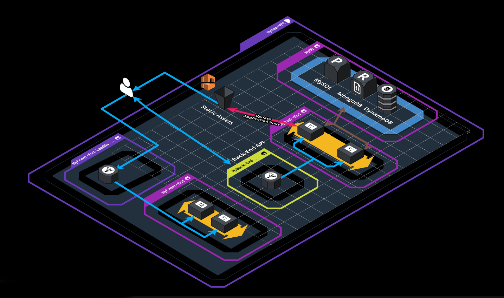

# PE Opdracht Automation II

## Applicatie informatie

De hogeschool wil een To-do applicatie voorzien voor alle studenten.

De applicatie bestaat uit een [3-tier web app](https://en.wikipedia.org/wiki/Multitier_architecture) gebouwd in Angular als frontend, NodeJS (+express) als backend gekoppeld aan een databank.

De applicatie bevindt zich in deze repository en bestaat uit 4 actieve branches: **[https://github.com/2TIN-CloudServices1/CloudToDoApp](https://github.com/2TIN-CloudServices1/CloudToDoApp)**

 Deze 4 branches hebben impact op de gebruikte database binnen de applicatie:

* `sequelize`: Deze branch maakt gebruik van MySQL als databank met het ORM mapping framework sequelize.
* `dynamo-db`: Deze branch maakt gebruik van AWS DynamoDB als databank.
* `main`: Deze branch maakt gebruik van MongoDB als databank met het ORM mapping framework mongoose. _Deze branch wordt niet gebruikt voor deze opdracht._
* `serverless`: Deze branch maakt gebruik van API Gateway gekoppeld aan Lambda functies en met DynamoDB als databank. _Deze branch wordt niet gebruikt voor deze opdracht._

**health check:** De backend bevat een health endpoint die gebruikt kan worden als health check indien nodig.

Daarnaast bevat de backend ook een endpoint / carrousel die de urls van de images teruggeeft die gebruikt worden in de frontend.

**Initiele Setup:** Dockerfiles & compose files zijn beschikbaar. Die zijn enkel bedoeld om de applicatie te testen, containers mogen __niet__ in de oplossing gebruikt worden.

**Informatie over deployment / configuratie** is telkens terug te vinden in de `README.md` file van de verschillende branches.

# Opdracht

**Architectuur diagram voor de sequelize branch:**

## Technology

De opdracht bestaat erin om de applicatie via Terraform te deployen naar een AWS omgeving. Je gebruikt hiervoor zoveel mogelijk de AWS services wanneer dat kan.

Belangrijk is dat de applicatie (zowel de front- als backend) altijd highly available & fault tolerant opgebouwd is. Afhankelijk van de services die je gebruikt, kan dit een impact hebben op het architectuurdiagram - zorg ervoor dat je je keuze kan motiveren. Je zal dus enerzijds gebruik moeten maken van availability zones en anderzijds moet de applicatie (frontend EN backend) zelf ook altijd blijven draaien. Denk hierbij aan zaken zoals autoscaling bij extra load / piek tijden.

Om de servers te ontlasten zullen in de applicatie alle statische assets zoals images vanaf een S3 bucket worden gehost. Voorzie die S3 bucket en host de images daar. __Pas de links in de applicatie aan zodat de images vanaf je bucket gehost worden__.

> Als er een afbeelding toegevoegd wordt aan de S3 bucket, moet deze automatisch meegenomen worden door de applicatie bij een refresh van de pagina.

De applicatie moet bereikbaar zijn via __één IP adres / hostname__. Je zal dus mogelijk gebruik moeten maken van loadbalancers.

Als database backend gebruik je minstens mysql, maar check ook "Extra's" hieronder.

Je zet de volgende omgevingen op: staging en production. Staging kan groeien van 1 tot 2 instances. Production kan groeien van 1 tot 4 instances.

Je oplossing is zo moduleerbaar mogelijk (modules!).

### Hoe begin ik hieraan?

Begin met de applicatie, zoals ze aangeleverd is, eens op te zetten en te analyseren, deze is opgezet met `compose`. Dit zorgt ervoor dat we een out-of-the-box werkende applicatie krijgen, nadeel is wel dat het als 1 applicatie op 1 server opgezet wordt (3 dockers, maar vanuit 1 compose file).

Zoek dus uit hoe de verschillende componenten werken en hoe ze uit elkaar te halen en afzonderlijk op te zetten. Eens dit werkt is de volgende stap om ze terug met elkaar te laten communiceren. Lees ook zeker de `README.md` van de applicatie repository voor meer informatie over de opbouw van de applicatie zelf.

Je maakt voor het opzetten gebruik van een VPC per environment om interne & externe traffic gescheiden te houden. Denk hierbij aan de nodige subnets, ip adressen, NAT gateways, ...
Daarnaast maken we gebruik van het principle of least privilege. Gebruik voldoende security groups en eventueel ACLs.

Hou het Architectuur diagram ook in de gaten.

## Minimum requirements (11p)

### Applicatie

* Een werkende applicatie waar alle componenten losgetrokken worden (front- & backend, S3 bucket en DBs) en met elkaar communiceren.
* Belangrijk is dat de applicatie (zowel de front- als backend) altijd highly available & fault tolerant opgebouwd is.
* De applicatie moet bereikbaar zijn via __één IP adres / hostname__. Je zal dus mogelijk gebruik moeten maken van loadbalancers.
* Je zet de volgende omgevingen op: staging en production. Staging kan groeien van 1 tot 2 instances. Production kan groeien van 1 tot 4 instances.
* Als database backend gebruik je mysql (minstens voor staging - zie later).
* De applicatie is highly-available opgezet dmv een elastic load balancer met minstens 2 webservers beschikbaar achterliggend.
* Alle stappen ondernomen om tot het bovenstaande te komen is duidelijk gedocumenteerd in 1 document op github, stap voor stap met screenshots waar nodig.
* Je oplossing is zo moduleerbaar mogelijk (modules!).
* Je maakt voor het opzetten gebruik van een VPC per environment om interne & externe traffic gescheiden te houden.
* De applicatie deployment is opzetbaar met 1 commando.

### Documentatie

**Indien de lab omgeving niet overeenkomt met de documentatie resulteert dit in een '0' op de PE.**

Deze documentatie is 1 document in je github repository in markdown formaat. Dit document geeft een duidelijk overzicht van jou oplossing, waarna het inzoomt op elk component en toelicht hoe je dit opgebouwd hebt en hoe dit samenwerkt met de rest. Waar nodig gebruik je code-snippets of screenshots om te verduidelijken.

## Extra's

Deze worden enkel beoordeeld indien de minimum requirements voldaan zijn.

### Organisatie (1p)

- Je gebruikt file lay-out om je oplossing op te zetten zodat je environments gescheiden zijn.
- Je gebruikt Terragrunt zodat je oplossing zo DRY mogelijk is.
- Je state files worden met een relevante organisatie lay-out veilig opgeslagen in S3. Zoals we gezien hebben is Terragrunt alweer interessant voor deze set-up.

### DynamoDB (1.5p)

- Je production environment gebruikt DynamoDB als database backend.

### Packer (5p)

- Je gebruikt Packer om images te bouwen (gebruik makend van o.a. de source code github repo), die je daarna gebruikt in je oplossing zodat je helemaal immutable kan werken.
- Je gebruikt Ansible om deze images te configureren at creation.
- Je gebruikt AWS om packer builds remote te laten runnen.
- De automatische (CI/CD) link om packer image builds te launchen bij source code changes en vervolgens automatisch te consumeren in terraform is niet nodig en out-of-scope.
- De source code en documentatie van deze aparte oplossing zet je ook in je repo.

### Monitoring (1.5p)

- Implementeer Datadog monitoring op je applicatie en infrastructuur, voeg relevante metrics samen op een nuttig dashboard:
  - Loadbalancer metrics
  - API-Gateway metrics
  - DB metrics
  - Autoscaling health metrics
- De source code en documentatie van deze oplossing zet je ook in je repo.

# Mogelijk interessante tips

## Terraform modules

Er bestaan nogal wat interessante modules in de (Terraform Registry)[https://registry.terraform.io/] die je heel wat werk kunnen besparen.

## `LabRole`

Er zijn limitaties aan AWS Academy en het gebruik van de voorgedefineerde `LabRole` kan noodzakelijk zijn.

## Terraformer :)

Het is beter onmiddellijk met IaC te beginnen, maar het tool bestaat wel en kan je mss. op weg helpen: [terraformer](https://github.com/GoogleCloudPlatform/terraformer).

Mogelijk meer een vloek dan een zegen.

# Belangrijk

* Op regelmatige tijdstippen wordt er gecommit naar github (minstens 1x per elk 1 uur werk). Het falen van deze verplichting heeft een '0' tot gevolg.
* Als tijdens de verdediging je oplossing niet dezelfde is als degene op het ogenblik van de deadline, dan wordt dat expliciet vermeld bij aanvang van de verdediging, met een exhaustieve lijst van veranderingen.
  * Het niet vermelden resulteert in een '0' voor de PE.
  * Je wordt gequoteerd op de inzending zoals die was op het tijdstip van de deadline.
* Er wordt enkel individueel gewerkt.
* Plagiaat is niet toegestaan. (zie PXL examenregelement).
  * Hier staan strenge straffen op, tot zelfs uitsluiting van alle examens.
  * De persoon die eventuele oplossingen doorgeeft is eveneens schuldig aan plagiaat.
* Er wordt NIET gecommuniceerd over de PE met andere studenten! Dat wordt beschouwd als plagiaat.
