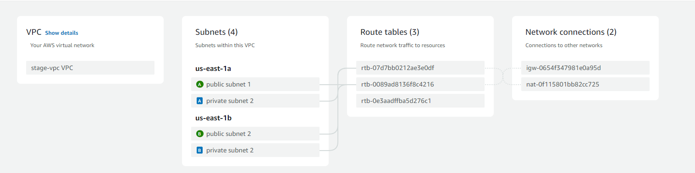

# PE2 Automation

## Terragrunt region + state

we add this to a terragrunt.hcl file in the live folder so the region will apply to every terragrunt.hcl file and the state will be added to an s3 bucket

```bash
locals {
  parsed = regex("./live/(?P<env>.+)/.*", get_terragrunt_dir())
  env    = local.parsed.env
}

generate "provider" {
  path = "provider.tf"
  if_exists = "overwrite_terragrunt"
  contents = <<EOF
    provider "aws" {
    region = "us-east-1"
    }
EOF
}

remote_state {
  backend = "s3"
  config = {
    bucket = "11904402-state-bucket-${local.env}"
    region = "us-east-1"
    key    = "${path_relative_to_include()}/terraform.tfstate"
  }
  generate = {
    path      = "backend.tf"
    if_exists = "overwrite_terragrunt"
  }
}
```

add this to every terragrunt.hcl file to use the region + state hcl file

```bash
include {
  path = find_in_parent_folders()
}
```

## Terragrunt

to define which module the file uses:

```bash
terraform {
  source = "../../../modules/webserver-cluster"
}
```

to add a dependency:

```bash
dependency "s3" {
  config_path = "../s3"
}
```

to define the variables used in the module:

```bash
inputs = {
  variable = value
  variable_using_dependency = dependency.s3.outputs.bucket
}
```

## Stage

### VPC

256 ips are enough so the cidr block will be "172.32.1.0/24"
enable dns hostnames and support

the vpc has 2 availability zones

2 public subnets

2 private subnets -> nat gateway to access the internet

Resource map:



### S3 bucket

I created the s3 bucket with a variable for the name

To add images to the s3 i used the resource aws_s3_object

in this resource i iterate through the images folder to upload every image with the extension .jpg

```bash
resource "aws_s3_bucket" "s3" {
  bucket = var.bucket

  tags = {
    Name        = var.bucket
  }
}

resource "aws_s3_object" "images" {
    bucket = aws_s3_bucket.s3.id
    for_each = fileset("images/", "**/*.jpg")

    key = each.value
    source = "images/${each.value}"
    content_type = each.value
}
```

### RDS

I first made a security group for the RDS instance that allows ingress the mysql port (3306)

I also needed a subnet group there i added the private subnets

then i made the RDS itself with as credentials we use variables to input it in the terragrunt.hcl file

```bash
resource "aws_security_group" "sg-database" {
  name = "database-sg"
  vpc_id = var.vpc_id

  ingress {
    description = "Allow mysql"
    from_port = 3306
    to_port = 3306
    protocol = "tcp"
    cidr_blocks = [ "0.0.0.0/0" ]
  }

  egress {
    from_port = 0
    to_port = 0
    protocol = "-1"
    cidr_blocks = [ "0.0.0.0/0" ]
  }

  tags = {
    Name = "database-sg"
  }
}

resource "aws_db_instance" "default" {
  engine               = "mysql"
  engine_version       = "8.0.39"
  allocated_storage    = 20
  storage_type         = "gp2"
  identifier           = var.db_name
  username             = var.db_user
  password             = var.db_pass
  publicly_accessible  = true
  db_name              = var.db_name
  instance_class       = "db.t4g.micro"
  parameter_group_name = "default.mysql8.0"
  option_group_name    = "default:mysql-8-0"
  vpc_security_group_ids = [aws_security_group.sg-database.id]
  db_subnet_group_name = aws_db_subnet_group.subnet_group.name
  skip_final_snapshot  = true
}

resource "aws_db_subnet_group" "subnet_group" {
  name       = "main"
  subnet_ids = var.private_subnets

  tags = {
    Name = "My DB subnet group"
  }
}

```

### webserver-cluster

inhoud:

- security groups
- launch templates
- autoscaling groups
- loadbalancers

**Security groups**

sg-backend:

- inbound
  - allow sql port (3306)
  - allow HTTP port (80)
  - allow backend port (3000)
  - allow HTTPS port (443)
- outbound
  - allow all traffic

sg-frontend:

- inbound
  - allow backend port (3000)
  - allow HTTP port (80)
  - allow HTTPS port (443)
- outbound
  - allow all traffic

```bash
resource "aws_security_group" "sg-backend" {
  name = "backend-sg"
  vpc_id = var.vpc_id

  ingress {
    description = "Allow mysql"
    from_port = local.sql_port
    to_port = local.sql_port
    protocol = "tcp"
    security_groups = [var.sgDatabase]
  }

  ingress {
    description = "Allow HTTP"
    from_port = local.http_port
    to_port = local.http_port
    protocol = "tcp"
    cidr_blocks = [ "0.0.0.0/0" ]
  }

  ingress {
    description = "Allow HTTPS"
    from_port = 443
    to_port = 443
    protocol = "tcp"
    cidr_blocks = [ "0.0.0.0/0" ]
  }

  ingress {
    description = "Allow backend port"
    from_port = local.backend_port
    to_port = local.backend_port
    protocol = "tcp"
    cidr_blocks = [ "0.0.0.0/0" ]
  }

  egress {
    from_port = 0
    to_port = 0
    protocol = "-1"
    cidr_blocks = [ "0.0.0.0/0" ]
  }

  tags = {
    Name = "backend-sg"
  }
}

resource "aws_security_group" "sg-frontend" {
  name = "frontend-sg"
  vpc_id = var.vpc_id

  ingress {
    description = "Allow backend port"
    from_port = local.backend_port
    to_port = local.backend_port
    protocol = "tcp"
    security_groups = [aws_security_group.sg-backend.id]
  }

  ingress {
    description = "Allow HTTP"
    from_port = local.http_port
    to_port = local.http_port
    protocol = "tcp"
    cidr_blocks = [ "0.0.0.0/0" ]
  }

  ingress {
    description = "Allow HTTPS"
    from_port = 443
    to_port = 443
    protocol = "tcp"
    cidr_blocks = [ "0.0.0.0/0" ]
  }

  egress {
    from_port = 0
    to_port = 0
    protocol = "-1"
    cidr_blocks = [ "0.0.0.0/0" ]
  }

  tags = {
    Name = "frontend-sg"
  }
}

```

**Launch Templates**

backend-lt:

- sg-backend
- userdata (given with the terragrunt file)
  - i changed the env variables not with export but with sed because export didnt work.
  - i cloned my own forked repository for changes to carrousel.routes.js to pull images from the s3

```bash
resource "aws_launch_template" "backend-template" {
  name_prefix          = "backend-lt"
  image_id             = "ami-06b21ccaeff8cd686"
  instance_type        = "t2.micro"
  vpc_security_group_ids = [aws_security_group.sg-backend.id]
  iam_instance_profile {
    name = "LabInstanceProfile"
  }
  user_data = base64encode(var.user_data_backend)
  tags = {
    Name = "backend-lt"
  }
}
```

userdata:

```bash
#!/bin/bash
yum update -y
yum install -y git nodejs
git clone https://github.com/DriesMelottePXL/CloudToDoApp.git
cd CloudToDoApp/backend/
git checkout sequelize # dit zal anders zijn in de terragrunt file van production
sed -i "s/host: process.env.DBURL || 'localhost'/host: '${dependency.rds.outputs.db_url}'/" db.js
sed -i "s/username: process.env.DBUSER || 'root'/username: '${dependency.rds.outputs.db_user}'/" db.js
sed -i "s/password: process.env.DBPASSWORD || ''/password: '${dependency.rds.outputs.db_pass}'/" db.js
sed -i "s/database: process.env.DBDATABASE || 'todo'/database: '${dependency.rds.outputs.db_name}'/" db.js
cd routes
sed -i 's/process\.env\.BUCKET/"${dependency.s3.outputs.bucket}"/g' carrousel.routes.js
cd ..
npm install aws-sdk
npm install
npm start
```

frontend-lt:

- sg-frontend
- userdata
  - checkout branch based on the variable given in stage or production
  - dont forget to add http:// and the port when giving the backend dns
  - host with nginx

```bash
resource "aws_launch_template" "frontend-template" {
  name_prefix          = "frontend-lt"
  image_id             = "ami-06b21ccaeff8cd686"
  instance_type        = "t2.micro"
  vpc_security_group_ids = [aws_security_group.sg-frontend.id]
  iam_instance_profile {
    name = "LabInstanceProfile"
  }
  user_data = base64encode(<<-EOF
              #!/bin/bash
              yum update -y
              yum install -y git nodejs nginx
              git clone https://github.com/2TIN-CloudServices1/CloudToDoApp.git
              cd CloudToDoApp/frontend/
              git checkout ${var.branch}
              echo "export const environment = {production: true, apiurl: 'http://${aws_lb.lb-backend.dns_name}:3000'};" > src/environments/environment.prod.ts
              npm install
              npm run build --configuration=production
              rm -rf /usr/share/nginx/html
              cp -r dist/frontend/ /usr/share/nginx/html/
              cp nginx.conf /etc/nginx/nginx.conf
              sudo systemctl enable nginx
              sudo systemctl start nginx
              EOF
              )
  tags = {
    Name = "frontend-lt"
  }
}
```

**Auto-scaling**

back- and frontend-asg:

- use the launch template id
- add the target group arn we will make later
- set the instances you will create in private subnets
- put the min and max size in variables so it can be changed when in production or stage

```bash
resource "aws_autoscaling_group" "frontend-asg" {
  launch_template {
    id = aws_launch_template.frontend-template.id
    version = "$Latest"
  }

  target_group_arns = [aws_lb_target_group.frontendtg.arn]
  health_check_type = "ELB"

  vpc_zone_identifier = var.private_subnets
  max_size = var.max_size
  min_size = var.min_size

   tag {
    key                 = "Name"
    value               = "frontend"
    propagate_at_launch = true
  }
}

resource "aws_autoscaling_group" "backend-asg" {
  launch_template {
    id = aws_launch_template.backend-template.id
    version = "$Latest"
  }

  target_group_arns = [aws_lb_target_group.backendtg.arn]
  health_check_type = "ELB"

  vpc_zone_identifier = var.private_subnets
  max_size = var.max_size
  min_size = var.min_size

   tag {
    key                 = "Name"
    value               = "backend"
    propagate_at_launch = true
  }
}
```

**Loadbalancer**

backend:

- loadbalancer
  - load_balancer_type: application
  - subnets: public
  - security_groups: sg-backend
- listener
  - load_balancer_arn
  - port: backend port (3000)
  - protocol HTTP
  - default_action stuff
- target group
  - port: backend port (3000)
  - protocol HTTP
  - vpc_id
  - health check on path /health
- listener rule
  - listener_arn
  - priority
  - action: type: forward and target group arn

frontend:

- loadbalancer
  - load_balancer_type: application
  - subnets: public
  - security_groups: sg-frontend
- listener
  - load_balancer_arn
  - port: HTTP port (80)
  - protocol HTTP
  - default_action stuff
- target group
  - port: HTTP port (80)
  - protocol HTTP
  - vpc_id
  - health check on path /
- listener rule
  - listener_arn
  - priority
  - action: type: forward and target group arn

```bash
resource "aws_lb" "lb-backend" {
  name               = "backend-lb-${var.env}"
  load_balancer_type = "application"
  subnets            = var.public_subnets
  security_groups    = [aws_security_group.sg-backend.id]
}

resource "aws_lb_listener" "lb-backend-listener" {
  load_balancer_arn = aws_lb.lb-backend.arn
  port              = local.backend_port
  protocol          = "HTTP"

  default_action {
    type = "fixed-response"

    fixed_response {
      content_type  = "text/plain"
      message_body  = "404: page not found"
      status_code   = 404
    }
  }
}

resource "aws_lb_target_group" "backendtg" {
  name     = "backend-${var.env}"
  port     = local.backend_port
  protocol = "HTTP"
  vpc_id   = var.vpc_id
  health_check {
    path = "/health"
    protocol = "HTTP"
    matcher = "200"
    interval = 15
    timeout = 3
    healthy_threshold = 2
    unhealthy_threshold = 2
  }
}

resource "aws_lb_listener_rule" "backendrule" {
  listener_arn  = aws_lb_listener.lb-backend-listener.arn
  priority      = 100

  condition {
    path_pattern {
      values = ["*"]
    }
  }

  action {
    type              = "forward"
    target_group_arn  = aws_lb_target_group.backendtg.arn
  }
}

resource "aws_lb" "lb-frontend" {
  name               = "frontend-lb-${var.env}"
  load_balancer_type = "application"
  subnets            = var.public_subnets
  security_groups    = [aws_security_group.sg-frontend.id]
}

resource "aws_lb_listener" "lb-frontend-listener" {
  load_balancer_arn = aws_lb.lb-frontend.arn
  port              = local.http_port
  protocol          = "HTTP"

  default_action {
    type = "fixed-response"

    fixed_response {
      content_type  = "text/plain"
      message_body  = "404: page not found"
      status_code   = 404
    }
  }
}

resource "aws_lb_target_group" "frontendtg" {
  name     = "frontend-${var.env}"
  port     = local.http_port
  protocol = "HTTP"
  vpc_id   = var.vpc_id

  health_check {
    path = "/"
    protocol = "HTTP"
    matcher = "200"
    interval = 15
    timeout = 3
    healthy_threshold = 2
    unhealthy_threshold = 2
  }
}

resource "aws_lb_listener_rule" "frontendrule" {
  listener_arn  = aws_lb_listener.lb-frontend-listener.arn
  priority      = 100

  condition {
    path_pattern {
      values = ["*"]
    }
  }

  action {
    type              = "forward"
    target_group_arn  = aws_lb_target_group.frontendtg.arn
  }
}
```

## Prod

Het enige verschil tussen prod en stage is de dynamodb idpv de rds en de userdata van de backend

dynamodb word aangemaakt met als key "\_id"

```bash
resource "aws_dynamodb_table" "todo_table" {
  name           = var.table
  billing_mode   = "PAY_PER_REQUEST"
  hash_key       = "_id"

  attribute {
    name = "_id"
    type = "S"
  }

  tags = {
    Environment = "production"
    Project     = "todo-app"
  }

  point_in_time_recovery {
    enabled = true
  }

  server_side_encryption {
    enabled = true
  }
}
```

de userdata voor de backend veranderd naar dit:

```bash
#!/bin/bash
yum update -y
yum install -y git nodejs
git clone https://github.com/DriesMelottePXL/CloudToDoApp.git
cd CloudToDoApp/backend/
git checkout dynamodb
echo "export AWS_TABLE_NAME=${dependency.dynamodb.outputs.table_name}" >> /etc/environment
echo "export AWS_REGION=us-east-1" >> /etc/environment
source /etc/environment
npm install aws-sdk
npm install
npm start
```
