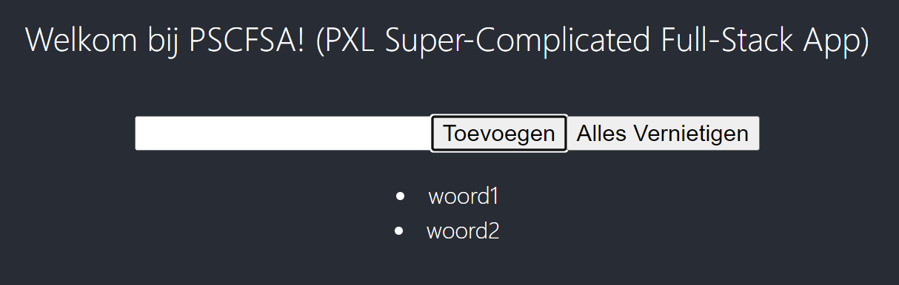

# Container deployement en monitoring PE 

## Beschrijving

PSCFSA is een fullstack web app die met een frontend woorden in een database kan steken of verwijderen.

De volgende technologieën worden gebruikt:

- React frontend
- Python/Flask backend
- Postgres database

## Opdracht

- Zet een EKS cluster op in je AWS Sandbox.
- Manage de nodes met SSM.
- Zorg dat de database in een aparte (RDS) service opstaat.
- Zorg ervoor dat deze web app automatisch in EKS gedeployed kan worden.

### Evaluatie (20p)

### Minimum requirements om te slagen (10p)

- De app werkt volledig op EKS en RDS (frontend, backend en database kunnen met elkaar communiceren).
- Je kan woorden toevoegen en verwijderen.
- De app is beschikbaar in je browser vanaf de ingress-loadbalancer van je cluster.
- De aangepaste files zijn beschikbaar in de kubernetes directory in dit repository.
- Alle EC2 instances zijn opgenomen in SSM Fleet management.
- Breidt het standaard patch shedule uit zodat alle instances in orde zijn met Compliance en dat dit automatisch in orde blijft (sheduled scans en patch shedule)
- Alles is duidelijk en volledig gedocumenteerd en deze documentatie is in markdown format terug te vinden in de repository.

### Extra 1 (5p)

- Implementeer Datadog op je applicatie (2p) en infrastructuur (1p)
- Gebruik SSM om via een Task de datadog agent op de cluster nodes te installeren en monitor deze apart. (1p)
- Datadog monitort de EKS cluster en basis metrics van de containers en applicatie en geeft dit weer op een overzichtelijk dashboard (1p)

### Extra 2 (5p)

Zorg dat alles automatisch uitgevoerd wordt via IaC met een taal naar keuze (Ansible, Terraform, ...)

- EKS Cluster (vpc, service, nodes, ingress, controlplane), RDS en SSM (3p)
- Applicatie deployment via ECR (2p)

# Belangrijk

- Plagiaat is niet toegestaan. (zie PXL examenregelement)
- Hier staan strenge straffen op, tot zelfs uitsluiting van alle examens.
- De persoon die eventuele oplossingen doorgeeft is eveneens schuldig aan plagiaat.
- Er wordt enkel individueel gewerkt.
- Op regelmatige tijdstippen wordt er gecommit naar github (minstens 1x per elk 1 uur werk). Het falen van deze verplichting heeft een '0' tot gevolg.
- Er wordt NIET gecommuniceerd over de PE met andere studenten! Dat wordt beschouwd als plagiaat.
