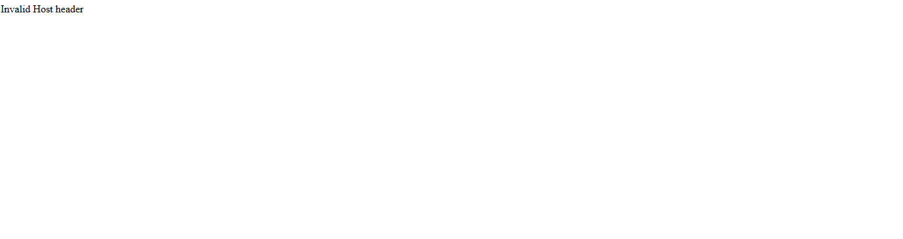
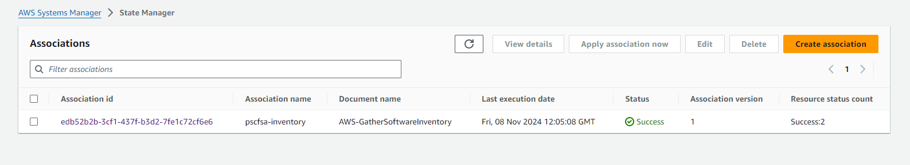
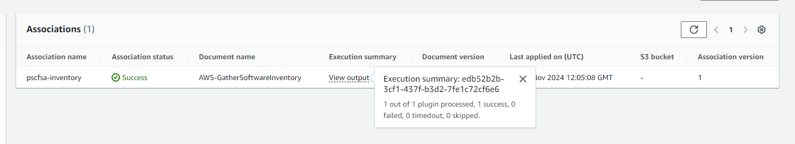
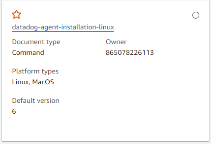
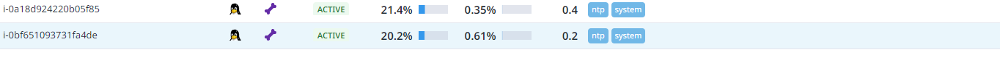
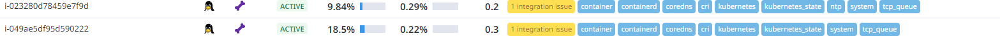
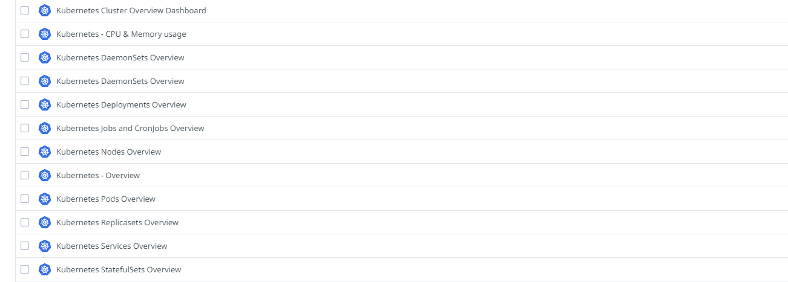

# Documentation PE 1 Cloud

## EKS Cluster

setup:

- Name
- IAM role
- Cluster endpoint access

keep everything else default.

## Node group

we ofcourse need nodes to to deploy the pods

setup:

- Name
- IAM role

keep everything else default.

## Kubectl connection

To use the kubectl command in the cluster you need to make connection to the EKS cluster:

```bash
aws eks --region us-east-1 update-kubeconfig --name pscfsa
```

now we can apply the yaml files

```bash
kubectl apply -f .
```

and ofcourse we need to add a loadbalancer:

```yaml
apiVersion: v1
kind: Service
metadata:
  name: loadbalancer-pscfsa-service
  namespace: pscfsa
  annotations:
    service.beta.kubernetes.io/aws-load-balancer-type: nlb
    service.beta.kubernetes.io/aws-load-balancer-nlb-target-type: ip
    service.beta.kubernetes.io/aws-load-balancer-scheme: internet-facing
spec:
  ports:
    - port: 80
      targetPort: 3000
      protocol: TCP
  type: LoadBalancer
  selector:
    app: frontend
```

## First problem

when you apply the files you will see it doesnt work yet



this is because we need to add a .env file with this environment variable:

```
DANGEROUSLY_DISABLE_HOST_CHECK=true
```

create a ECR, build a new image and push it to the repository

add this repository to your frontend.yaml

when you add this you will see everything works!

## RDS

setup:

- postgresSQL
- database name
- free tier
- public access enabled

change the database-uri in configmaps.yaml to the uri from the RDS

this will not work yet first we need to add the text table to the postres RDS otherwise you get this error in your backend logs:

_sqlalchemy.exc.ProgrammingError: (psycopg2.errors.UndefinedTable) relation "text" does not exist
LINE 1: INSERT INTO text (text) VALUES ('k') RETURNING text.id_

go into the database:

```bash
psql -h <rds uri> -U <username> -d <db name>
```

add the table:

```SQL
CREATE TABLE text (
        id serial PRIMARY KEY,
        text VARCHAR ( 100 ) UNIQUE NOT NULL
    );
```

## Fleet manager

when you added the LabRole to the cluster and node group you will see the instances will apear in the systems manager's fleet manager.

## Baseline Patches

when you are in the systems manager go to compliance under node management.

click create baseline patch.

1. Enter a Name for your custom patch baseline, such as AmazonLinuxSecAndNonSecBaseline-PE
2. Select Amazon Linux 2 from the list.
3. Examine the options in the lists and ensure that Product, Classification, and Severity have values of All.
4. Leave the Auto approval delay at its default of 0 days
5. Change the value of Compliance reporting - optional to Critical
6. Choose Add another rule
7. In the new rule, change the value of Compliance reporting - optional to Medium.
8. Check the box under Include non-security updates to include all Amazon Linux updates when patching.

If an approved patch is reported as missing, the option you choose in Compliance reporting, such as Critical or Medium, determines the severity of the compliance violation reported in System Manager Compliance.

9. In the Patch exceptions section in the Rejected patches - optional text box, enter system-release.\* This will reject patches to new Amazon Linux releases that may advance you beyond the Patch Manager supported operating systems prior to your testing new releases.
10. Choose Create patch baseline and you will go to the Patch Baselines page where the AWS provided default patch baselines, and your custom baseline, are displayed.

## Inventory

Go to inventory under Node management and create a new Inventory

- Name
- Targets: Selecting all managed instances in this account (since we use an eks cluster and it can create new instances depending on the load we select this instead of manually)
- Schedule: 30m

when you go to the state manager you will see your inventory



when you go to fleet manager and click on a node, select associations and view output you will see the execution summary and the status shoud say success



## scheduled scan

to make a scheduled scan go to state manager under node management and create an association

- Name
- select the AWS-RunPatchBaseline document
- Operation: scan
- for the target choose a resource group and select your eks
- for the schedule select daily: and select everyday at 00:00
- severity is medium

## scheduled install

to make a scheduled install we do the same as the scan only select install as operation.

## Datadog extra

### install the agent through SSM

in your systems manager go all the way down to documents.

go to all documents

and search for "datadog"

select the document "datadog-agent-installation-linux"



run the command

put in your APIkey from datadog and the site in my case its us5.datadoghq.com

at target selection choose instances manually and select the instances you want the agent to be installed

run the command

you will see the agents in your datadog



### configure the datadog agents.

for this step we need to install helm

we also need a yaml file with the configuration in this case we configure kubernetes metrics and other stuff.

```yaml
datadog:
  apiKey: "1e937b85c7a1aa0c03ac676f866e9681"

  site: "us5.datadoghq.com"

  logs:
    enabled: true

  apm:
    enabled: true

  apm_config:
    enabled: true

  kubeStateMetricsEnabled: true

  processAgent:
    enabled: true
    processCollection: true

  networkMonitoring:
    enabled: true

  systemProbe:
    enableTCPQueueLength: true
    enableOOMKill: true

  collectEvents: true

  clusterAgent:
    replicas: 2
    createPodDisruptionBudget: true

kubelet:
  tlsVerify: true
  host: "https://kubernetes.default.svc:10250"

daemonset:
  useHostNetwork: true
  useHostPort: true
  updateStrategy:
    type: RollingUpdate

externalMetrics:
  enabled: true

logs_config:
  container_collect_all: true
```

next we run the helm command to apply the config to the agents

```bash
helm install datadog -f datadog.yaml datadog/datadog
```

if you make changes to the file and add other metrics you need to run this command.

```bash
helm upgrade datadog -f datadog.yaml datadog/datadog
```

now you can see the agents with the right config in your datadog.



### Dashboard

when making a custom dashboard you can copy and paste all sorts of KPI's from the kubernetes dashboard templates


