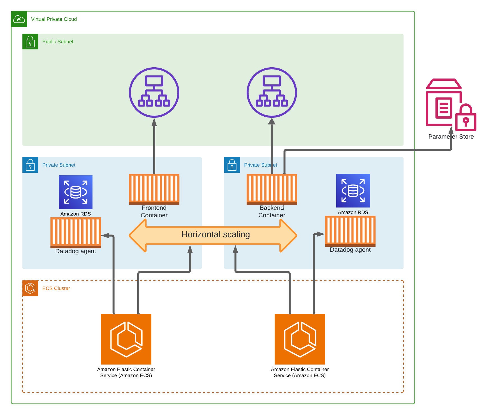
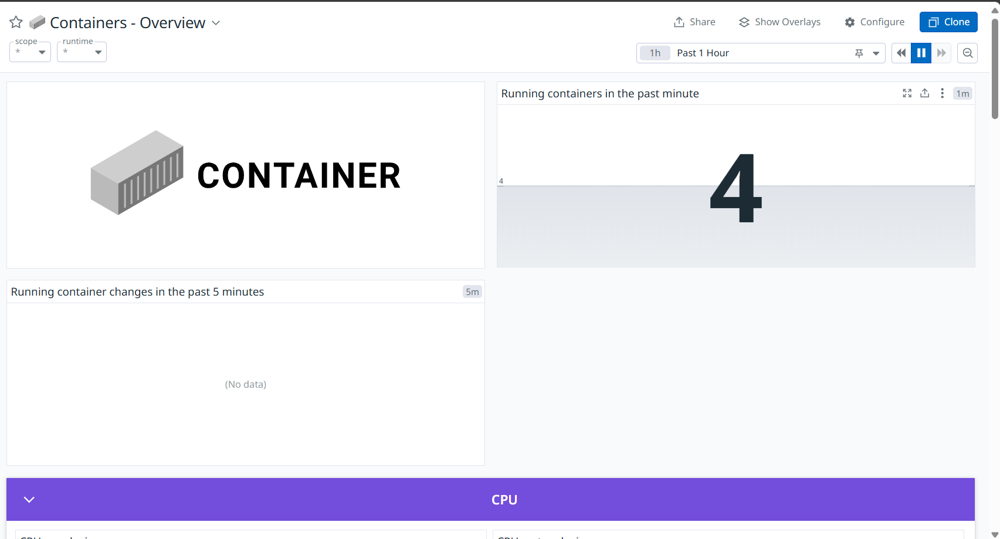
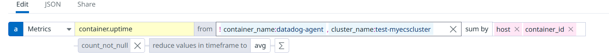
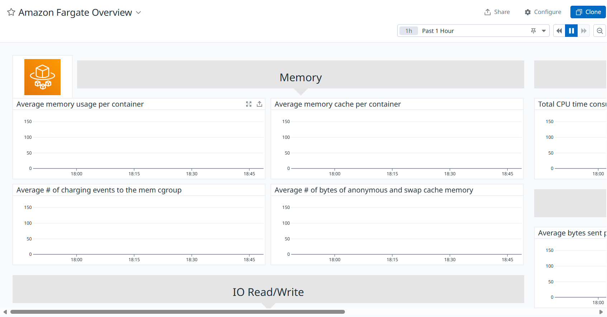
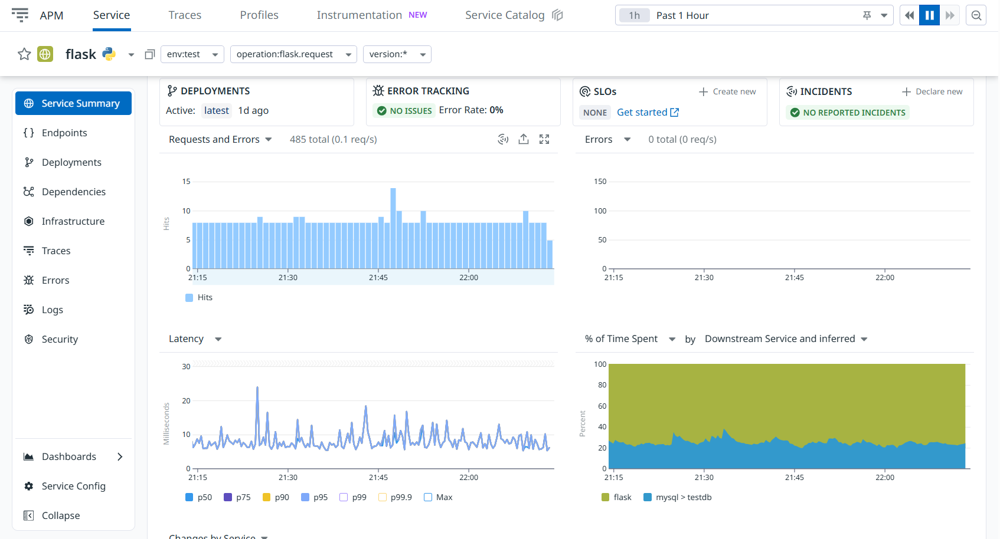
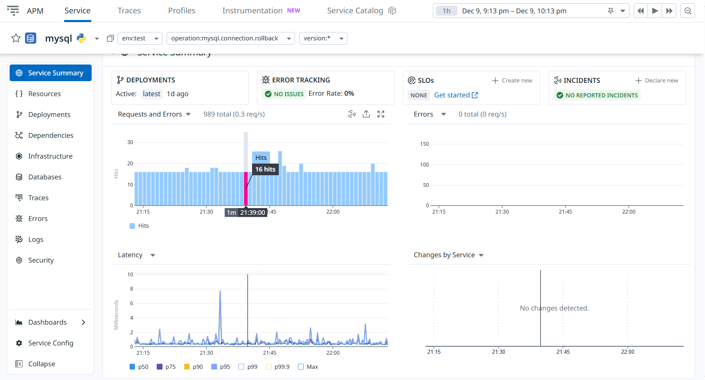
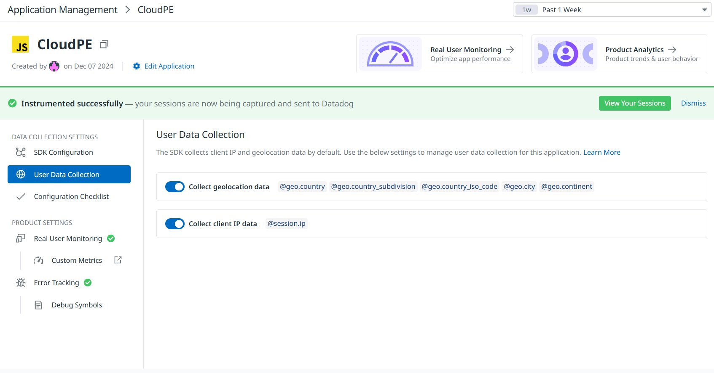

## Table of Contents
- [Infrastructure](#Infrastructure)
   1. [Dockerfiles](#dockerfiles)
      - [WebLayer](#weblayer)
      - [ApplicationLayer](#applicationlayer)
   2. [Conditions](#conditions)
   3. [Resources](#resources)
      - [VPC and Networking](#vpc-and-networking)
      - [Security Groups](#security-groups)
      - [Elastic Load Balancers (ALBs)](#elastic-load-balancers-albs)
      - [ECS Cluster and Services](#ecs-cluster-and-services)
      - [RDS Database](#rds-database)
      - [SSM Parameters](#ssm-parameters)
   4. [Scaling and Auto-Scaling](#scaling-and-auto-scaling)
   5. [Architecture Diagram](#Architecture-Diagram)
- [Datadog](#Datadog)
   1. [Container/Fargate Metrics](#container-metrics)
   2. [APM](#apm)
   3. [MySQL](#mysql)
   4. [RUM](#rum)

# Infrastructure

## Dockerfiles

### WebLayer

- **FROM python:3.9**  

  The image is based on Python 3.9, which includes the Python runtime and necessary dependencies for Python-based applications.

- **RUN apt-get update && apt-get install -y nginx gettext-base**  

  Updates the package list and installs Nginx (a web server) and `gettext-base` (for template processing).

- **apt-get install -y python3-pip** 

  Installs Python's package manager, `pip`.

- **apt-get clean**  

  Cleans up unnecessary files to reduce the image size.

- **RUN pip3 install jinja2-cli**  

  Installs the `jinja2-cli` package for processing Jinja2 templates.

- **WORKDIR /app**  

  Sets `/app` as the working directory for subsequent commands and the default location for files.

- **COPY requirements.txt /app/**  

  Copies the `requirements.txt` file (Python dependency list) to the container.

- **RUN pip install --no-cache-dir -r requirements.txt gunicorn**  

  Installs the dependencies listed in `requirements.txt` and the Gunicorn web server.

- **COPY . /app**  

  Copies all application files from the local directory to the container's `/app` directory.

- **RUN mkdir /etc/nginx/templates**  

  Creates a directory for Nginx template files.

- **COPY default.j2 /etc/nginx/templates/default.j2**  

  Copies the Jinja2 template file for the Nginx configuration into the container.

- **COPY startup.sh /app/startup.sh**  

  Copies a startup script to the `/app` directory.

- **RUN chmod +x /app/startup.sh**  

  Makes the `startup.sh` script executable.

- **EXPOSE 80**  

  Exposes port 80, the default HTTP port, for the container.

- **ENTRYPOINT ["/app/startup.sh"]**

  Specifies `/app/startup.sh` as the entry point for the container. This script runs when the container starts.

### startup.sh

- **sed -i "s/env: '<ENV_NAME>',/env: '$RUM_ENV',/" /app/templates/base.
html**

  Update base.html template with the environment name

- **jinja2 /etc/nginx/templates/default.j2 -o /etc/nginx/sites-available/
default -D API_URL="$API_URL"**

  Generate Nginx configuration file using Jinja2 templates

- **rm -f /etc/nginx/sites-enabled/default**

  Remove existing default site configuration

- **ln -s /etc/nginx/sites-available/default /etc/nginx/sites-enabled/**
  Create a symbolic link for the generated configuration

- **service nginx start**

  Start Nginx service

- **gunicorn -b 0.0.0.0:8000 app:app**

  Start the Gunicorn server to run the app

---

### ApplicationLayer

- **FROM python:3.9-slim**

  This image uses the slim variant of Python 3.9, which is smaller and optimized for production use. It includes only essential libraries, reducing the overall image size.

- **WORKDIR /app**

  Sets `/app` as the working directory for the container. All subsequent commands will be executed relative to this directory.

- **COPY parameters.py .**

  Copies the `parameters.py` file into the container's working directory.

- **COPY app.py .**

  Copies the main application file `app.py` into the container.

- **COPY requirements.txt .**

  Copies the `requirements.txt` file, which lists the application's dependencies, into the container.

- **RUN pip install --no-cache-dir -r requirements.txt**

  Installs the Python dependencies specified in `requirements.txt`. The `--no-cache-dir` flag ensures that pip does not cache any files, reducing the image size.

- **RUN pip install ddtrace**

  Installs the `ddtrace` library, used for application performance monitoring and distributed tracing.

- **EXPOSE 4000**

  Exposes port `4000`, which is the default port for the application to run.

- **CMD ["ddtrace-run", "python", "app.py"]**

  Sets the default command to execute the application when the container starts:
  - **`ddtrace-run`**: Wraps the Python application to enable instrumentation with `ddtrace`.
  - **`python app.py`**: Runs the main application file.


## Conditions
- **IsTestStack**:
  - This condition checks whether the stack name is "test". It is used to differentiate between test and production environments.
  - **Usage**:
    - For test stacks, the desired count for ECS services and maximum capacity for auto-scaling targets are reduced to 1.
    - For production stacks, these values are scaled up to 2 (minimum) and 4 (maximum).

## Resources

### VPC and Networking
- **VPC**: The Virtual Private Cloud spans `10.0.0.0/16`.
- **Subnets**:
  - Public Subnets:
    - `10.0.1.0/24` in Availability Zone 1.
    - `10.0.2.0/24` in Availability Zone 2.
  - Private Subnets:
    - `10.0.3.0/24` in Availability Zone 1.
    - `10.0.4.0/24` in Availability Zone 2.
- **NAT Gateway**: Facilitates outbound internet traffic for private subnets.
- **Route Tables**:
  - Public Route Table with a route to the Internet Gateway.
  - Private Route Table with a route to the NAT Gateway.

### Security Groups
- **MySQL Security Group**:
  - Allows inbound traffic on port `3306` for MySQL.
  - CIDR: `0.0.0.0/0` (should be scoped further for production).
- **Frontend ALB Security Group**:
  - Allows inbound HTTP traffic on port `80`.
- **Backend ALB Security Group**:
  - Allows inbound traffic on port `4000`.

### Elastic Load Balancers (ALBs)
- **Frontend ALB**:
  - Public-facing load balancer managing HTTP traffic for the frontend ECS service.
  - Routes requests to the Frontend Target Group.
- **Backend ALB**:
  - Public-facing load balancer managing HTTP traffic for the backend ECS service.
  - Routes requests to the Backend Target Group.

### ECS Cluster and Services
- **ECS Cluster**: Manages containerized applications.
- **Frontend ECS Service**:
  - Runs frontend tasks using AWS Fargate.
  - Connects to the Frontend Target Group via the Frontend ALB.
- **Backend ECS Service**:
  - Runs backend tasks using AWS Fargate.
  - Connects to the Backend Target Group via the Backend ALB.

## Task Definitions

### Frontend Task Definition
- **Task Family**: Defined as frontend-task.
- **Container**:
  - **Name**: frontend-container
  - **Image**: 278253487803.dkr.ecr.us-east-1.amazonaws.com/pe/frontend:latest
  - **Port**: 80
  - **Environment Variables**:
    - `API_URL`: Backend Load Balancer DNS Name
  - **Logging**:
    - Driver: awslogs
    - Group: /ecs/frontend-container

- **Additional Containers**:
  - **Name**: datadog-agent
  - **Image**: public.ecr.aws/datadog/agent:latest
  - **Port**: 8126 (for tracing)
  - **Environment Variables**:
    - `DD_API_KEY`: Datadog API Key
    - `ECS_FARGATE`: true
    - `DD_SITE`: us5.datadoghq.com
    - `DD_ENV`: name of the stack
    - `DD_SERVICE`: frontend-service
    - `DD_VERSION`: 1.0.0
    - `DD_LOGS_ENABLED`: true
    - `DD_RUM_ENABLED`: true

### Backend Task Definition
- **Task Family**: Defined as backend-task.
- **Container**:
  - **Name**: backend-container
  - **Image**: 278253487803.dkr.ecr.us-east-1.amazonaws.com/pe/backend:latest
  - **Port**: 4000
  - **Environment Variables**:
    - `APP_ENV`: Stack Name
  - **Logging**:
    - Driver: awslogs
    - Group: /ecs/backend-container

- **Additional Containers**:
  - **Name**: datadog-agent
  - **Image**: public.ecr.aws/datadog/agent:latest
  - **Port**: 8126 (for tracing)
  - **Environment Variables**:
    - `DD_API_KEY`: Datadog API Key
    - `ECS_FARGATE`: true
    - `DD_SITE`: us5.datadoghq.com
    - `DD_SERVICE`: backend-service
    - `DD_VERSION`: 1.0.0
    - `DD_LOGS_ENABLED`: true
    - `DD_APM_ENABLED`: true
    - `DD_MYSQL_ENABLED`: true
    - `DD_MYSQL_SERVER`: RDS Endpoint
    - `DD_MYSQL_PORT`: 3306
    - `DD_MYSQL_USER`: RDS username
    - `DD_MYSQL_PASSWORD`: RDS password

### RDS Database
- **MySQL RDS Instance**:
  - Engine: MySQL.
  - Instance type: `db.t3.micro`.
  - Allocated storage: `20 GB`.
  - Deployed in private subnets for security.
  - Credentials (username/password) are stored in SSM Parameter Store.

### SSM Parameters
- Parameters stored securely in AWS Systems Manager Parameter Store:
  - **DB Instance Name**: Specifies the database name.
  - **DB Password**: Stores the password securely.
  - **RDS Endpoint**: Stores the database endpoint address.
  - **Master Username**: Stores the master user name.

## Scaling and Auto-Scaling
- **Frontend Service**:
  - Scales between 1 and 4 tasks depending on environment and load.
- **Backend Service**:
  - Scales between 1 and 4 tasks depending on environment and load.
- **Auto-Scaling Targets**:
  - Defined for both ECS services to adjust the desired count dynamically.

## Architecture Diagram



# Datadog

## Container/Fargate Metrics


for this there is no need for additional configuration in the image

we previously created a datadog agent as a sidecar container.

### Container

we can now just go to dashboards and go to "Containers - Overview":



Here we can see all kinds of different metrics we can copy to our custom dashboard.

I copied the "Running containers in the past minute" metric




### Fargate

for the fargate metric we can go to the AWS Fargate Overview

Here I copied the "Avarage memory usage per container" metric



edit these metrics so it excludes the datadog agent containers and filters on cluster_name

## APM

this is why we used ddtrace in the dockerfile

for this we need to add some stuff to the dockerfile:

- pip install ddtrace
- CMD ["ddtrace-run", "python", "app.py"]

once you have done this and deployed it in your infrastructure you can go to APM > Service catalog

Here you can see your flask app once you open your service page you see all kinds of metrics you can use.



here i used the "/Create count", "Avarage Latency" and "Total traces" metrics and here i filtered on env name

## MySQL

when implementing APM we see in the services that there also is a service mysql here you can find metrics of your mysql db



here i used the "MySQL Latency" and "Requests and errors" metrics and filtered also on env name

## RUM

to add RUM to your application go to "Digital Experience" > "Add an Application"

choose manual instrumentation and select CDN async

copy the code and paste it in base.html in the frontend

```js
<script>
        (function(h,o,u,n,d) {
          h=h[d]=h[d]||{q:[],onReady:function(c){h.q.push(c)}}
          d=o.createElement(u);d.async=1;d.src=n
          n=o.getElementsByTagName(u)[0];n.parentNode.insertBefore(d,n)
        })(window,document,'script','https://www.datadoghq-browser-agent.com/us5/v5/datadog-rum.js','DD_RUM')
        window.DD_RUM.onReady(function() {
          window.DD_RUM.init({
            clientToken: 'pub3e5e2eb2e61c0b995d914c3634819e65',
            applicationId: 'd0076b0c-b95b-4aeb-900c-079a56004233',
            // `site` refers to the Datadog site parameter of your organization
            // see https://docs.datadoghq.com/getting_started/site/
            site: 'us5.datadoghq.com',
            service: 'cloudpe',
            env: '<ENV_NAME>',
            // Specify a version number to identify the deployed version of your application in Datadog
            // version: '1.0.0',
            sessionSampleRate: 100,
            sessionReplaySampleRate: 20,
            trackUserInteractions: true,
            trackResources: true,
            trackLongTasks: true,
            defaultPrivacyLevel: 'mask-user-input',
          });
        })
      </script>
```

once you deployed the application again you will see this screen.



now you can go to dashboards and click one of the RUM dashboard to copy some metrics i used the metrics "Top 5 Browsers" and "Live user sessions by country"

these are also filtered by env


