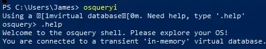
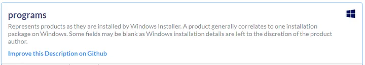

# OSQuery

## Task 3

**Question:** How many tables are returned when we query “table process” in the interactive mode of Osquery?

**Answer:** 3

**Explanation:**

**Question:** Looking at the schema of the processes table, which column displays the process id for the particular process?

**Answer:** pid

**Question:** Examine the .help command, how many output display modes are available for the .mode command?

**Answer:** 5

## Task 4

**Question:** In Osquery version 5.5.1, how many common tables are returned, when we select both Linux and Window Operating system?

**Answer:** 56

**Explanation:**
check the windows os

**Question:** In Osquery version 5.5.1, how many tables for MAC OS are available?

**Answer:** 180

**Question:** In the Windows Operating system, which table is used to display the installed programs?

**Answer:** Programs

**Explanation:**

**Question:** In Windows Operating system, which column contains the registry value within the registry table?

**Answer:** Data

## Task 5

**Question:** Using Osquery, how many programs are installed on this host?

**Answer:** 19

**Explanation:**

- enter this command: `SELECT count(*) FROM programs;`

**Question:** Using Osquery, what is the description for the user James?

**Answer:** Creative Artist

**Explanation:**

- enter the following command: `SELECT description from users WHERE username=’James’;`

**Question:** When we run the following search query, what is the full SID of the user with RID ‘1009’?

**Answer:** S-1-5-21-1966530601-3185510712-10604624-1009 (different for everyone)

**Question:** When we run the following search query, what is the Internet Explorer browser extension installed on this machine?

**Answer:** C:\Windows\System32\ieframe.dll

**Question:** After running the following query, what is the full name of the program returned?

**Answer:** Wireshark 3.6.8 64-bit

**Question:** Which table stores the evidence of process execution in Windows OS?

**Answer:** userassist

**Question:** One of the users seems to have executed a program to remove traces from the disk; what is the name of that program?

**Answer:** DiskWipe.exe

**Explanation:**

**Question:** Create a search query to identify the VPN installed on this host. What is name of the software?

**Answer:** ProtonVPN

**Explanation:**

**Question:** How many services are running on this host?

**Answer:** 214

**Explanation:**

**Question:** A table autoexec contains the list of executables that are automatically executed on the target machine. There seems to be a batch file that runs automatically. What is the name of that batch file (with the extension .bat)?

**Answer:** batstartup.bat

**Explanation:**

**Question:** What is the full path of the batch file found in the above question? (Last in the List)

**Answer:** C:\Users\James\AppData\Roaming\Microsoft\Windows\Start Menu\Programs\Startup\batstartup.bat
