# Retracted

## Task 2

**Question:** What is the full path of the text file containing the “message”?

**Answer:** C:\Users\Sophie\Desktop\SOPHIE.txt

**Explanation:**
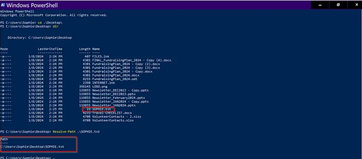

**Question:** What program was used to create the text file?

**Answer:** notepad.exe

**Explanation:**
opening event viewer and follow the path `Application and Service Logs > Microsoft > Windows > Sysmon > Operational.`

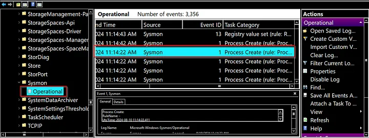

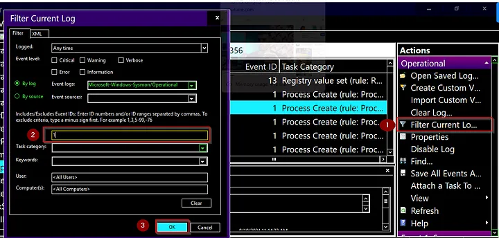

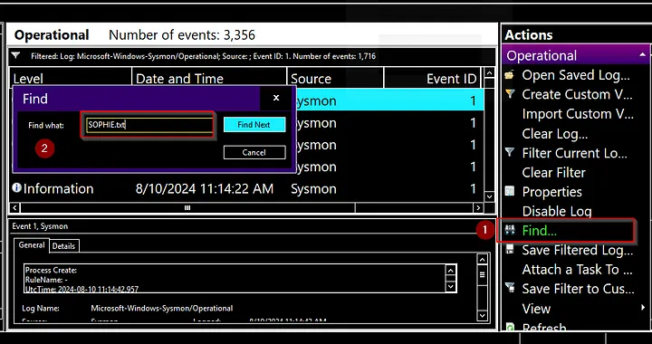

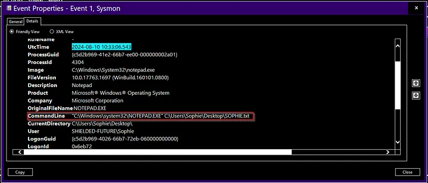

**Question:** What is the time of execution of the process that created the text file?

**Answer:** 2024-01-08 14:25:30

**Explanation:**

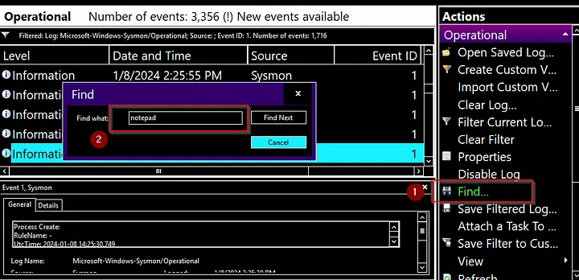

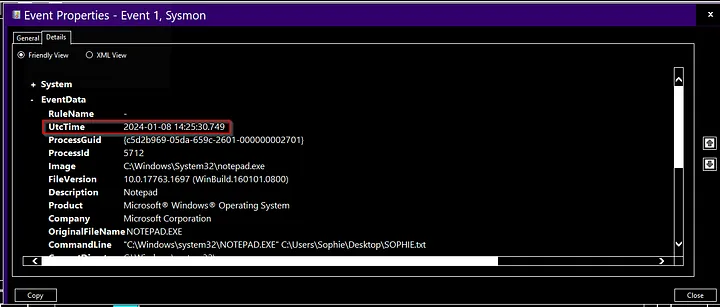

## Task 3

**Question:** What is the filename of this “installer”?

**Answer:** antivirus.exe

**Explanation:**
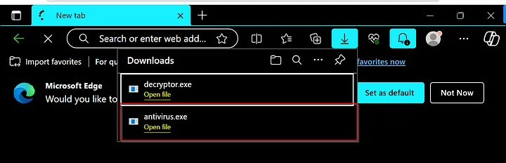

**Question:** What is the download location of this installer?

**Answer:** C:\Users\Sophie\download

**Explanation:**

- open the file throw explorer, and you will finid the path.

**Question:** The installer encrypts files and then adds a file extension to the end of the file name. What is this file extension?

**Answer:** .dmp

**Explanation:**

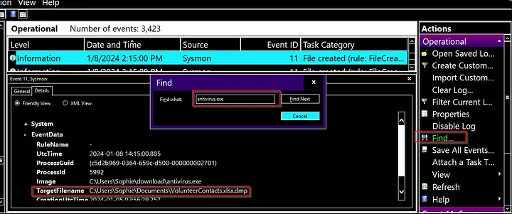

**Question:** The installer reached out to an IP. What is this IP?

**Answer:** 10.10.8.111

**Explanation:**

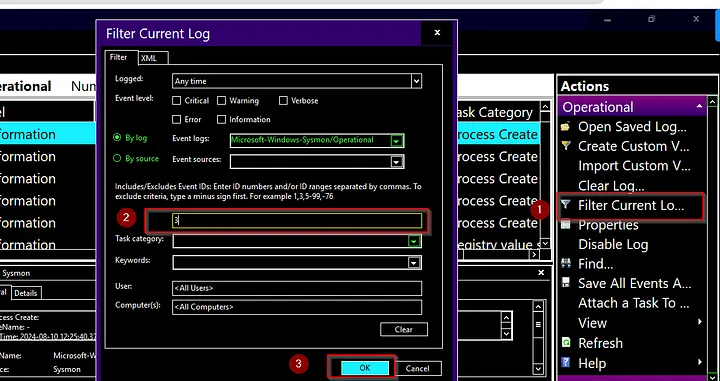

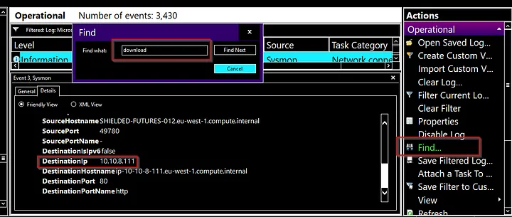

## Task 4

**Question:** The threat actor logged in via RDP right after the “installer” was downloaded. What is the source IP?

**Answer:** 10.11.27.46

**Explanation:**
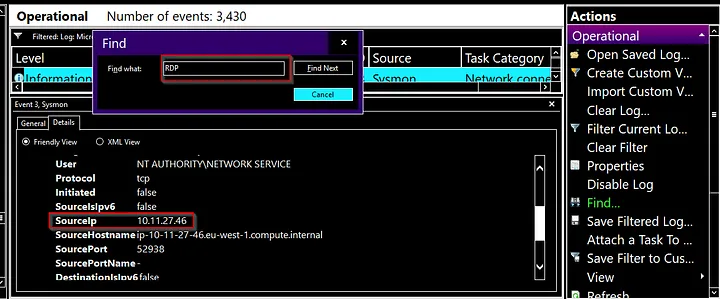

**Question:** This other person downloaded a file and ran it. When was this file run? Timezone UTC (Format YYYY-MM-DD hh:mm:ss)

**Answer:** 2024-01-08 14:24:18

**Explanation:**

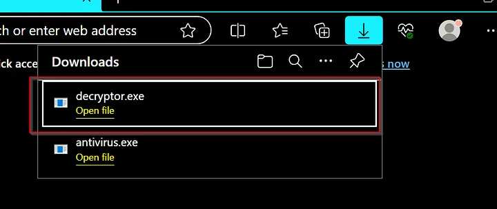

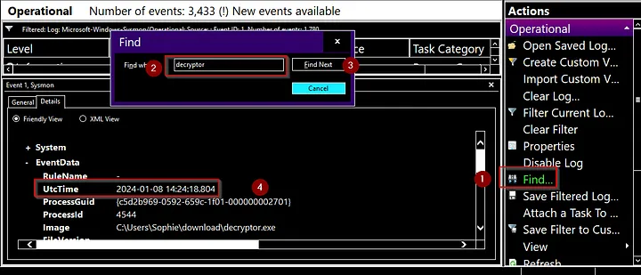

## Task 5

**Question:** Arrange the following events in sequential order from 1 to 7, based on the timeline in which they occurred.

**Answer:**

1.  Sophie downloaded the malware and ran it.
2.  The malware encrypted the files on the computer and showed a ransomware note.
3.  Sophie ran out and reached out to you for help.
4.  Someone else logged into Sophie’s machine via RDP and started looking around.
5.  The intruder downloaded a decryptor and decrypted all the files.
6.  A note was created on the desktop telling Sophie to check her Bitcoin.
7.  We arrive on the scene to investigate.
