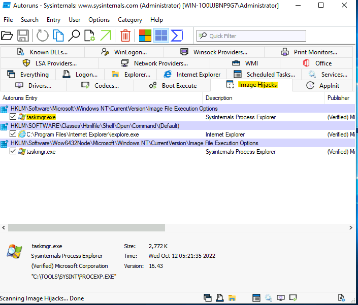
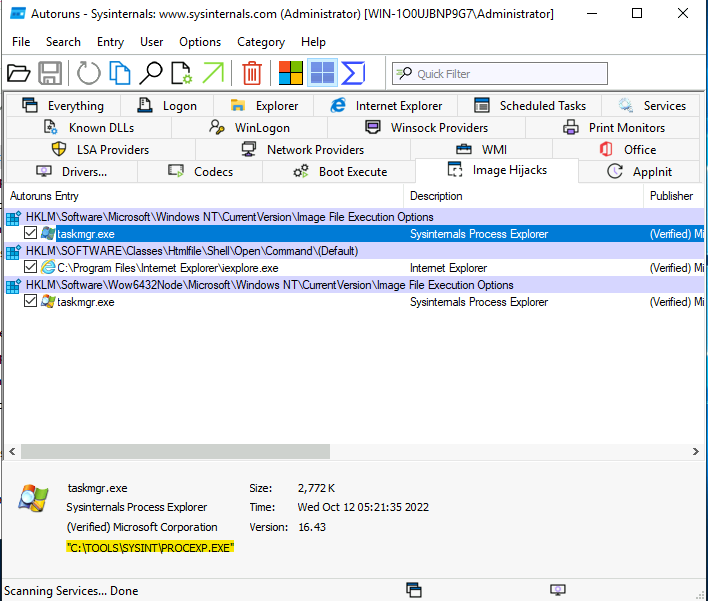

# Sysinternals

## Task 1

**Question:** When did Microsoft acquire the Sysinternals tools?

**Answer:** 2006

## Task 2

**Question:** What is the last tool listed within the Sysinternals Suite?

**Answer:** ZoomIt

## Task 3

**Question:** What service needs to be enabled on the local host to interact with live.sysinternals.com?

**Answer:** WebClient

## Task 4

**Question:** There is a txt file on the desktop named file.txt. Using one of the three discussed tools in this task, what is the text within the ADS?

**Answer:** I am hiding in the stream.

**Explanation:**

- open powershell
- change directory to ./Desktop
- enter this command: streams ./file.txt
- you will see it outputs the path with :ads.txt:$DATA 26
- now enter the command notepad ./file.txt:ads.txt
- it opens the notepad with the answer

## Task 5

**Question:** Using WHOIS tools, what is the ISP/Organization for the remote address in the screenshots above?

**Answer:** Microsoft Corporation

## Task 6

**Question:** What entry was updated?

**Answer:** taskmgr.exe

**Explanation:**

**Question:** What is the updated value?

**Answer:** c:\tools\sysint\procexp.exe

**Explanation:**

## Task 9

**Question:** Run the Strings tool on ZoomIt.exe. What is the full path to the .pdb file?

**Answer:** C:\agent_work\112\s\Win32\Release\ZoomIt.pdb

**Explanation:**

- open powershell
- change directory to C:/Tools/sysint
- run command strings .\zoomit.exe | findstr /i .pdb

_The tasks, questions or answers not mentioned here means there were no answers needed._
