# Sysmon

## Task 4

**Question:** How many event ID 3 events are in C:\Users\THM-Analyst\Desktop\Scenarios\Practice\Filtering.evtx?

**Answer:** 73,591

**Explanation:**

- Open powershell
- enter this command: `C:\Users\THM-Analyst\Desktop\Scenarios\Practice> Get-WinEvent -Path C:\Users\THM-Analyst\Desktop\Scenarios\Practice\F
iltering.evtx -FilterXPath ‘*/System/EventID=3’| Measure-Object -Line`

**Question:** What is the UTC time created of the first network event in C:\Users\THM-Analyst\Desktop\Scenarios\Practice\Filtering.evtx?

**Answer:** 2021-01-06 01:35:50.464

**Explanation:**

- open the scenarios folder on the desktop
- open the Practice folder
- open the filtering event viewer
- scroll down to the oldest log
  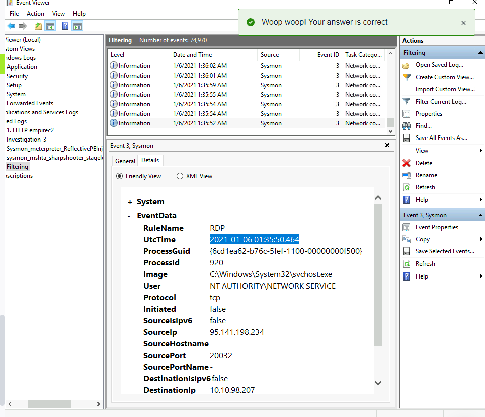

**Question:**

**Answer:**

## Task 10

**Question:** What is the full registry key of the USB device calling svchost.exe in Investigation 1?

**Answer:** HKLM\System\CurrentControlSet\Enum\WpdBusEnumRoot\UMB\2&37c186b&0&STORAGE#VOLUME#\_??\_USBSTOR#DISK&VEN_SANDISK&PROD_U3_CRUZER_MICRO&REV_8.01#4054910EF19005B3&0#\FriendlyName

**Explanation:**

- I looked at the earliest logs and worked my way to the latest. What I focused on was to see if anything references svchost.exe.
  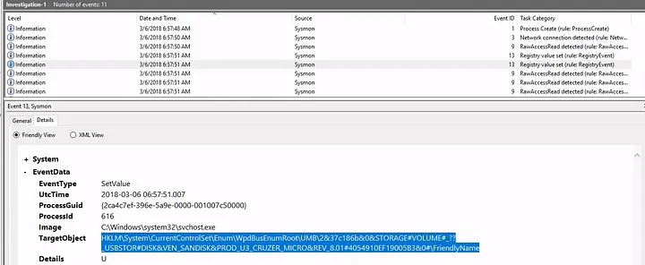

**Question:** What is the device name when being called by RawAccessRead in Investigation 1?

**Answer:** \Device\HarddiskVolume3

**Explanation:**

- I looked at the earliest instance of “RawAccessRead” under Task Category. After that, I looked for anything that would give a name. Instead I found a “Device” tag instead.
  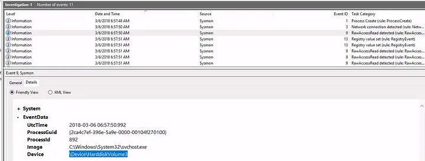

**Question** What is the first exe the process executes in Investigation 1?

**Answer:** rundll32.exe

**Explanation:**

- I worked down starting with the earliest after the first RawAccessRead event. WUDFHost.exe was not the right answer. After a few tries, I saw the latest entry is rundll32.exe being terminated. I decided to enter that as the answer because I thought maybe the malicious file wanted to terminate the process it started to make it harder for anyone to notice something is in the network.

**Question:** What is the full path of the payload in Investigation 2?

**Answer:** C:\Users\IEUser\AppData\Local\Microsoft\Windows\Temporary Internet Files\Content.IE5\S97WTYG7\update.hta

**Explanation:**
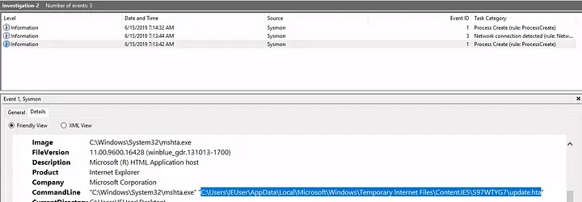

**Question:** What is the full path of the file the payload masked itself as in Investigation 2?

**Answer:** C:\Users\IEUser\Downloads\update.html

**Explanation:**


**Question:** What signed binary executed the payload in Investigation 2?

**Answer:** C:\Windows\System32\mshta.exe

**Explanation:**
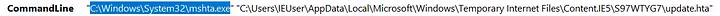

**Question:** What is the IP of the adversary in Investigation 2?

**Answer:** 10.0.2.18

**Explanation:**
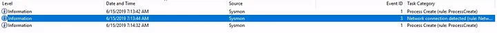

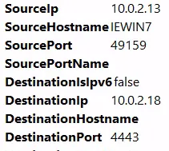

**Question:** What back connect port is used in Investigation 2?

**Answer:** 4443

**Question:** What is the IP of the suspected adversary in Investigation 3.1?

**Answer:** 172.30.1.253

**Explanation:**

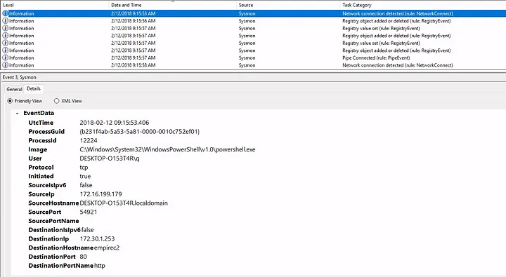

**Question:** What is the hostname of the affected endpoint in Investigation 3.1?

**Answer:** DESKTOP-O153T4R

**Question:** What is the hostname of the C2 server connecting to the endpoint in Investigation 3.1?

**Answer:** empirec2

**Question:** Where in the registry was the payload stored in Investigation 3.1?

**Answer:** HKLM\SOFTWARE\Microsoft\Network\debug

**Explanation:**
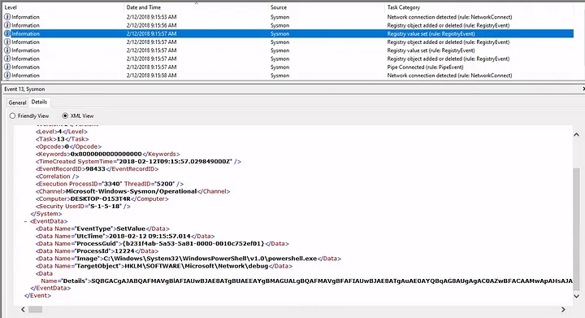

**Question:** What PowerShell launch code was used to launch the payload in Investigation 3.1?

**Answer:** “C:\Windows\System32\WindowsPowerShell\v1.0\powershell.exe” -c “$x=$((gp HKLM:Software\Microsoft\Network debug).debug);start -Win Hidden -A \”-enc $x\” powershell”;exit;

**Explanation:**

- enter this command in powershell:
  `(Get-WinEvent -Path .\Investigation-3.1.evtx | Where-Object {$_.Id -eq "13"} | Select-Object -First 1).Properties.Value[6]`

**Queston:** What is the IP of the adversary in Investigation 3.2?

**Answer:** 172.168.103.188

**Explanation:**

- Enter these commands in powershell:

```
$Events = Get-WinEvent -Path .\Investigation-3.2.evtx | Where-Object {$_.Id -eq "3"}

$Events[0].Properties

$Events[0].Properties[13].Value
```

**Question:** What is the full path of the payload location in Investigation 3.2?

**Answer:** c:\users\q\AppData:blah.txt

**Explanation:**
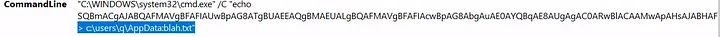

**Question:** What was the full command used to create the scheduled task in Investigation 3.2?

**Answer:** “C:\WINDOWS\system32\schtasks.exe” /Create /F /SC DAILY /ST 09:00 /TN Updater /TR “C:\Windows\System32\WindowsPowerShell\v1.0\powershell.exe -NonI -W hidden -c \”IEX ([Text.Encoding]::UNICODE.GetString([Convert]::FromBase64String($(cmd /c ‘’more < c:\users\q\AppData:blah.txt’’’))))\””

**Explanation:**
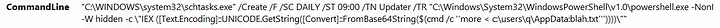

**Question:** What process was accessed by schtasks.exe that would be considered suspicious behavior in Investigation 3.2?

**Answer:** lsass.exe

**Explanation:**

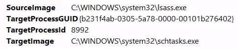

**Question:** What is the IP of the adversary in Investigation 4?

**Answer:** 172.30.1.253

**Explanation:**

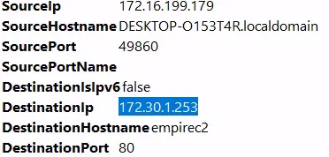

**Question:** What port is the adversary operating on in Investigation 4?

**Answer:** 80

**Question:** What C2 is the adversary utilizing in Investigation 4?

**Answer:** Empire

_The tasks, questions or answers not mentioned here means there were no answers needed._
