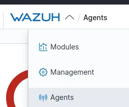

# Wazuh

## Task 1

**Question:** When was Wazuh released?

**Answer:** 2015

**Question:** What is the term that Wazuh calls a device that is being monitored for suspicious activity and potential security threats?

**Answer:** Agent

**Question:** Lastly, what is the term for a device that is responsible for managing these devices?

**Answer:** Manager

## Task 3

**Question:** How many agents does this Wazuh management server manage?

**Answer:** 2

**Explanation:**

**Question:** What are the status of the agents managed by this Wazuh management server?

**Answer:** disconnected

## Task 4

**Question:** How many “Security Event” alerts have been generated by the agent “AGENT-001”?

**Answer:** 196

**Explanation:**

- go to security events in your agent
- change the date
  

## Task 7

**Question:** What is the name of the tool that we can use to monitor system events?

**Answer:** Sysmon

**Question:** What standard application on Windows do these system events get recorded to?

**Answer:** Event Viewer.

## Task 8

**Question:** What is the full file path to the rules located on a Wazuh management server?

**Answer:** /var/ossec/ruleset/rules

**Question:** What application do we use on Linux to monitor events such as command execution?

**Answer:** Auditd

**Question:** What is the full path & filename for where the aforementioned application stores rules?

**Answer:** /etc/audit/rules.d/audit.rules

## Task 10

**Question:** What is the name of the standard Linux tool that we can use to make requests to the Wazuh management server?

**Answer:** curl

**Question:** What HTTP method would we use to retrieve information for a Wazuh management server API?

**Answer:** GET

**Question:** What HTTP method would we use to perform an action on a Wazuh management server API?

**Answer:** PUT

**Question:** Use the API console to find the Wazuh server’s version.

**Answer:** v4.2.5

**Explanation:**

## Task 11

**Question:** Analyse the report. What is the name of the agent that has generated the most alerts?

**Answer:** agent-001

**Explanation:**

_The tasks, questions or answers not mentioned here means there were no answers needed._
