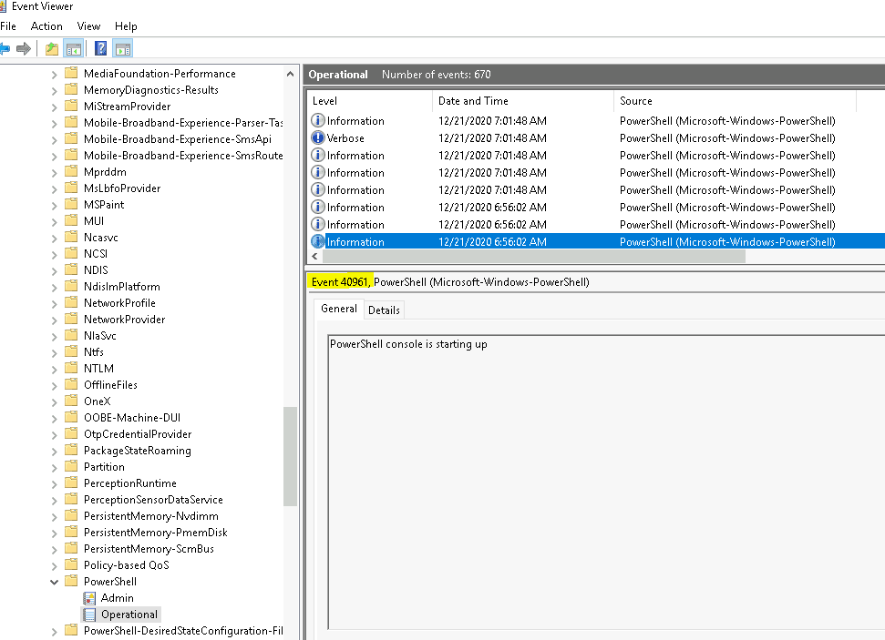
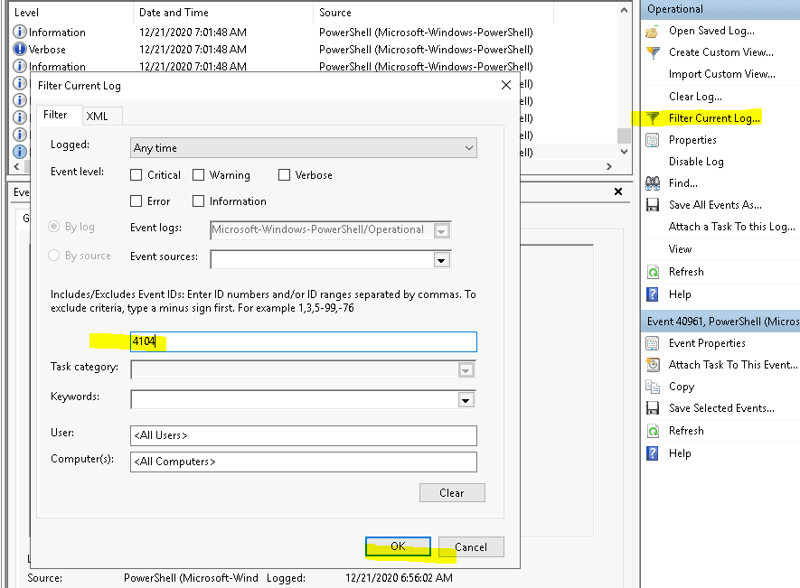
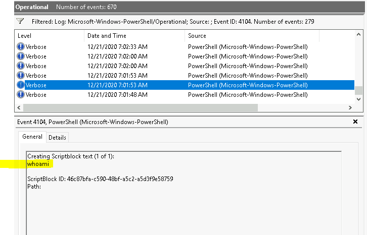
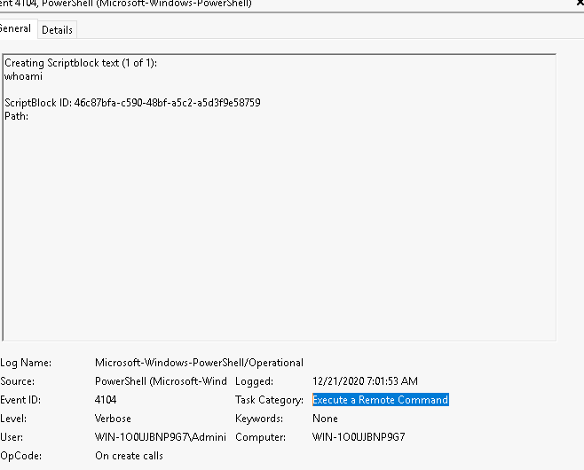
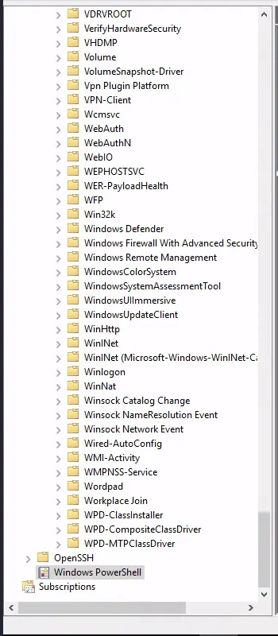
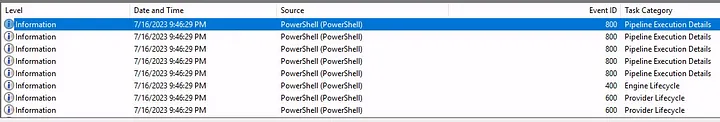
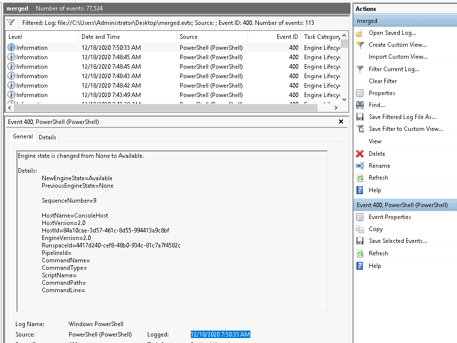
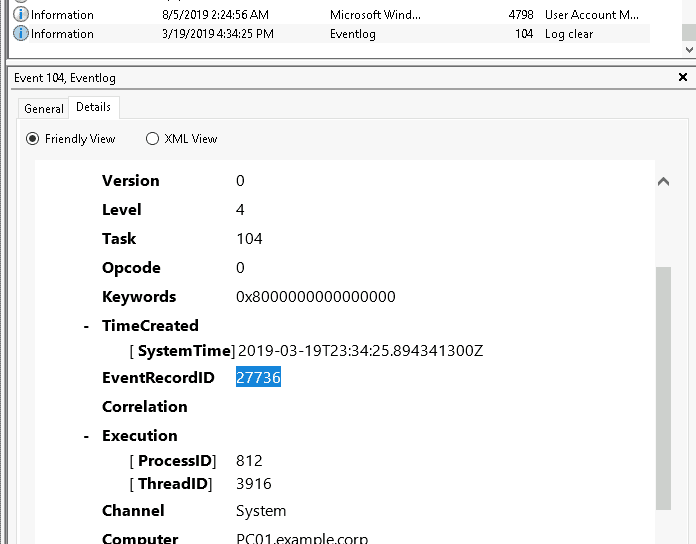
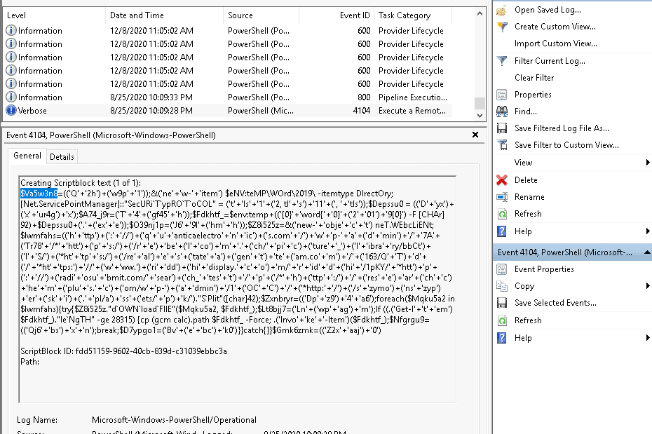

# Windows event logs

## Task 2

**Question:** What is the Event ID for the earliest recorded event?

**Answer:** 40961

**Explanation:**

**Question:** Filter on Event ID 4104. What was the 2nd command executed in the PowerShell session?

**Answer:** whoami

**Explanation:**

scroll down

**Question:** What is the Task Category for Event ID 4104?

**Answer:** Execute a Remote Command

**Explanation:**

**Question:** What is the Task Category for Event ID 800?

**Answer:** Pipeline Execution Details

**Explanation:**

now look for an entry with 800 for their eventID

## Task 3

**Question:** How many log names are in the machine?

**Answer:** 1071

**Explanation:**

- open powershell
- run this command: `wevtutil.exe el | Measure-Object`

**Question:** What is the definition for the query-events command?

**Answer:** event log, log file, structured query

**Explanation:**

- open powershell
- run this command: `wevtutil.exe qe /?`

**Question:** What option would you use to provide a path to a log file?

**Answer:** /lf:true

**Question:** What is the VALUE for /q?

**Answer:** XPATH query

**Question:** What is the log name?

**Answer:** Application

**Explanation:**

- open powershell
- run this command: `wevtutil qe Application /c:3 /rd:true /f:text`

**Question:** What is the /rd option for?

**Answer:** Event read direction

**Question:** What is the /c option for?

**Answer:** Maximum number of events to read

## Task 4

**Question:** Execute the command from Example 1 (as is). What are the names of the logs related to OpenSSH?

**Answer:** OpenSSH/Admin,OpenSSH/Operational

**Explanation:**

- Open powershell
- run this command: `Get-WinEvent -ListLog *`

**Question:** Execute the command from Example 7. Instead of the string _Policy_ search for _PowerShell_. What is the name of the 3rd log provider?

**Answer:** Microsoft-Windows-PowerShell-DesiredStateConfiguration-FileDownloadManager

**Explanation:**

- Open powershell
- run this command: `Get-WinEvent -ListProvider *Powershell*`

**Question:** Execute the command from Example 8. Use Microsoft-Windows-PowerShell as the log provider. How many event ids are displayed for this event provider?

**Answer:** 192

**Explanation:**

- Open powershell
- run this command: `(Get-WinEvent -ListProvider Microsoft-Windows-PowerShell).Events | Format-Table Id, Description | Measure-Object`

**Question:** How do you specify the number of events to display?

**Answer:** -MaxEvents

**Question:** When using the FilterHashtable parameter and filtering by level, what is the value for Informational?

**Answer:** 4

## Task 5

**Question:** Using Get-WinEvent and XPath, what is the query to find WLMS events with a System Time of 2020-12-15T01:09:08.940277500Z?

**Answer:** `Get-WinEvent -LogName Application -FilterXPath '*/System/Provider[@Name="WLMS"] and */System/TimeCreated[@Name="SystemTime"]="2020-12-15T01:09:08.940277500Z"'`

**Question:** Using Get-WinEvent and XPath, what is the query to find a user named Sam with an Logon Event ID of 4720?

**Answer:** `Get-WinEvent -LogName Security -FilterXPath '*/EventData/Data[@Name="TargetUserName"]="Sam" and */System/EventID=4720'`

**Question:** Based on the previous query, how many results are returned?

**Answer:** 2

**Question:** based on the output from the question #2, what is Message?

**Answer:** A user account was created

**Question:** Still working with Sam as the user, what time was Event ID 4724 recorded? (MM/DD/YYYY H:MM:SS [AM/PM])

**Answer:** 12/17/2020 1:57:14 PM

**Explanation:**

- Open powershell
- run this command: `Get-WinEvent -LogName Security -FilterXPath '*/EventData/Data[@Name="TargetUserName"]="Sam" and */System/EventID=4724'`

**Question:** What is the Provider Name?

**Answer:** Microsoft-Windows-Security-Auditing

## Task 7

**Question:** What event ID is to detect a PowerShell downgrade attack?

**Answer:** 400

**Question:** What is the Date and Time this attack took place? (MM/DD/YYYY H:MM:SS [AM/PM])

**Answer:** 12/18/2020 7:50:33 AM

**Explanation:**
Filter on eventID 400

**Question:** A Log clear event was recorded. What is the ‘Event Record ID’?

**Answer:** 27736

**Explanation:**
The clear log is a task category

**Question:** What is the name of the computer?

**Answer:** PC01.example.corp

**Question:** What is the name of the first variable within the PowerShell command?

**Answer:** $Va5w3n8

**Explanation:**
Filter on source PowerShell and scroll down to the first event

**Question:** What is the Date and Time this attack took place? (MM/DD/YYYY H:MM:SS [AM/PM])

**Answer:** 8/25/2020 10:09:28 PM

**Question:** What is the Execution Process ID?

**Answer:** 6620

**Explanation:**
Found in the XML part of the event

**Question:** What is the Group Security ID of the group she enumerated?

**Answer:** S-1-5-32-544

**Explanation:**

- First, we need to find the even ID. After some google
  https://www.ultimatewindowssecurity.com/securitylog/encyclopedia/event.aspx?eventid=4799
- We filter on EventID 4799
- The answer is de SID of the security group administrators

**Question:** What is the event ID?

**Answer:** 4799
