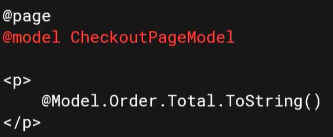
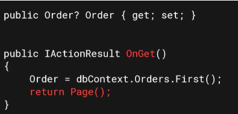
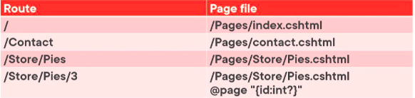

# Razor Pages 
- simpler form of creating pages
- based on PageModel and code-behind
- Can co-exist in single application with MVC
- Most concepts apply

## @model directive

@model gives access to methods and properties

links to class with same name as Page itself

## The PageModel Class

exposes the properties of data we want to use in the UI

## Page Handler Methods
- Allows for separating of page and its data
- OnGet()
- OnPost()
- Async verions exist too

## Using OnGet()

## Routing to Pages
- routing is simpler
- pages folder as root
- filename and location

