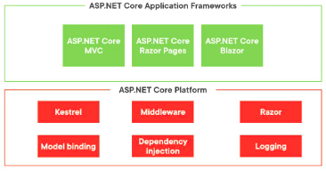
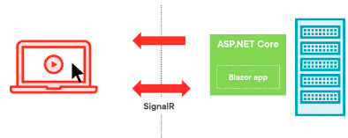
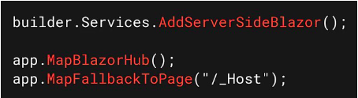
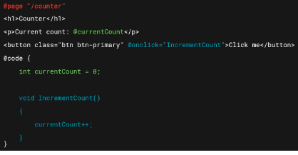
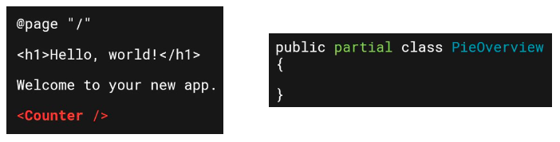

# Blazor
Blazor is a framework to build interactive web UIs using C# and HTML
(alternative for using javascript and HTML)

Part of ASP.NET core

## Blazor - 2 options
- Blazor WebAssembly
    - WebAssembly makes running C# code in browsers possible
    - C# runs entirely in te browser
    - Out of scope for this course
- Blazor server
    - Razor components executed on server
    - UI updates to browser via SignalR connection

## Blazor Server - How it works
- Blazor components
    - Prerenter HTML on server
    - SignalR connection between browser and server
        - UI events form browser are sent tothe server (e.g. click)
        - UI updates are sent back form server to browser

=> All code you write, runs on the server!

## Blazor server - configuration
- register Blazor services (AddServerSideBlazor) in DI container
- Add middleware
    - TO accept incoming connections form components (MapBlazorHub)
    - To route requests to Blazor (MapFallbackToPage)
- Blazor can co-exist with other ASP.NET core technologies (e.g. MVC)

## Blazor Server - Components
- Building block of a Blazor application
- Main component with other components nested inside
    - Several levels of nesting
- Can be a page, but also a part of a page (e.g. a button)
- Contains Razor code and C# code

## Blazor Server - Using a component
- Use other components by adding them as a tag
- Best practice: put the code block in a code-behind file
    - E.g. PieOverview.razor and PieOverview.razor.cs

