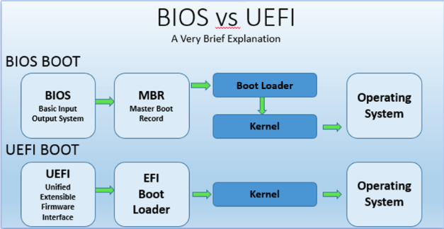
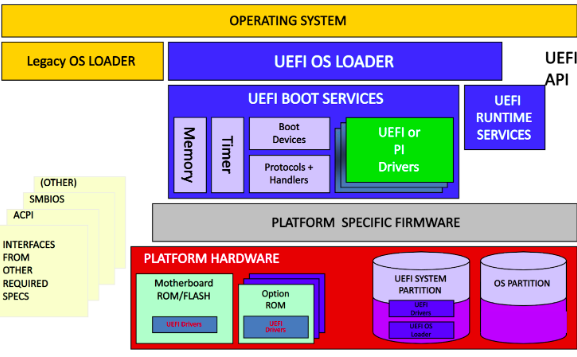

# kernel
### Linux virtual memory
when a linux program allocates memory, this is just an entry in a table of the OS. it is virtual

Only when the program actually accesses the memory is the RAM for it found and used.

"memory usage" of a process can mean two things:
 - how much virtual memory it uses overall
 - how much actual or "resident" memory it uses, limited to the system's resident RAM capacity.

### linux kernel
Core component of the linux operating system

Responsible for managing system resources, providing low-level services to other parts of the operating systems, and controlling hardware services.

### linux kernel:
Typically described as monolithic
 - All system-level services are contained within a single executable file
 - Benefits of monolithic design: improved performance and symplified system management.

The kernel also includes a modular design
 - certain features can be compiled as loadable kernel modules
 - Modules can be dynamically loaded or unloaded at runtime
 - Provides greater flexibilty and allows for customization
 - example: adding support for a particular hardware device or file system
    - Developers can experiment with new features without commiting to the main kernel source code
    - if a new feature proves useful and stable, it can be integrated into the main kernel codebase
 - Modular design allows for greather customization and flexibility

 ### Features and services of the linux kernel
 - process management: The kernel manages all running processes on the system, allocating resources and scheduling CPU time.
 - Memory management: The kernel is responsible for managing the allocation and deallocation of system memory, as well as implementing virtual memory.
 - File system management: The kernel provides the file system interface for managing multiple file systems.
 - Device management: The kernel controls access to hardware devices, such as disk drives, network adapters, and input/output devices.
 - Network management: The kernel provides the networking sack.

 ### Linux Kernel Organization
 Software residing in memory that tells the CPU where to look for its next task

 Acting as a mediator, the kernel manages the hardware and is the primary interface between the hardware and any running program.

 processes, managed by the kernel, make up user space.

### User space and user processes
the kernel runs in kernel mode, and the user processes run in user mode.

user space:
 - User mode restricts access to a small subnet of memory and safe CPU operations.
 - User space refers to the parts of main memory that the user processes can access. if a process makes a mistake and crashes, the consequences are limited and can be cleaned up by the kernel

kernel space;:
 - Code running in kernel mode has unrestricted access to the processor and main memory.
 - This is a powerfull but dangerous privilege that allows the kernel to easily corrupt and crash the entire system.
 - The memory area that only the kernel can access is called kernel space.

### Linux virtual file system
VFS provides unified view of file system to apps & kernel.

Abstracts underlying file system details for consistent interface.

File systems mounted at specific mount points in file system hierarchy.

VFS caches recently accessed files/directories in memory for performance improvement.

supports various file system types: local, network, special.
 - procfs: virtual view of running system, allows access/modification of system info & config parameters.
 - sysfs: virtual view of system's hardware devices & drivers, allows view/modification of device attributes & settings.

Provides flexible & extensible framework for managing files/directories in various file system tymes & locations.

### Process Management
Starting, pausing, resuming, scheduling, and terminating of processes.

Each process uses the CPU for a small fraction of a second, then pauses; then another process uses the CPU for another

# systemd
### what is systemd?
 - open-source software that provides system components for linux
 - main goal: unify service config and behavior across linux distro's
 - provides a system and service manager that runs as PID1 and starts the rest of the system
 - provices replacements for various daemons and utilities, including device management, login management, network connection management, and event logging.

### what does systemd do?
takes care of boot and all types of services

### practical targets
 - graphical.target
 - multi-user.target
 - rescue.target
 - reboot.target

# Booting Linux
## legacy BIOS
### begrippen
- POST: power-on self-test
- UEFI: Unified Firmware Interface
- MBR: Master Boot Record

UEFI nieuwere versie van BIOS. Heeft dezelfde functie.

technical advantages of using UEFI:
- Secure Boot
- GUID Partition Table (GPT)
- Platform and architecture Independence
- Consistend Variables and Services
- Modular and Extensible
- Improved Boot Performance

## UEFI: Enhancing Bootloader Functionality and Flexibility

 