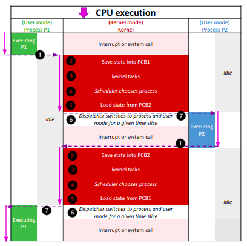

# kernel
### **Linux virtual memory**
when a linux program allocates memory, this is just an entry in a table of the OS. it is virtual

Only when the program actually accesses the memory is the RAM for it found and used.

"memory usage" of a process can mean two things:
 - how much virtual memory it uses overall
 - how much actual or "resident" memory it uses, limited to the system's resident RAM capacity.

### **linux kernel**
Core component of the linux operating system

Responsible for managing system resources, providing low-level services to other parts of the operating systems, and controlling hardware services.

### **linux kernel: Monolithic and Modular**
Typically described as **monolithic**
 - All system-level services are contained within a single executable file
 - Benefits of monolithic design: improved performance and symplified system management.

The kernel also includes a **modular** design
 - certain features can be compiled as loadable kernel modules
 - Modules can be dynamically loaded or unloaded at runtime
 - Provides greater flexibilty and allows for customization
 - example: adding support for a particular hardware device or file system
    - Developers can experiment with new features without commiting to the main kernel source code
    - if a new feature proves useful and stable, it can be integrated into the main kernel codebase
 - Modular design allows for greather customization and flexibility

 ### **Features and services of the linux kernel**
 - **process management**: The kernel manages all running processes on the system, allocating resources and scheduling CPU time.
 - **Memory management**: The kernel is responsible for managing the allocation and deallocation of system memory, as well as implementing virtual memory.
 - **File system management**: The kernel provides the file system interface for managing multiple file systems.
 - **Device management**: The kernel controls access to hardware devices, such as disk drives, network adapters, and input/output devices.
 - **Network management**: The kernel provides the networking sack.

 ### **Linux Kernel Organization**
 Software residing in memory that tells the CPU where to look for its next task

 Acting as a mediator, the kernel manages the hardware and is the primary interface between the hardware and any running program.

 processes, managed by the kernel, make up user space.

### **User space and user processes**
the kernel runs in kernel mode, and the user processes run in user mode.

**user space**:
 - User mode restricts access to a small subnet of memory and safe CPU operations.
 - User space refers to the parts of main memory that the user processes can access. if a process makes a mistake and crashes, the consequences are limited and can be cleaned up by the kernel

**kernel space**:
 - Code running in kernel mode has unrestricted access to the processor and main memory.
 - This is a powerfull but dangerous privilege that allows the kernel to easily corrupt and crash the entire system.
 - The memory area that only the kernel can access is called kernel space.

### **Linux virtual file system**
VFS provides unified view of file system to apps & kernel.

Abstracts underlying file system details for consistent interface.

File systems mounted at specific mount points in file system hierarchy.

VFS caches recently accessed files/directories in memory for performance improvement.

supports various file system types: local, network, special.
 - procfs: virtual view of running system, allows access/modification of system info & config parameters.
 - sysfs: virtual view of system's hardware devices & drivers, allows view/modification of device attributes & settings.

Provides flexible & extensible framework for managing files/directories in various file system tymes & locations.

### **Process Management**
Starting, pausing, resuming, scheduling, and terminating of processes.

Each process uses the CPU for a small fraction of a second, then pauses; then another process uses the CPU for another small fraction of a second; then another process takes a turn, and so on.

**Context switch**: The act of one process giving up control of the CPU to another process.

**Time slice**: each piece of time gives a process enough time for significant computation.

The linux kernel also provides system calls for managing processes, such as creating new processes, changing process priority, and terminating processes.

### **Linux processes (minder belangrijk)**

A process is an instance of a program that is currently executing.

Each process has its own memory space, program code and execution context, including program counter, stack and other registers.

Processes can communicate with each other using various interprocess communication mechanisms, such as pipes, sockets and shared memory segments.

Processes are created using the fork system call, which creates a new process by duplicating the current process.:
 - The new process is called the child process, and it has its own unique process ID
 - The fork system call creates a copy of the parent process, including its memory and state, and then sets the PID of the child process to a new value.
 - The child process can then execute a new program of perform other tasks independently of the parent process.

Processes can also be created using other system calls, such as exec, which replaces the current process with a new program, or clone, which create a new process with shared memory and oter resources. 

### **Types of linux processes**
**Init process**: The "init" process is the first process that gets started when the linux operating system boots up, and it becomes the parent process for all other processes.

**Parent and Child Processes**: Each user process has a parent process in the system, with most commands having a shell as their parent.

**Orphan processes**: When a child process is killed or terminated, the parent process is updated about it through the SIGCHLD signal. But, when the parent process is killed before the termination of the child process, the child process becomas an orphan process with "init" process as its new PID

**Zombie processes**: A process which is killed but still shows its entry in the process status or the process table is called a zombie process, they are dead and are not used.

**Daemon processes**: Daemon processes are system-related background processes that run with root permissions and wait for requests from the other processes. They often run in the background and can work with other processes. Examples include print daemon.

### **Processs states $ signals**
Linux signals are a form of interprocess communication (IPC) used to notify a process of an event or condition.

Signals can be sent to a process by another process, by the kernel, or by the process itself.

Each signal has a unique number that identifies it, such as SIGTERM for termination or SIGKILL for immediate termination.

Signals can be sent using the kill command, the kill system call, or other IPC mehcanisms such as pipes or sockets.

When a process receives a signal, it can either ignore the signal, handle the signal, or perform the default action associated with the signal.

The signal system call allows a process to specify a custom signal handler function to be executed when a particular signal is received.

Some common use cases for signal include graceful termination of a process, handling user interrupts, and sending status updates between processes.

### **fork() and exec()**
**fork()**
 - Fork is a clone operation, it takes the current process, also called the parent process, and it clones it in a new process with a brand new process ID.
 - when forking, everything is copied from the parent process: the stack, the heap, but also the file descriptors meaning the standard input, the standard output and the standard error.
 - it means that if my parent process was writing to the current shell console, the child process will also write to the shell console.

**exec()**
 - the execute operation is used onlinux to replace the current process image with the image from another process.

### **Shell command execution**
A shell console is a process that waits for input from the user.

It also launches a bash interpreter when you hit Enter and it provides an environment for your commands to run.

When you type a command and hit enter, the shell is forked to a child process that will be responsible for running your command. The shell will wait patiently until the execution of the child process finishes.

On the other hand, the child process is linked to the same file descriptors and it may share variables that were declared on a global scope.

The child process executes the "exec" command in order to replace the current process image in the process image of the command you are trying to run.

The child process will eventually finish and it will print its result to the standard output it inherited from the parent process, in thi case the shell console itself.

### **Kernel: Process management -context switching**
1. The CPU interrupts the current process based on an internet timer, switches into kernel mode, and hadns control back to the kernel.

2. The kernel records the current state of the CPU and memory, which will be essential to resuming the process that was just interrupted.

3. The kernel performs any tasks that might have come up diring the preceding time slice (such as collecting data form input and output, or I/O operations)

4. The kernel is now ready to let another process run The kernel analyzes the list of processes taht are ready to run and chooses one.

5. the kernel prepares the memory for this new process and then prepares the CPU.

6. The kernel tells the CPU how long the time slice for the new process will last.

7. The kernel switches the CPU into user mode and hands control of the CPU to the process

The context switch answers the important questions of when the kernel runs. The answer is that it runs between process time slices during a context switch.

### The linux scheduler

Responsible for deciding which process to run next.

The scheduler uses a variety of factors to make informed decisions, including process priorities, CPU utilization, process states, and scheduling classes.

Each process is assigned a priority value, which ranges from -20 (highest priority) to 19 (lowest priority)

The scheduler uses a priority-based scheduling algorithm, but also takes into account other factors to ensure that system resources are used efficiently.

The scheduler can dynamically adjust priorities based on system load and other factors, e.g. process affinity and process real-time constraints.

linux supports multiple scheduling classes, each with its own scheduling algorithm, to optimize performance for different types of workloads.

The Completely Fair Scheduler (CFS) is the default scheduler in most linux distributions, wich uses a fairness algorithm to ensure that all processes receive an equal share of the CPU time.

### **Completely fair scheduler**
Linux scheduler manages groups of threads, multi-threaded processes, and all the processes of a given user.

Tasks are grouped and managed by scheduler as schedulable entities.

Each per-CPU run queue of processes sorts schedulable entities structures in a time-ordered fashion into a red-black tree.

The leftmost node in the tree is occupied by the entity that has received the least slice of execution time, indexed by processor "execution time" in nanoseconds.

When the scheduler is invoked to run a new process, it selects the leftmost node in the scheduling tree to execute.

Each process has a "maximum execution time" that represents the time the process would have expected to run on an "ideal processor"

when a process is stopped or reaches its maximum execution time, it is reinserted into the scheduling tree based on its newly spent execution time

The new leftmost node is selected from the tree for execution

if a process spends a lot of its time sleeping, its spent time value is low , and it automatically gets the priority boost when it finally needs it.

### **Linux threads**
Threads are lightweight execution contexts that share memory and code within a parent process.

For example, in a browser, multiple tabs can be different threads.

Each thread has its own stack and program counter, but all threads within a process share the same heap and global variables.

Threads allow a program to perform multiple tasks simultaneously.

Threads within a process can communicate within each other using shared memory or other IPC mechanisms.

Threads can synchronize their actions using mutexes, semaphores, and other synchronization primitives.

**Advantages**

**Responsiveness**: if the process is divided into multiple threads, if one thread completes its execution, then its output can be immediately returned.

**Faster context switch**: context switch time between threads is lower compared to process context switch. Process context switchin requires more overhead from the CPU.

**Effective utilization of multiprocessor system**: if we have multiple threads in a single process, then we can schedule  multiple threads on multiple processors.

**Resource sharing**: Resources like code, data, and files can be shared among all threads within a process.

**Communication**: Communication between multiple threads is easier, as the threads shares common address space, Processes require Inter-Process Communication (IPC) techniques.

### **Interrupts in Linux**
Signal emitted by hardware or software when a process or an event needs immediate attention.

Interrupts can be generated by 3 sources: Hardware, processor and software

Interrupts cause the CPU to switch to calling the interrupt handler

The interrupt handler in a software routine that performs a specific task, such as reading data from a hardware device or notifying the kernel of a user input event.

Interrupts in linux are managed by the Interrupt Service Routine (ISR) and the Interrupt Request (IRQ) subsystem.

The ISR is invoked to handle the interrupt, and the corresponding IRQ number is passed to the ISR.

The Linux kernel supports interrupt coalescing, combining many interrupts into one, which reduces the overall overhead of handling interrupts.

### **sockets**
Linux sockets are a type of file descriptor that allow processes to communicate with each other over a network between processes on the same system.

The socket mechanism provides a means of inter-process communication (IPC) by establishing named contact points between which the communication take place and provide a standardized way to send and receive data between processes or between a process and a network service.

Sockets can be created and managed using various system calls and APIs, such as socket(), bind(), listen(), accept(), send() and recv().

The socket API is implemented in the linux kernel and is used by many network services and applications.

Sockets are widely user for various network protocols, such as TCP/IP, UDP, and Unix domain sockets.

**what are sockets used for**

Socket are generally employed in client-server applications
 - the server creates a socket, attaches it to a network port addresses then waits for the client to contact it.
 - the client creates a socket and then attempts to connect to the server socket.
 - When the connection is established, transfer of data takes place.

 **practically**

 A socket connecting to the network is created at each end of the communication
 
 Each socket has a specific address, composed of an IP address and a port number.

# systemd
### what is systemd?
 - open-source software that provides system components for linux
 - main goal: unify service config and behavior across linux distro's
 - provides a system and service manager that runs as PID1 and starts the rest of the system
 - provices replacements for various daemons and utilities, including device management, login management, network connection management, and event logging.

### what does systemd do?
takes care of boot and all types of services

### practical targets
 - graphical.target
 - multi-user.target
 - rescue.target
 - reboot.target

# Booting Linux
## legacy BIOS
### begrippen
- POST: power-on self-test
- UEFI: Unified Firmware Interface
- MBR: Master Boot Record

UEFI nieuwere versie van BIOS. Heeft dezelfde functie.

technical advantages of using UEFI:
- Secure Boot
- GUID Partition Table (GPT)
- Platform and architecture Independence
- Consistend Variables and Services
- Modular and Extensible
- Improved Boot Performance

## UEFI: Enhancing Bootloader Functionality and Flexibility

 