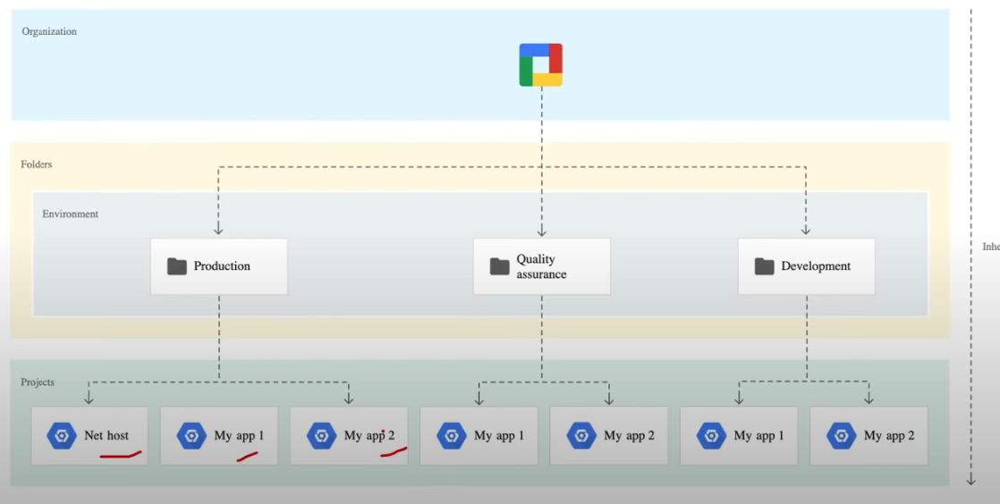

# GCACE Course (Youtube)

Created by: Dries Melotte
Created time: August 12, 2025 9:15 AM
Category: Fundamentals
Last edited by: Dries Melotte
Last updated time: September 2, 2025 2:24 PM

# Identity Access and Resource setup

## What is a Resource

- Service- level resources
    - compute Instance VM
    - Cloud Storage Buckets
    - Cloud SQL Databases
- Account-level resources
    - Organization
    - Folders
    - Projects

## Architectural Hierarchy

### Environment Oriented Hierarchy

### Function-Oriented Hierarchy

### Granular-Access Oriented Hierarchy

## Projects and Folders

### Projects

a logical grouping of resources

is made up of:

- settings
- permissions
- other metadata

A project can’t access another project’s resources unless you use a shared VPC or VPC Network Peering

Each Project ID is unique across Google Cloud

When billing is enabled, each project is associated with one billing account

A project serves as a namespace. This means every resource within each project must have a unique name, but you can usually reuse resource names if they are in separate projects

### Folders

A folder allows you to logically group multiple projects that share common IAM permissions

Folders are commonly used to isolate projects for different departments or for different environments

## Organizational Policies

To create a policy you create a **constraint**

You need to apply an **enforcement**

Enforcement is made up of the following

- **Resource Type:** What resource to apply the constraint to
- **Enforcement Method:** When the enforcement is applied e.g. On Create, Update
- **Condition:** CEL Expression to define the logical rules of access
- **Action:** Allow or Deny

There are two constraint types:

- Managed (Created by GCP)
- Custom (Created by you)

Example organiztional policy using Common Expression Language (CEL):

You can change the hierarchy evaluation by setting the Policy Source

Policy Source

- Inherit parent’s policy
    - follow the policy that the folder or organization above it is using or the Google-defined default if no parent exists
- Google Managed defaults
    - Follow the default policy set by Google
- Override parent’s policy
    - policy includes rules from the parent folder or replaces the parent policy entirely

Organization policy **rules** define the values to be enforced by a constraint. You can turn the constraint’s enforcement on or off within a rule

## Principle of Least Privilege

PoLP is the security practice of granting users, programs, or processes the minimum permissions.

## Cloud IAM

lets you control who has specific permissions to access GC resources

3 major components

- Principal identifier
    - indifiduals or systems accessing resources
        - Users
        - Service accounts
        - Groups
- Roles
    - Define what actions a member can perform
        - Viewer
        - Editor
        - Custom Roles
- Policies
    - Rules that connect members with roles for specific resources
        - a policy might allow a group to view project details but not make changes

### Principal

Identifies who gets access

types:

- Google Accounts
- Service accounts
- Google groups
- Google Workspace accounts
- Cloud Identity domains
- allAuthenticatedUsers
- allUsers
- One or more federated identities in a workforce identity pool
- One or more federated identities in a workloud identity pool
- A set of Google Kubernetes Engine Pods
- Resource Manager principal sets (for principal access boundary policy bindings only)

### Roles

are used to group permissions to define what actions users or services can perform on Google Cloud.

permissions cannot be assigned to user directly. Instead, roles are assigned to users, granting all the permissions contained in the role.

3 types:

- Basic
    - legacy roles
        - owner
        - editor
        - viewer
    - avoid if possible
- Predifined
    - fine-grained roles managed by google
        - compute admin
        - storage object viewer
- Custom

### Permissions

permissions specify what actions users or services can perform

for example: storage.bucket.get → Allows reading bucket info using a GET request

### Conditions

a rule that specifies when access to a resource is granted based on a logic expression

example: Restrict access to a resource during specific hours or for certain IP ranges

How it works:

- Specified in the role binding of an IAM policy
- Access is granted only if the condition expression evaluates to true

### Metadata

Metadata in IAM provides info for versioning concurrency control, and auditing

includes etag for consistent updates, version for schema specification, and optional auditConfig for logging.

Etag:

- Enables concurrency control for consistent policy updates.
- Prevents race conditions during policy updates.

Version:

- Defines the schema version to ensure consistency and compatibility across updates

### Audit config

specifies which permission types are logged and identifies any exemptions for certain identities in IAM policies

Types:

- Admin Activity Logs
- Data Access Logs
- Policy Denied Logs

### Policy Architecture

A policy is a collection of statements that define who has what type of access

It is attached to a resource and enforces access control when the resource is accessed.

A binding connects one or more members to a specific role

### Policy statements

policy statements define access control rules, specifying roles, members, and conditions for resource access.

- JSON
- YAML

this example shows a project-level IAM policy retrieved with gcloud projects get-iam-policy

### Policy Limitations

- each resource (organization, folder, project) can have one IAM policy.
- Policies support up to 1500 members or 250 groups
- Policy changes take up to 7 mins to propagate
- Up to 100 conditional role bindings per policy
- conditional roles alllow up to 12 logic operators for fine-grained access

### Conditions

**condition attributes** define rules based on resource properties or request details, such as timestamps, IP addresses, or other contextual data

**Time-based** **conditions** allow you to control access by specifying when a policy is valid

**Resource-based conditions** restrict access based on specific resources

**Condition limitations:**

- Only supported for specific services
- primitive roles are not supported
- Cannot use allUsers or allAuthenticatedUsers as members
- up to 100 conditional role bindings per policy
- maximum 20 bindings for the same role and member

## Service Accounts

enable apps or VM’s to securely access google cloud resources without user involvement

- User managed
    - created manually by users for custom applications or workloads
    - You control the naming and permissions
    - E.g., my-app-service-account@my-project.iam.gserviceaccount.com
- Google-managed
    - Automatically created and managed by Google for its services
    - Some are visible for specific use cases, others are hidden for backend system tasks
    - Names typically include “service agent” or “service account”
    - E.g., cloud-storage-service-agent@system.gserviceaccount.com
- Default
    - Created by GCP when you enable specific services like Compute Engine, App Engine, etc
    - Automatically granted project-wide Editor role unless modified
    - E.g., my-project@appspot.gserviceaccount.com

### Service account Keys

- google managed
    - Fully handled by Google
    - Keys are rotated automatically
    - Private keys are secure and never accessible
    - Use IAM APIs to perform signing operations
- User managed
    - Keys created and managed by users.
    - You control the private key and are responsible for
        - Security and rotation
        - Preventing loss of the private key
    - Public keys are stored by Google;  private keys are not retrievable by Google.
    - If lost, service account stops functioning
    - Store keys in Cloud KMS for enhanced security

### Service Account Permissions

Service account permissions define who can use a service account and access resources via IAM policies.

- Service accounts have IAM policies like any resource
- Roles control access to the service account
- Service Account User role grants access at the project or service account level
- Users can impersonate service accounts to access resources
- Default service accounts get editor roles for basic tasks

### Access Scopes

legacy method for defining permissions for service accounts on Google Cloud

You can assign a service account, such as the default “Compute Engine default service account,” to a VM or resource

Access Scope Options

- Allow default access
- Allow full access to all Cloud APIs
- Set access for each API

### Use of Service Accounts

Service accounts authenticate and authorize apps or services to access GCP resources securely, either by attachment or impersonation

### Service Accounts Best Practices

- Use serviceAccount.keys.list() or Logs Viewer to audit service accounts and keys
- Delete unused external keys
- Grant only the minimum permissions needed for the service account
- Create separate service accounts for each service with specific permissions
- Use the IAM Service Account API for key rotation

# Billing Configuration

## Billing Account

Cloud Billing Account is used to define who pays for a given set of Google Cloud resources and is connected to a Google payments profile

Billing account includes one or more billing contracts defined on the Payments profile
Billing can have sub-accounts for resellers, so you can bill resources to be paid by your customer

## Billing Account Types

Self-serve (or Online) account

- Payment instrument is a credit or debit card or ACH direct debit, depending on availability in each country or region.
- Costs are charged automatically to the payment instrument connected to Cloud Billing account
- You can sign up for self-service accounts online
- The documents generated for self-serve accounts include statements, payments receipts, and tax invoices, and are accessible in the Cloud Console

Invoiced (or Offline) account

- Payment instrument can be check or wire transfer
- Invoices are sent by mail or electronically
- Invoices are also accessible in the Cloud Console, as are payment receipts
- You must be eligible for invoiced billing. Learn more about invoiced billing eligibility.

## Payment Profile Types

Individual

- You are using your account for your own personal payments
- If you register your payments profile as an individual, then only you can manage the profile. You won’t be able to add or remove users, or change permissions on the profile.

Business

- You are paying on behalf of a business, organization, partnership, or educational institution.
- You use Google payments center to pay for Play apps and games. and google services like Google Ads, Google Cloud, and Fi phone service
- A business profile allows you to add other users to the Google payments profile you manage, so that more than one person can access or manage payments profile.
- All users added to a business profile can see the payment info in that profile

## Charging Cycle

For self-serve Billing accounts, your Google Cloud costs are charged automatically in one of two ways

- monthly billings
- Threshold billing

## Cloud Billing IAM Roles

Cloud Billing lets you control which users have administrative and cost viewing permissions for specified resources by setting Identity and Access Management policies on the resources

To grant or limit access to Cloud Billing, you can set IAM policy at the org level, Cloud Billing account level and/or the project level

Cloud billing roles in IAM

- Billing Account Creator
    - Create new self-serve billing accounts
- Billing Account Admin
    - Manage billing accounts (but not create them)
- Billing Account User
    - Link projects to billing accounts
- Billing Account Viewer
    - View billing account cost info and transactions
- Project Billing Manager
    - Link/unlink the project to/from a billing account
- Billing Account Costs Manager
    - Can view and export cost info of billing accounts

## Billing Health Check and Budget Alerts

Recommendations to avoid common billing issues

Budget alerts:

Multiple alert thresholds to reduce spending surprises and unexpected cost overruns

## Budget Alerts

You can now narrow the budget scope to:

- Specific projects
- Specific resources

You can set multiple thresholds that preemptively warn you when you approach your budget limit

Notification options:

- Email alerts to billing admins and users
- Link Monitoring email notification channels to this budget
- Connect a Pub/Sub topic to this budget

## Built-in Billing Reports

Billing Reports

- An interactive pricing explorer including graph visualization

Cost Table Report

- A tabular breakdown of cost to analyze details of invoices

Cost Breakdown Report

- at-a-glance waterfall overview of monthly charges and credit

Pricing Report

- Access SKU prices for Google cloud services

### Billing Reports

Configuring various views of the billing report can help you answer questions like these:

- How is my current month’s spending trending?
- What Google Cloud project cost the most last moth?
- What service cost me the most?
- What are my forecasted future costs based on historical trends?
- How much ami spending by region?
- WHat was the cost of resources with label X

### Cost Table Report

access and analyze the details of your invoices and statements

Because your generated invoice and statement PDFs only contain simplified, summarized views of your costs, the cost table report is available to provide invoice or statement cost details, such as the following:

- Includes project-level cost details from your invoices and statements, including your tax costs broken out by project
- Includes additional details you might need, such as service IDs, SKU IDs, and project numbers.
- The report view is customizable and downloadable to CSV

### Cost Breakdown Report

This report shows the following summarized view of monthly charges and credits:

- The combined cost of your monthly GCP usage at the on-demand rate, calculated using non-discounted list prices
- Savings realized on your invoice due to negotiated pricing
- Savings earned on your invoice with usage-based credits, broken down by credit type
- Your invoice-level charges such as tax and adjustments applied for that invoice month

### Pricing Report

This report shows the following pricing information:

- Displays SKU prices specific to the selected Cloud Billing account
- If your Cloud Billing account has negotiated contract pricing, each SKU displays the list price, your contract price, and your effective discount.
- If a SKU is subject to tiered pricing, each pricing tier for a SKU is listed as a separate row
- All the prices are shown in the currency of the selected billing account
- The report view is customizable and downloadable to CSV for offline analysis

# Serverless and app deployment

## Cloud SDK

You can use the Cloud SDK to programmatic create, modify, delete or interact with Google Cloud resources

Languages:

- Java
- Python
- Node.js
- Ruby
- Go
- .NET
- PHP

## App Engine

App Engine is a Platform as a Service (PaaS) for your application

Quickly deploy and scale web-applications without worrying about the underlying infrastructure

Languages

- Nodejs, Java, Ruby, C#, Go, Python, PHP
- Bring-Your-Own-Language-Runtime (BuoLR)
    - custom docker container

Powerfull application diagnostics

- Cloud Monitoring and Cloud logging to monitor health and performance
- Cloud Debugger and Error Reporting to diagnose and fix bugs quickly

**Application versioning** to easily create development, test, staging, and production environments

**Traffic splitting** to route incoming requests to different app versions, A/B test, and do incremental feature rollouts.

**Application security**

- defining access rules with App Engine firewall
- leverage managed SSL/TLS certificates by default

### Environments in App Engine

2 types of environments: Flexible and Standard

You can simultaneously use both environments for your application

App Engine is well suited to applications that are designed using microservice architecture

# Data Storage Options

## Cloud SQL

relational managed database service for MySQL, PostgreSQL and SQL Server with replication support.

- Automatic failover with read replicas
- Point-in-time recovery for restores.
- Auto-scaling storage up to 30TB with SSD or HDD.
- Data encrypted at rest and in transit.
- Simple pricing for CPU, memory, storage, and traffic.

A Cloud SQL instance is a virtual machine on Google Cloud that runs your database

## Spanner

Fully managed relational database service that is both strongly consistent and horizontally scalable

Key Features:

- Ensures data is instantly replicated across all regions using Google’s atomic clock system called TrueTime
- Supports globally consistent reads and distributed transactions across regions
- Automatically manages replication, sharding, and performance optimization based on data size and load
- provides synchronous data replication across independent zones for fault tolerance

### Architecture

## Firestore

- Document database
- NoSQL
- integrated with Firebase; strong consistency
- Automatic scaling, ACID transactions
- Use cases: Web/mobile apps, real-time sync

## AllowDB

fully managed, PostreSQL-compatible database service, built for high performance and scalability in demanding applications.

A single AllowDB deployment in a Google Cloud region organizes resources into a cluster

A cluster consists of nodes grouped into instances with private static IPs Applications connect to instances using PostreSQL protocols, which forward SQL queries to nodes

AlloyDB has two kinds of instances:

- Primary Instance:
    - HA Primary: Includes two nodes - active and standby, with automatic failover ensuring high availability
    - Basic Instance: Single node for non-production use, with no standby.
- Read Pool Instnace: Optional read-only instances with automatic loadbalancing

Key Features:

- 4x faster transactions and 100x faster analytics than PostreSQL
- Lightning-fast ScaNN-powered queries for Vertex AI
- 100x faster insights with a columnar engine.
- Natural Language SQL with smart recommendations

Use Cases:

- Fast response times for e-commerce, finance, and gaming
- Simplified PostreSQL migration
- Real-time BI, fraud detection, and AI-driven vector search

## Bigtable

fully managed, scalable NoSQL database for real-time analytics on massive datasets

- handles petabytes of data with horizontal scaling
- provides low-latency, high-throughput for real-time analytics
- Ideal for large, sparse datasets with wide-column NoSQL structure
- Partitions data efficiently across nodes for scalability.
- Integrates seamlessly with Google Cloud services and the Hadoop ecosystem

Use Cases

- Time-Series Data: Track CPU, memory, or sensor metrics over time
- Marketing Data: Store purchase histories and customer preferences.
- Financial Data: Handle transaction histories and stock prices
- IoT Data: manage usage reports from devices
- Graph Data: Map connections and relationships

### Architecture

Client requests are routed through a frontend server to Bigtable nodes in a cluster

Each node manages specific requests and handles “tablets,” which are shards of Bigtable tables stored in SSTable format on Colossus.

- Adding nodes increases capacity and throughput to handle more requests.
- Tablets can move between nodes without copying data, as nodes store only metadata.

Writes are stored in Colossus for durability; no data is stored directly on nodes

## Managed file storage

As an alternative to Compute Engine Disk Persistent Block Storage you can use Managed File Storage Solutions

Managed Solutions:

- Firestore Basic
- Firestore Zonal
- Firestore Regional
- Google Cloud NetApp Volumes
- Google Cloud Managed Lustre

Partnered Solutions

- NetApp Cloud Volumes ONTAP
- Nasuni Cloud File Storage
- Sycomp Storage Fueled by IBM Storage Scale

When to use:

You have lots of storage, and want Google or a partner to handle all the storage operations.

Provides flexibility for storage features and configuration.

## BigQuery

serverless, fully managed data warehouse and analytics engine designed for fast, scalable data processing across clouds.

Easily connect to various data sources and BI tools for smooth data import

Quickly browse datasets and tables through the user-friendly interface

Use the UI, command line, or APIs making it simple for both beginners and experts

### workflow

### Key features

serverless & managed: No need for infrastructure management - Google handles scaling and updates

Real-Time & Flexible: supports continuous data streaming and handles structured and unstructured data

Multicloud Analytics: Analyze data across multiple clouds using open formats like Apache Iceberg

Efficient Storage & Querying: Columnar storage for fast queries, with built-in analytics and machine learning

Security & Governance: Centralized access control, encryption, and compliance tools

Flexible Pricing: On-demand (Pay-per-query) or reserved pricing to optimize costs

Data import: various formats like CSV, JSON, Avro, Parquet and google sheets (excel files aren’t supported directly)

## Firebase

fully-managed platform for rapidly developing and deploying web and mobile applications

PaaS utilizing Serverless technology

Firebase offers the following Services and features:

- Cloud Firestore
- Machine Learning
- Cloud Functions
- Authentication
- Hosting
- Cloud Storage
- Realtime Database
- Crashlytics
- Performance Monitoring
- Test lab
- App distribution
- Google Analytics
- In-App Messaging
- Predinctions
- A/B Testing
- Cloud Messaging
- Remote config
- Dynamic Links

Firebase is an alternative to Google Cloud for users who want to focus on building and deploying their application in a highly opinionated framework

# Compute Engine deployment

## Durable Block Storage

HyperDisk advantages (over Persistent Disk):

- can increase or decrease volume without changing it size.
- Doesn’t depend on provisioned capacity
- Higher IOPS and throughput limits

If you create a disk you charged for it, even if its not in use

Some HyperDisks can be attached to multiple VMs at the same time

## Persistent Disk Storage Options

Zonal Persistent Disk is a reliable block storage for applications running in a single zone

Ideal for: Sequential read/write; use SSD or Extreme PD for high IOPS needs

Key Features:

- Scales up to 64 TiB per disk and 257 TiB per VM
- Predictable performance scaling with capacity and vCPUs
- Built-in redundancy with incremental snapshots for fast backups.

Regional Persistent Disk is a durable storage replicated across two zones within the same region for high availability

Ideal for: Multi zone applications needing redundancy

Key Features:

- Provides 99.9% SLA with automatic synchronous replication between zones
- Designed for multi-zone failover and high availability workloads

## VM Manager

A suite of tools for managing OS updates and compliance across VMs running on Google Cloud, mainly Windows and Linux on Compute Engine.

Services:

- Patch: Schedule or apply patches on demand and monitor compliance.
- OS Inventory: Collect and review OS details.
- OS Policies: Manage software packages - install, remove, auto-update.

2 ways to enable VM manager

- automatic (project-wide)
- Manual (per specific VM or project-wide)

OS Config Agent Functions:

- Patch: Executes patches via OS-native tools (yum, apt, rmp)
- OS Inventory: Stores collected inventory data in instance metadata and logs.
- OS Policies: Enforces desired software states based on defined policies.

You can use Terraform to extend VM Manager across multiple projects in your Google Cloud organization

# Google Kubernetes Engine (GKE) deployment

## Helm

package manager for Kubernetes that simplifies deploying, managing, and versioning applications in clusters.

Helps automate the deployment and management of Kubernetes applications using reusable packages called “charts.”

Charts:
Helm packages applications as charts, which are pre-configured Kubernetes resources that can be shared and deployed

Version Control:

Supports versioning and rollbacks of application configurations

Integration with GKE

Simplifies managing complex applications, upgrades and cluster configurations

Ensures consistent, repeatable deployments across environments

## Kubernetes

open-source container orchestration system for automating deployment, scaling and management of containers.

The advantage of Kubernetes over Docker is the ability to run “container apps” distributed across multiple VMs (nodes)

a unique compontent of kubernetes are Pods.

A pod is a group of one or more containers with shared storage, network resources and other shared settings

ideally for micro-service architectures where a company has tens to hundreds of services they need to manage

## Kubernetes components

## Manifest Files in Kubernetes

generalized name for any Kubernetes Configuration File that define the configuration of various K8s components

These are all manifest files with specific purposes:

- Deployment File
- PodSpec File
- Network Policy File

Manifest Files can be written in either:

- YAML
- JSON

can contain multiple K8s component configs

kubectl apply command is generally used to deploy manifest files

Resource Config file is sometimes used to describe multiple resources in a manifest

## Control Plane and Worker Nodes

Control Plane node manages processes like scheduling, restarting nodes…

Worker node does the work, running your app in pods and containers…

Control plane node:

- API server - the backbone of communication
- Scheduler - determines where to start a pod on worker node
- Controller Manager - detect state changes
- etcd - A Key/Value Store that stores the state of the cluster
- Kubelet - Allows user to interact with the node via KubeCTL

Worker Node runs:

- Kubelet
- Kube Proxy
- Container Runtime
- Pods and Containers

## Pods

are the smallest unit in Kubernetes

abstract away the container layer so you can directly interact with the kubernetes layer

a pod is intended to run one application in multiple containers

- Database Pod, Job Pod, Frontend App Pod, Backend App Pod

Each Pod gets it own private IP address

- Containers will run on different ports
- Containers can talk to each other via localhost

Each Pod can have a shared storage volume attached

- All containers will share the same volume

## API Server

The API server exposes an HHTP API that lets end users, different parts of your cluster, and external components communicate with one another

The Kubernetes API lets you query and manipulate the state of API objects in Kubernetes

The API server is a component of the kubernetes control plane that exposes the kubernetes API. The API server is the front end for the kubernetes control plane

kube-apiserver is designed to scale horizontally.

Everything has to go through the API server

You can interact with the API Server in three ways

- UI*
- API
- CLI Kubectl

## Deployment

A deployment provides declarative updates for Pods and ReplicaSets

A Deployment Controller changes the actual state to the desired state at a controlled state.

# Networking Resources

## Networking

VPC is a logically isolated section of the Google CLoud Network where you can laumch Google Cloud resources.

You choose a range of IPs using CIDR Range

## Cloud NAT

is a fully managed network address translation service for secure, scalable outbound connectivity for Google Cloud resources

Cloud NAT provides NAT for the following Google Cloud resources:

- Compute Engine VM instances
- GKE clusters
- Cloud Run instances
- Cloud Run functions instances through Serverless VPC Access
- App Engine with Serverless VPC Access
- Regional network endpoint groups

two types:

- Public NAT: for resources without public IPs
- Private NAT: Enables private-to-private communication across networks

## Cloud DNS

high-performance, managed DNS service for publishing domain names globally without managing your own servers

- publish and maintain DNS records by using the same infrastructure that google uses
- Supports public zones and private zones
- Enables inbound and outbound forwarding for private zones using VPCs and on-premises networks
- Work with managed zones and DNS records through the CLI, API, or SDK

Use Cases

- Managing internal and external DNS records for applications
- Setting up hybrid cloud with private zones and on-premises networks.
- Enabling custom DNS forwarding policies for cross-network resolution.

## Cloud VPN

a service that securely connects your on-premises or other private networks to your VPC using encrypted IPsec tunnels

The VPN connection encrypts traffic traveling between the networks, with one VPN gateway handling encryption and the other handling decryption

2 types

- HA VPN (High Availability VPN)
- Classic VPN (no ipv6

Use Cases